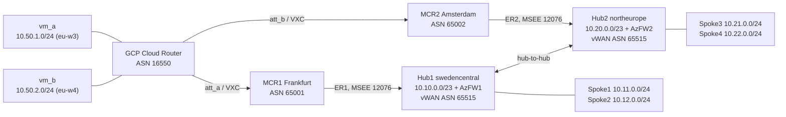
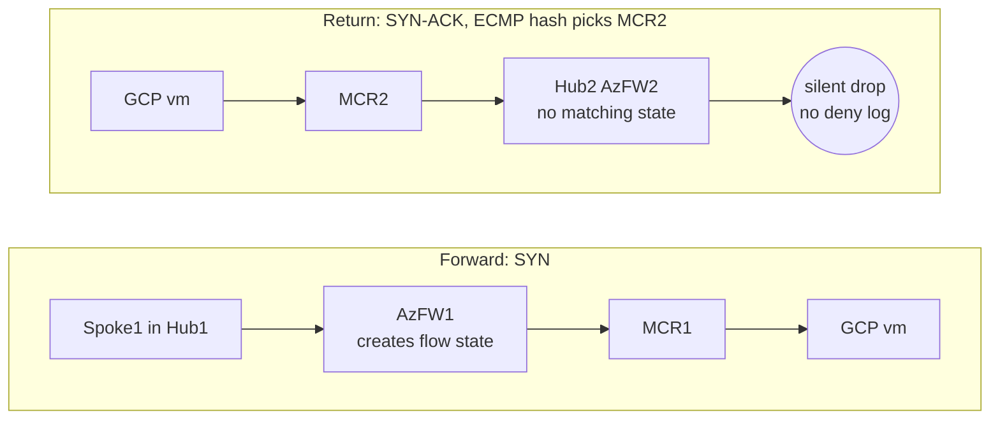
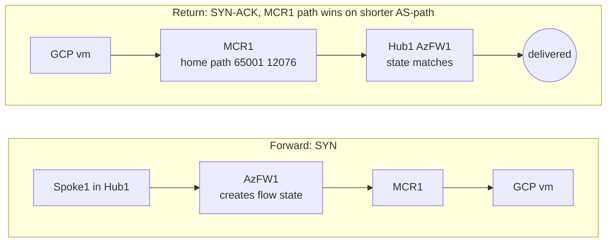

# Three blind spots in the ExpressRoute DR guide that secured vWAN and route maps exposed

*An update to [Azure ExpressRoute: Designing for disaster recovery with private peering](https://learn.microsoft.com/en-us/azure/expressroute/designing-for-disaster-recovery-with-expressroute-privatepeering). The DR guide is still a good foundation, but secured Virtual WAN, partner-managed CEs, and vWAN route maps change where ExpressRoute DR path engineering has to happen.*

If you read the Microsoft Learn ExpressRoute DR article years ago and built your mental model around "asymmetry is bad for performance, but probably not fatal," secured Virtual WAN changes the stakes. In a secured vWAN hub, return traffic that enters the wrong hub does not merely add latency. It can hit an Azure Firewall that never saw the TCP SYN, then disappear without a policy deny log.

That is not theory. In this lab, a dual-ExpressRoute, dual-hub design with two Megaport MCRs and a single GCP Cloud Router produced asymmetric, hash-dependent TCP failures. The baseline showed roughly 54 cross-contaminating flows per firewall. vWAN route maps reduced that contamination by 98 percent in the active/active design, and the active/passive design gave clean failover in 54.2 seconds. The AS-path prepend worked in BGP, and for a standards-compliant on-premises router it is the fix: the longer prepended path loses at the AS-path step before MED is considered, and eBGP installs one best path by default. The remaining `/24` ECMP we saw is a GCP Cloud Router simulator artifact, useful to document, but not the thesis.

## 1. The official guide is right about a lot. Here is where the world moved on.

The Microsoft Learn article says this about Virtual WAN:

> "The concepts described in this article equally applies when an ExpressRoute circuit is created under Virtual WAN or outside of it."

It also says this about stateful devices on ExpressRoute private peering:

> "Typically, over the ExpressRoute private peering path you don't come across stateful entities such as NAT or Firewalls. Therefore, asymmetrical routing over ExpressRoute private peering doesn't necessarily block traffic flow."

That second quote is the assumption this lab breaks. In secured vWAN, routing intent sends private traffic through the hub firewall. The firewall is stateful. If the outbound SYN traverses Hub1's firewall and the return SYN-ACK traverses Hub2's firewall, Hub2 has no session state. The packet is dropped by the state engine. Azure Firewall does not emit a neat `Deny` record for that state miss.

The baseline evidence is in `labs\vwan-dual-er-symmetric\show-output\design-c-asymmetric-2026-06-15\README.md`. Probe 09 shows `spoke1` to `vm_b` had one success and two timeouts. The firewall correlation says AzFW1 logged the forward SYNs, while AzFW2 had zero entries for the same flow pair.

Query (run for each hub with `az monitor log-analytics query -w law-vwan-symm-103167`):

```kql
AzureDiagnostics
| where ResourceType == "AZUREFIREWALLS"
| where TimeGenerated > ago(60m)
| where ResourceGroup =~ "rg-vwan-symm-103167"
| where msg_s contains "10.50.2.2" or msg_s contains "10.11.0"
| project TimeGenerated, Resource, msg_s
| order by TimeGenerated asc
```

```text
22:12:41  AZFW-HUB1-SWEDENCENTRAL  TCP SYN 10.11.0.4 -> 10.50.2.2:22  Allow
...
AZFW-HUB2-NORTHEUROPE  ZERO entries for 10.11.0.4 <-> 10.50.2.2
```

That absence is the proof. In the same folder, `09-tcp-spoke1-to-vmb-x5.txt` shows the TCP symptom, retrieved by running the probe on the spoke VM:

```bash
az vm run-command invoke -g rg-vwan-symm-103167 -n vm-spoke1 \
  --command-id RunShellScript \
  --scripts "for i in 1 2 3 4 5; do nc -zv -w5 10.50.2.2 22; done"
```

```text
Connection to 10.50.2.2 22 port [tcp/ssh] succeeded!
nc: connect to 10.50.2.2 port 22 (tcp) timed out
nc: connect to 10.50.2.2 port 22 (tcp) timed out
```

**Pull-quote candidate:** In secured vWAN, asymmetry is not just suboptimal. It is a stateful firewall failure mode, and the cleanest evidence can be the log entry that is not there.

## 2. What the official guide covers well

The Learn article, currently dated `ms.date: 2025-04-28` in the page metadata, gets the core ExpressRoute DR advice right. It recommends geo-redundant circuits, different peering locations, diverse provider paths, high availability inside each circuit, and careful control of parallel paths.

It also identifies the classic path-selection tools:

1. Advertise a more-specific route on the preferred circuit.
2. Use ExpressRoute connection weight for Azure-to-on-premises preference.
3. Prepend AS path on the less-preferred path.

The article then maps those tools into two large-enterprise patterns. Scenario 1 is the local-circuit-preferred active/standby pattern. Scenario 2 is an active/active pattern where sites can use either region through either circuit.

This lab does not refute those designs. It updates them for a 2024 and later operating model: secured vWAN hubs, vWAN route maps, partner-managed CEs, and a cloud router acting as the on-premises peer.

## 3. What the lab models

The lab topology is the same shape as the article's multi-region enterprise DR picture, but with modern cloud plumbing:

| Component | Lab value |
|---|---|
| Azure Hub1 | `swedencentral`, `10.10.0.0/23`, secured vWAN hub with Azure Firewall |
| Azure Hub2 | `northeurope`, `10.20.0.0/23`, secured vWAN hub with Azure Firewall |
| Azure spokes | `10.11.0.0/24`, `10.12.0.0/24`, `10.21.0.0/24`, `10.22.0.0/24` |
| ExpressRoute circuit 1 | Stockholm path through MCR1, ASN 65001 |
| ExpressRoute circuit 2 | Amsterdam path through MCR2, ASN 65002 |
| On-premises simulator | GCP VPC with Cloud Router `router-vwan-symm-a` |
| GCP BGP peers | Partner attachments to MCR1 and MCR2 |

The topology evidence is in `labs\vwan-dual-er-symmetric\show-output\design-c-phase1b-2026-06-15\README.md` and the Design C baseline folder. The baseline `README.md` confirms one Cloud Router, two PARTNER Interconnect attachments, both BGP peers established, and both secured hubs using routing intent for private traffic.

The important modeling choice is that GCP Cloud Router is the on-premises side. In a real customer network that could be a carrier-managed virtual router, an interconnect partner device, or another cloud's routing appliance. The point is the same: the customer may not own the CE router where the original article expects AS-path and local-preference work to happen.



*One GCP Cloud Router peers with both Megaport MCRs; each MCR lands on its own ExpressRoute circuit into a secured vWAN hub. The single CR with two equal-cost paths is what makes the return direction ambiguous.*

## 4. Blind spot 1: secured vWAN hubs have stateful firewalls

The old ExpressRoute private peering assumption was: parallel paths are mostly a performance and consistency concern unless you happen to insert a stateful device.

Secured vWAN inserts that stateful device by design.

In the baseline, GCP Cloud Router installed the spoke `/24` prefixes through both MCRs at priority 0. The key table is in `show-output\design-c-asymmetric-2026-06-15\README.md` and the raw status is in `07-router-a-status.txt`, retrieved from the Cloud Router:

```bash
gcloud compute routers get-status router-vwan-symm-a \
  --region europe-west3 --project gcp-vwan-symm-103167 --format json
```

The summarized result:

```text
Prefix          Via MCR1        Via MCR2        AS-path MCR1      AS-path MCR2      GCP decision
10.11.0.0/24    present         present         65001 12076       65002 12076       ECMP
10.12.0.0/24    present         present         65001 12076       65002 12076       ECMP
10.21.0.0/24    present         present         65001 12076       65002 12076       ECMP
10.22.0.0/24    present         present         65001 12076       65002 12076       ECMP
```

That makes the return path a per-flow hash. For a Hub1 source, a return flow that hashes to MCR2 enters Hub2 and hits AzFW2. AzFW2 never saw the SYN. The SYN-ACK dies.



*The firewall is stateful, but the two directions take different hubs. AzFW2 sees a SYN-ACK for a flow whose SYN it never processed, so it drops the packet, and because it is a stateful drop rather than a policy deny, nothing is logged.*

The firewall correlation in the same baseline folder proves both directions of the problem:

| Probe | Forward firewall | Missing return-side firewall state | Result |
|---|---|---|---|
| `09-tcp-spoke1-to-vmb-x5.txt` | AzFW1 logged spoke1 SYNs | AzFW2 had zero matching entries | 1/3 succeeded |
| `10-tcp-spoke3-to-vma-x5.txt` | AzFW2 logged spoke3 SYNs | AzFW1 had zero matching entries | 2/3 succeeded |
| `12-tcp-spoke3-to-vmb-x5.txt` | AzFW2 logged spoke3 SYNs | AzFW1 had zero matching entries | 0/3 succeeded |

Baseline cross-contamination was about 54 flows per firewall. That number matters later, because it lets us quantify whether the route maps improved anything.

## 5. Blind spot 2: partner-managed CEs own the path between carrier and on-premises

The Learn article suggests using local preference on the iBGP session between customer routers when you want to influence path selection from the on-premises side. That advice is correct when the enterprise owns the CE routers.

But many modern private interconnect designs do not look like that. In this lab, Megaport MCRs terminate the ExpressRoute side, and GCP Cloud Router terminates the on-premises simulator side. There is no customer-owned iBGP session between two enterprise routers where we can simply set local preference.

The evidence is again in `show-output\design-c-asymmetric-2026-06-15\README.md`: `router-vwan-symm-a` learns every spoke `/24` from both MCRs with the same two-hop AS path, `65001 12076` and `65002 12076`. The GCP router's advertised routes in `08-router-a-bgp-advertised.txt` show both GCP prefixes advertised to both MCR peers. That is a realistic partner-interconnect shape, but it removes the exact CE-router lever the original article assumes.

This is where vWAN route maps become important. If we cannot reliably change the customer CE, we can move some AS-path engineering into Azure.

## 6. Blind spot 3: vWAN Route Maps are the modern AS-path lever

vWAN Route Maps let the Azure hub change BGP advertisements on ExpressRoute connections. That gives a vWAN-native equivalent to the article's AS-path prepend examples, but the prepend happens at the virtual hub layer, not on a customer CE router.

The lab tested two mechanisms, each mapped to one of the Learn article's scenarios:

| Learn article pattern | Lab mechanism | vWAN action | Evidence |
|---|---|---|---|
| Scenario 2, active/active | Mech C1 | OUTBOUND route maps on both hubs, prepend AS 64496 three times for the remote-region prefixes | `show-output\design-c-mechC1-symmetric-2026-06-16\14-verdict.md` |
| Scenario 1, active/passive | Mech C2 | Hub1 primary, Hub2 standby, blanket OUTBOUND prepend AS 64496 five times, Hub2 INBOUND prepend, `hub_routing_preference=ASPath` | `show-output\design-c-mechC2-symmetric-2026-06-16\15-verdict.md` |

The mechanism spec is in `labs\vwan-dual-er-symmetric\design.md`, section 4. The route map constraints are important: vWAN Route Maps accept 2-byte ASNs, reject private ASNs, and must not use Azure-reserved ASNs. The lab verified that Azure Route Maps accepted AS 64496.



*The outbound route map prepends AS 64496 onto the remote-region path, so the standby route via MCR2 reads `65002 12076 64496 64496 64496 ...`. A standards-compliant router compares AS-path length before MED and installs the single shorter home path, so the SYN-ACK returns through the same hub and firewall that saw the SYN.*

## 7. Why the prepend ASN is 64496, not 23456

The outline for this post originally used AS 23456, also known as AS_TRANS. That was changed before the final evidence run.

The selected value is **64496**, from the RFC 5398 documentation range `64496-64511`. It is a 2-byte ASN, it is not in the private range that starts at 64512, it is not Azure-reserved, and it carries no operational semantics. That makes it useful as a visible synthetic marker in a lab.

We rejected 23456 because it does carry semantics. RFC 6793 defines AS_TRANS as the 2-byte placeholder used when a BGP speaker that cannot represent a 4-byte ASN has to substitute a value. If this lab later moved to 4-byte ASNs, a deliberate 23456 prepend could be confused with an actual transition artifact. AS 64496 avoids that ambiguity.

The other critical correction is propagation. vWAN Route Maps do **not** strip the reserved ASN before the route reaches GCP. The prepended 64496 stays visible in the BGP AS path all the way to Cloud Router. That visibility is the mechanism. If Azure stripped it, GCP would never see the de-preference signal.

C1 evidence in `show-output\design-c-mechC1-symmetric-2026-06-16\02-cr-routes-summary.txt` shows the marker clearly, again from `get-status` on the Cloud Router:

```bash
gcloud compute routers get-status router-vwan-symm-a \
  --region europe-west3 --project gcp-vwan-symm-103167 --format json
```

```text
10.11.0.0/24  MCR1  65001 12076                                len=2
10.11.0.0/24  MCR2  65002 12076 64496 64496 64496              len=5
10.21.0.0/24  MCR2  65002 12076                                len=2
10.21.0.0/24  MCR1  65001 12076 64496 64496 64496 65520 65520  len=7
```

C2 evidence in `show-output\design-c-mechC2-symmetric-2026-06-16\02-gcp-cr-bestroutes-table.txt` shows the standby path with five prepends. This is the same `get-status` output, projected to `destRange / nextHopIp / asPath`:

```bash
gcloud compute routers get-status router-vwan-symm-a \
  --region europe-west3 --project gcp-vwan-symm-103167 --format json
```

```text
10.11.0.0/24  169.254.159.194  65001 12076
10.11.0.0/24  169.254.93.154   65002 12076 64496 64496 64496 64496 64496
10.21.0.0/24  169.254.159.194  65001 12076
10.21.0.0/24  169.254.93.154   65002 12076 64496 64496 64496 64496 64496
```

## 8a. Mech C1 in action: active/active, matching Learn Scenario 2

Mech C1 is the active/active update to the Learn article's Scenario 2. Each region keeps its local circuit preferred. Hub1 prefixes should return through MCR1 and Hub1. Hub2 prefixes should return through MCR2 and Hub2.

The route maps did what they were configured to do. Files `03-az-routemap-hub1.json`, `04-az-routemap-hub2.json`, and `05-er-connection-routing.txt` in `show-output\design-c-mechC1-symmetric-2026-06-16\` confirm outbound route maps on both hub ExpressRoute connections, each adding AS path `[64496, 64496, 64496]` for remote-region prefixes.

The best-routes table in `02-cr-routes-summary.txt` also proves this is an Azure-side change that GCP can see. The `/23` hub aggregates become single-path:

```bash
gcloud compute routers get-status router-vwan-symm-a \
  --region europe-west3 --project gcp-vwan-symm-103167 --format json
```

```text
10.10.0.0/23  169.254.159.194  65001 12076  SINGLE-PATH
10.20.0.0/23  169.254.93.154   65002 12076  SINGLE-PATH
```

The operational improvement is huge. The KQL summary in `10-azfw1-kql.txt` counts cross-contaminating flows before and after the route maps:

```kql
AzureDiagnostics
| where TimeGenerated > ago(60m) and Category == "AzureFirewallNetworkRule"
| where msg_s contains "10.50"
| extend SourceIP = extract(@"from (\d+\.\d+\.\d+\.\d+)", 1, msg_s)
| project TimeGenerated, Resource, SourceIP, msg_s
```

```text
Baseline cross-contamination:
  Hub1 AzFW saw Hub2 spoke: 54 flows
  Hub2 AzFW saw Hub1 spoke: 54 flows

Post-Mech-C1 cross-contamination:
  Hub1 AzFW saw Hub2 spoke: 1 flow
  Hub2 AzFW saw Hub1 spoke: 1 flow
```

That is a 98 percent reduction.

Against a standards-compliant on-premises CE, C1 is the intended fix. The home path is shorter, the remote path is longer, AS-path is evaluated before MED, and eBGP selects a single best path by default.

The same `02-cr-routes-summary.txt` also records the GCP simulator caveat: every spoke `/24` remained installed through both MCRs at equal VPC route priority. GCP Cloud Router kept both routes in `bestRoutes` even when one path was two hops and the other was five or seven hops. The data plane saw the consequence in the simulator: `08-probe-spoke3-vma.txt` had only two TCP successes out of five, with three timeouts. That is a GCP-specific route-priority artifact, not a failure of AS-path prepend as the ExpressRoute symmetry mechanism.

## 8b. Mech C2 in action: active/passive, matching Learn Scenario 1

Mech C2 is the active/passive update to the Learn article's Scenario 1. MCR1, ER1, and Hub1 are primary. MCR2, ER2, and Hub2 are standby.

The C2 configuration is captured in `show-output\design-c-mechC2-symmetric-2026-06-16\03-azure-c2-config.txt`, and the verdict is in `15-verdict.md`. The important controls are:

| Control | C2 setting |
|---|---|
| Hub1 ER connection | no route map, primary clean path |
| Hub2 OUTBOUND map | prepend AS 64496 five times for all Azure prefixes |
| Hub2 INBOUND map | prepend AS 64496 five times for GCP prefixes |
| Hub routing preference | `ASPath` on both hubs |

This produced the intended primary path. The C2 `02-gcp-cr-bestroutes-table.txt` shows MCR1's clean path and MCR2's prepended standby path side by side for the spoke `/24`s:

```bash
gcloud compute routers get-status router-vwan-symm-a \
  --region europe-west3 --project gcp-vwan-symm-103167 --format json
```

```text
10.11.0.0/24  169.254.159.194  65001 12076
10.11.0.0/24  169.254.93.154   65002 12076 64496 64496 64496 64496 64496
10.12.0.0/24  169.254.159.194  65001 12076
10.12.0.0/24  169.254.93.154   65002 12076 64496 64496 64496 64496 64496
10.21.0.0/24  169.254.159.194  65001 12076
10.21.0.0/24  169.254.93.154   65002 12076 64496 64496 64496 64496 64496
10.22.0.0/24  169.254.159.194  65001 12076
10.22.0.0/24  169.254.93.154   65002 12076 64496 64496 64496 64496 64496
```

That table shows the intended BGP outcome: MCR1 has the shorter primary path and MCR2 carries the longer standby path. A normal on-premises CE would pick the MCR1 path and install one eBGP best route.

The data plane and firewall logs confirm the GCP simulator caveat. `04-probe-spoke1-vma.txt` had two successes out of five. `06-probe-spoke3-vma.txt` had five successes out of five, which shows the hash-dependent nature of the GCP route-priority artifact. The KQL summary in `08-azfw-kql-cross-contamination-summary.txt` tallies which firewall saw which spoke source:

```kql
AzureDiagnostics
| where TimeGenerated between (datetime(2026-06-16T08:40:00Z) .. datetime(2026-06-16T09:20:00Z))
| where Category in ("AzureFirewallNetworkRule","AZFWNetworkRule")
| where msg_s contains "10.50"
```

```text
AZFW-HUB1-SWEDENCENTRAL  10.11.0.4  11  Expected C2 Azure egress via Hub1 primary
AZFW-HUB1-SWEDENCENTRAL  10.21.0.4   5  Expected C2 Azure egress via Hub1 primary
AZFW-HUB2-NORTHEUROPE    10.21.0.4   5  CROSS-CONTAMINATION: spoke-source flow on standby firewall
```

So C2 is a working active/passive symmetry design for standards-compliant peers, with one simulator caveat for GCP Cloud Router's VPC route-priority behavior. The failover behavior is excellent.

The primary-down test in `13-failover-during-primary-down.json` disabled the MCR1 GCP BGP peer, then polled the Cloud Router until the spoke prefixes were MCR2-only:

```bash
# inject the fault: disable the MCR1-facing BGP peer on the Cloud Router
gcloud compute routers update-bgp-peer router-vwan-symm-a \
  --peer-name auto-ia-bgp-att-vwan-symm-a-748c416bf214189 \
  --region europe-west3 --project gcp-vwan-symm-103167 --no-enabled --quiet

# then poll get-status every 10s until spoke prefixes are MCR2-only
gcloud compute routers get-status router-vwan-symm-a \
  --region europe-west3 --project gcp-vwan-symm-103167 --format json
```

GCP moved the spoke `/24`s to MCR2-only in **54.2 seconds**:

```text
10.11.0.0/24  169.254.93.154  65002 12076 64496 64496 64496 64496 64496
10.12.0.0/24  169.254.93.154  65002 12076 64496 64496 64496 64496 64496
10.21.0.0/24  169.254.93.154  65002 12076 64496 64496 64496 64496 64496
10.22.0.0/24  169.254.93.154  65002 12076 64496 64496 64496 64496 64496
```

The same file includes the failover data-plane probe from `vm-spoke3` to `vm_a`: five successes out of five during the fault. After restoring the MCR1 peer, `14-failover-after-primary-restored.json` shows the MCR1-primary paths returned in **45.4 seconds**.

That is the C2 value proposition: working active/passive symmetry for standard peers, plus clean active/passive failover.

## 9. A simulator caveat: GCP Cloud Router ranks VPC routes by MED, not AS-path

The lab used GCP Cloud Router to simulate an on-premises peer. That made the lab easy to automate and observe, but it also introduced a GCP-specific behavior that should not be generalized to normal CE routers.

Under the standard BGP best-path algorithm, AS-path length is evaluated before MED. A Cisco, Juniper, Arista, MikroTik, or similar on-premises router receives the unprepended two-hop path and the prepended longer path, rejects the longer AS path at that step, and installs a single best eBGP route by default. In that normal case, Mech C1 and C2 do exactly what we need for secured-vWAN firewall symmetry.

GCP Cloud Router behaved differently at the VPC route installation layer. For the `/23` aggregates, GCP installed one path. For all four spoke `/24`s, it installed both paths at `priority=0`, even when one path was much longer. The per-route VPC priority is visible in the `get-status` route entries:

```bash
gcloud compute routers get-status router-vwan-symm-a \
  --region europe-west3 --project gcp-vwan-symm-103167 \
  --format="table(result.bestRoutes.destRange, result.bestRoutes.asPaths.asLists, result.bestRoutes.priority)"
```

```text
10.11.0.0/24  65001 12076                                      priority 0
10.11.0.0/24  65002 12076 64496 64496 64496 64496 64496        priority 0
```

The evidence is in C1 `02-cr-routes-summary.txt`, C2 `02-gcp-cr-bestroutes-table.txt`, and the C2 verdict `15-verdict.md`. Niobe's verdict states the GCP behavior plainly: Cloud Router derives each VPC dynamic-route priority from MED, not AS-path length, so unequal AS-paths can still become equal-priority VPC routes. Equal priority means ECMP candidates.

That is a simulator caveat, not the blog thesis. GCP is only standing in for on-premises here. If your real on-premises peer follows normal BGP best-path behavior, the AS-path prepend is the fix and the GCP `/24` ECMP observation can be ignored for design purposes.

## 10. What the article still gets right

The original recommendations still matter.

More-specific route advertisement is still the most deterministic path-selection tool. In this lab, the `/23` aggregates were single-path precisely because they were not cross-propagated between hubs. Longest-prefix behavior is still king. In the GCP simulator, the more-specific `/24`s won over the clean `/23`s and exposed the VPC route-priority ECMP artifact.

Connection weight still influences Azure-side path selection. It does not fix this failure by itself because the broken leg is the GCP-to-Azure return path. Azure connection weight cannot change how GCP installs routes for Azure prefixes.

BFD is still a good recommendation. C2's deliberate peer-down test converged well under the 90 second target, with 54.2 seconds to standby and 45.4 seconds back to primary. Faster failure detection remains useful, especially when stateful firewalls force sessions to reset during path changes.

ECMP guidance is also still relevant. The GCP caveat is not that ECMP exists, but that GCP can recreate it at the VPC route-priority layer after a successful AS-path prepend.

## 11. When you would still reach for Mech C3: peers that ignore AS-path

C1 and C2 are the fixes for the normal ExpressRoute DR problem. Use AS-path prepend at the vWAN layer, make the wrong return path longer, and let the CE router's standard best-path algorithm select the shorter path before MED is considered.

Mech C3 is only for the edge case where the real peer behaves like the GCP simulator and installs unequal AS paths as equal-priority `/24` routes. In that narrow case, you need one more signal:

1. Suppress the more-specific `/24` advertisements on the standby circuit, so the peer sees only the `/23` aggregate from that side during normal operation.
2. Or apply a peer-side MED or route-priority signal so standby `/24`s are not equal-priority ECMP candidates.

The first option uses the behavior the lab already proved: `/23` aggregates were single-path in both C1 and C2. The second option works with GCP's actual installed-route model.

The practical recommendation is therefore:

| Goal | Recommendation |
|---|---|
| Modernize the Learn Scenario 2 active/active pattern inside vWAN | Use C1, outbound route maps with AS 64496. This is the working fix for standards-compliant on-premises routers. |
| Modernize the Learn Scenario 1 active/passive pattern inside vWAN | Use C2. The lab proved the primary and standby AS paths, 54.2 second failover, and 45.4 second restore. |
| Handle a GCP-like peer that ignores AS-path when assigning installed route priority | Add C3: suppress standby `/24`s or set peer-side MED or route priority. |

## 12. Reproduce it, and budget honestly

The lab lives under `labs\vwan-dual-er-symmetric\`. The implementation is in `labs\vwan-dual-er-symmetric\deploy\`, and the route-map design is in `labs\vwan-dual-er-symmetric\design.md`, section 4. The validation artifacts are in `labs\vwan-dual-er-symmetric\show-output\`.

Do not deploy this expecting a cheap toy lab. The realistic cost is about **$135 per day**:

| Layer | Component | Daily cost |
|---|---|---:|
| Azure | 2 Azure Firewall Standard instances in secured hubs | ~$60 |
| Azure | 2 ExpressRoute gateways | ~$24 |
| Azure | vWAN hubs and vWAN resource | ~$10 |
| Azure | VMs and disks | ~$8 |
| Azure | Log Analytics for firewall diagnostics | ~$4 |
| Megaport | 2 MCRs and VXCs | ~$26 |
| GCP | VMs and network egress | ~$3 |
| Total | | **~$135/day** |

The Azure Firewall pair is the dominant line item, and it is the point of the lab. A stripped variant without AzFW cannot reproduce the stateful-drop finding. ExpressRoute Direct ports are not charged for the first 45 days after provisioning, so for this short-lived lab the port cost is effectively $0.

Suggested reproduction order:

1. Deploy the Design C baseline and capture `show-output\design-c-asymmetric-2026-06-15\` equivalents.
2. Confirm the GCP-specific observation: the four spoke `/24`s are ECMP in `gcloud compute routers get-status` despite AS-path differences.
3. Run TCP probes from Hub1 and Hub2 spokes to the GCP VM.
4. Query AzFW logs and prove the absent return-side state.
5. Apply C1 outbound route maps with AS 64496 three times.
6. Re-capture GCP best routes, TCP probes, and AzFW cross-contamination.
7. Apply C2 active/passive maps and `hub_routing_preference=ASPath`.
8. Run the primary-down test and measure convergence.
9. If you need full steady-state symmetry, continue to C3 rather than increasing prepend depth.

## Evidence index

| Claim | Primary evidence |
|---|---|
| Baseline Design C asymmetric ECMP and stateful drops | `show-output\design-c-asymmetric-2026-06-15\README.md`, `07-router-a-status.txt`, `09-tcp-spoke1-to-vmb-x5.txt`, `13-azfw1-kql.txt`, `14-azfw2-kql.txt` |
| Baseline cross-contamination around 54 flows per firewall | `show-output\design-c-mechC1-symmetric-2026-06-16\10-azfw1-kql.txt` baseline comparison |
| C1 uses AS 64496 three times and reduces contamination by 98 percent | `show-output\design-c-mechC1-symmetric-2026-06-16\02-cr-routes-summary.txt`, `10-azfw1-kql.txt`, `14-verdict.md` |
| GCP simulator `/24` ECMP artifact and spoke3 2/5 data-plane result | `show-output\design-c-mechC1-symmetric-2026-06-16\02-cr-routes-summary.txt`, `08-probe-spoke3-vma.txt`, `14-verdict.md` |
| C2 AS 64496 five times, standard-peer success with GCP simulator caveat | `show-output\design-c-mechC2-symmetric-2026-06-16\02-gcp-cr-bestroutes-table.txt`, `08-azfw-kql-cross-contamination-summary.txt`, `15-verdict.md` |
| C2 failover passed in 54.2 seconds and restore in 45.4 seconds | `show-output\design-c-mechC2-symmetric-2026-06-16\13-failover-during-primary-down.json`, `14-failover-after-primary-restored.json`, `15-verdict.md` |
| AS 64496 rationale and route-map design | `labs\vwan-dual-er-symmetric\design.md`, section 4 |
