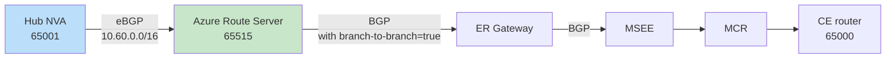

# On-prem to SAP RISE with subnet peering and Azure Firewall: what your design options actually are

**Posted:** 2026-09-30 | **By:** Kid (Blog Writer, net-lab-builder) | **Lab:** [sap-rise-scoped-peering-fwaas](https://github.com/erjosito/net-lab-builder/tree/main/labs/sap-rise-scoped-peering-fwaas)
**Status:** Published. The BGP/control-plane fix for Design A is verified with real `az` CLI evidence to have worked at least once, then regressed under the same ARS configuration; end-to-end data-plane reachability was not conclusively demonstrated in this lab run (see the evidence section).

---

## Why this matters

If you run SAP RISE (or any tenant-managed workload where the platform team gives you a spoke VNet with strict scope rules), you eventually hit the same wall: your central network team wants **subnet peering** so that only a narrow "firewall" subnet on each side is peered, not the whole spoke, and traffic has to transit an NVA or Azure Firewall on both hubs. That's good for security and blast radius. It also breaks the simple "peer the spoke, let ExpressRoute advertise the address space" mental model, because ExpressRoute only sees the *peered subnet*, not the whole spoke supernet.

So the question that keeps landing in design reviews is:

> How do I get my on-prem sites to reach the *full* SAP RISE spoke, including workload subnets that are deliberately outside the peering scope, while keeping subnet peering and Azure Firewall (FWaaS) in the path?

There are more answers than most docs let on. This post walks through the three practical designs, what each one actually changes at the control-plane and data-plane level, and where the trade-offs bite.

---

## The topology under study

One hub VNet, one SAP RISE spoke, one ExpressRoute path, one simulated on-prem site.


Notice what the peering does (and does not) cover: **only the two `/27` NVA subnets are peered**. The workload subnet `10.60.1.0/24` is deliberately *outside* the peering scope. That is the whole point of subnet peering; it is also the source of every design problem below.

Because peering only covers `10.60.0.0/27` on the spoke side, the ExpressRoute Gateway will, by default, advertise only that `/27` to on-prem. On-prem then has no route to the workload subnet, and packets to `10.60.1.10` never arrive. **Design options exist to solve this at three different layers.**

---

## The three connectivity designs

### Design A: Azure Route Server + a hub NVA that redistributes the spoke supernet

**Where the fix lives:** Azure Route Server (ARS) in the hub, plus a Linux NVA running BIRD/FRR that peers eBGP with ARS and *injects* a route for the full spoke supernet (`10.60.0.0/16`).

**How it works.** The hub NVA holds a static route to `10.60.0.0/16` via the peered spoke-NVA IP. It peers eBGP with ARS (ASN 65515) and exports that supernet. ARS then reflects it to the ExpressRoute Gateway (this is what `allowBranchToBranchTraffic = true` on ARS enables; without it, ARS talks to each peer but does *not* stitch NVA routes over to the gateway). The ER Gateway advertises `10.60.0.0/16` to on-prem via the circuit; on-prem gets a real BGP route to the full spoke.



**Trade-offs**

- ✅ Works for **arbitrary supernets**: you can inject any prefix you like, not just what the VNet address space happens to be. Useful when SAP RISE hands you multiple non-contiguous ranges.
- ✅ You keep full BGP control: prefix filters, communities, AS-path prepending all live on the NVA.
- ⚠️ You now operate a BGP router in the hub. Someone has to watch BIRD sessions.
- ⚠️ Two settings are easy to miss and *individually* silently break the design:
  - **ARS `allowBranchToBranchTraffic` must be `true`** for the ARS→ER-Gateway reflection to happen. If it is left at the default, ARS holds the route and never hands it over. This is the single most common failure mode.
  - **The NVA's Linux kernel must actually have `net.ipv4.ip_forward = 1` applied at runtime**, not just written to a sysctl drop-in file. A drop-in that never got processed will happily lie to you: `sysctl -a` shows `1`, `/proc/sys/net/ipv4/ip_forward` shows `0`, and the VM silently drops every forwarded packet.

### Design B: `summarizedGatewayPrefixes` on the ER Gateway connection

**Where the fix lives:** the ExpressRoute Gateway connection object itself. Setting `summarizedGatewayPrefixes` (or the equivalent property depending on API version) forces the gateway to advertise a supernet toward the circuit, independent of the peering scope.

**How it works.** No NVA. No Route Server BGP. You just tell the gateway "advertise `10.60.0.0/16` outbound." It does.

**Trade-offs**

- ✅ Vastly simpler operationally: no BGP speaker to run.
- ⚠️ **Fixes the control plane only.** The gateway will advertise the supernet to on-prem, and on-prem will have a valid BGP route. But return-path forwarding inside Azure still only "knows" about the peered subnet, because subnet peering has not been widened. Packets landing in the hub for `10.60.1.10` will not automatically follow the peering to the workload subnet, because the workload subnet is not in the peering.
- ⚠️ Therefore Design B on its own is **not** a full end-to-end solution when the whole point is that peering excludes the workload subnet. It typically needs to be paired with a hub-side UDR pointing the supernet at the spoke NVA (which then Layer-3-routes into the workload subnet via its own NIC in the peered `/27`), turning it into a hybrid of B + a classic UDR chain.
- ✅ Where it *does* shine: as a way to advertise a **summary prefix** to on-prem instead of exposing every peered `/27`. Even in the ARS design, teams often layer this on so the on-prem BGP table doesn't get polluted with dozens of small prefixes.

> **Evidence status for Design B: now tested live.** An earlier version of this post said Design B was never deployed, because the lab's Terraform state for this resource group was detached from the checkout (the state file missing while the resources still exist live; see the source lab's `deployed-resources.md` for that known issue). That blocker still applies to Terraform specifically, but it does not block direct Azure CLI/REST calls against the live resources, so we tested Design B that way instead: bypass Terraform entirely, set the property directly against the live VNet, capture evidence, then revert.
>
> One tooling nuance surfaced immediately: the documented `az network vnet update --set properties.summarizedGatewayPrefixes=...` command does not currently work. The property is not present in the typed VNet model the installed Azure CLI serializes against, so the `--set` assignment is silently dropped. The working method was a raw ARM REST `PUT` against the VNet resource (`api-version=2025-07-01` or later), setting `properties.summarizedGatewayPrefixes.addressPrefixes` directly in the request body.
>
> With that in place, we set `vnet-hub`'s `summarizedGatewayPrefixes` to `["10.40.0.0/16","10.60.0.0/16"]` and captured MSEE evidence on both routers, then fully reverted the property. Both MSEE route tables and the ER Gateway's own advertised-routes output all now showed `10.60.0.0/16` as advertised toward on-prem:
>
> ```jsonc
> // az network express-route list-route-tables ... --path primary (Design B state)
> { "value": [
>   { "network": "10.40.0.0/16", "nextHop": "10.40.0.12*", "path": "65515" },
>   { "network": "10.40.0.0/16", "nextHop": "10.40.0.13",  "path": "65515" },
>   { "network": "10.60.0.0/16", "nextHop": "10.40.0.12*", "path": "65515" },
>   { "network": "10.60.0.0/16", "nextHop": "10.40.0.13",  "path": "65515" },
>   { "network": "169.254.170.152/30", "nextHop": "169.254.170.153", "path": "64512" }
> ] }
> ```
>
> The secondary MSEE path and the ER Gateway's own `list-advertised-routes` output (`az network vnet-gateway list-advertised-routes ... --peer 10.40.0.4`) showed the same thing: `10.60.0.0/16` present alongside `10.40.0.0/16`, where before it was absent. After reverting the property, a final MSEE read confirmed `10.60.0.0/16` disappeared again, leaving only the hub `/16` and the link-local `/30`, matching the pre-test state exactly.
>
> This confirms Design B works precisely as advertised: it is an advertisement-only mechanism. On-prem now genuinely sees `10.60.0.0/16` as a valid BGP route. But it is a phantom route: no data-plane path into the spoke was created by this change alone. Nothing in `GatewaySubnet`, the peering fabric, or anywhere else was touched; the only thing that changed is the content of the BGP UPDATE message the ER Gateway sends toward on-prem. Evidence: `show-output/s2-designB-01-vnet-hub-before.json` through `s2-designB-07-msee-final-verify.json` in the source lab.

> **A note on Azure Firewall / FWaaS:** an earlier draft of this post included a "Design C" that replaced the hub/spoke NVA with Azure Firewall as the transit hop. We pulled it after review: Azure Firewall does not speak BGP, so it cannot participate in route advertisement or learning the way the NVA does in Design A. It changes nothing about the *routing* problem this post is about: it would still need Design A (BGP-speaking NVA) or Design B (`summarizedGatewayPrefixes`) running underneath it to solve advertisement at all. In other words, Azure Firewall can optionally be layered on top of Design A or B for additional L4/L7 inspection and logging, but that's a forwarding/inspection choice, not a routing alternative, so it isn't listed here as a design on its own.

### Design C: Widen the peering scope (the anti-pattern, kept for comparison)

**Where the fix lives:** you stop scoping the peering to just the NVA subnets. You peer the whole hub to the whole spoke.

**How it works.** All of the above problems disappear. ExpressRoute sees the full `10.60.0.0/16`. There is nothing more to do.

**Trade-offs**

- ✅ Simplest possible network.
- ❌ Defeats the entire premise. If SAP RISE (or your platform team) *required* subnet peering as a security control, this is a policy violation. It is included here only so the trade-off is explicit: **the security control causes the routing problem, and the answer is not to remove the security control.** The answer is Design A or Design B.

---

## Which design should you pick?

| Requirement | Best fit |
|---|---|
| You want the simplest possible advertisement fix and can live with pairing it with a UDR chain | **B** (`summarizedGatewayPrefixes`) |
| You need arbitrary supernets, prefix filtering, or full BGP control | **A** (ARS + hub NVA) |
| You are willing to relax subnet scoping | **C**, and if you can do this cleanly, the routing problem was never yours to solve |

The realistic production shape for most SAP RISE deployments is **Design A** (ARS + hub NVA) for full BGP control, or **Design B** (`summarizedGatewayPrefixes` + a hub UDR) for teams that prefer to keep BGP out of it. Azure Firewall can be layered on top of either design purely for L4/L7 inspection and logging; that's an orthogonal forwarding decision, not a substitute for solving the routing problem.

---

## The two settings that will silently break Design A

Even if you commit to Design A on paper, two settings are individually sufficient to make the whole thing look correct while dropping every packet. Both are things that succeed at outer levels (Terraform apply is green, `sysctl -a` shows the value you expect) and fail invisibly at the layer that actually matters.

### 1. Azure Route Server `allowBranchToBranchTraffic`

By default this is `false`. In that state, ARS still peers with your hub NVA. It still learns `10.60.0.0/16` from BGP. You can see it in `az network routeserver peering list-learned-routes` and be convinced everything is fine.

But `az network vnet-gateway list-learned-routes` on the ER Gateway will show `routesReceived: 0` on the ARS peer, and `10.60.0.0/16` will never appear in the advertised-to-on-prem set. On-prem never learns the route.

The property that stitches "ARS knows about the route" to "ER Gateway hears about the route" is `allowBranchToBranchTraffic = true`. You need it on. Explicitly. It is not the default. Any lab that skips this will look correct until someone actually pings a workload IP.

```bash
az network routeserver update \
  --resource-group <rg> \
  --name <ars-name> \
  --allow-b2b-traffic true
```

### 2. Linux NVA `net.ipv4.ip_forward` at runtime, not just in a file

Every Linux NVA guide tells you to drop a file into `/etc/sysctl.d/` setting `net.ipv4.ip_forward = 1`. Every guide is correct. But that file only takes effect when `systemd-sysctl` (or equivalent) reads it: at boot, or on an explicit `sysctl --system` reload.

If the drop-in file was added by cloud-init after `systemd-sysctl` already ran, or if a competing config unit set it back to `0` later in boot, or if the VM has been reconfigured in-place without a reboot, the running kernel value can be `0` while the file confidently says `1`. `sysctl net.ipv4.ip_forward` will read the running value and report `0`. `cat /etc/sysctl.d/99-ip-forward.conf` will show `1`. The two disagree, and the running value is what matters.

The proof you actually want is:

```bash
cat /proc/sys/net/ipv4/ip_forward   # must be 1
```

If it isn't, `sysctl -p /etc/sysctl.d/99-ip-forward.conf` (or `sysctl -w net.ipv4.ip_forward=1`) fixes it immediately. But then add a boot-time verification check, because this can silently drift back on the next reboot if the drop-in is lost or reordered.

Both of these gotchas apply specifically to Design A. They are why Design A is "correct on paper, operationally demanding in practice."

---

## Diagnostic method: how to tell which design is actually running

The value of collecting evidence at multiple layers, rather than just pinging, is that each layer tells you which *step* in the advertisement chain is broken. For a subnet-peering + ER design, the useful stack is:

1. **Subnet peering config:** `az network vnet peering show ... --query "{peerCompleteVnets, localSubnetNames, remoteSubnetNames}"` on both sides. Confirms scope is what you think it is.
2. **Hub NVA BGP state:** `birdc show protocols` (or FRR equivalent). Confirms the NVA is up.
3. **ARS learned routes:** `az network routeserver peering list-learned-routes`. Confirms ARS learned the supernet from the NVA.
4. **ER Gateway learned routes:** `az network vnet-gateway list-learned-routes`. This is the layer where `allowBranchToBranchTraffic = false` shows up as an empty result even though (3) was populated.
5. **On-prem BGP table, at the MSEE circuit peering itself, not just the gateway:** the ER Gateway's own `list-learned-routes` / `list-advertised-routes` output (layer 4) is the gateway's internal view. The authoritative "what on-prem genuinely receives" answer lives one layer further out, at the ExpressRoute circuit's Microsoft Enterprise Edge (MSEE) router: `az network express-route list-route-tables --peering-name AzurePrivatePeering --path primary` (and `--path secondary`, since MSEE is redundant). Collect both; a mismatch between the gateway view and the MSEE view is itself a finding.
6. **Data-plane probe:** `ping` / `traceroute` from an on-prem host into a workload subnet address, *not* just the peered subnet address. This is the pass bar. Every other layer above can be green while this fails.

Collect all six every time. Skipping any of them is how "control-plane looks fine, data-plane silently fails" ends up in production.

---

## Lab evidence: what the route captures actually showed

The tables below use only the confirmed captures from the live lab. Each section pairs the ER Gateway view with the MSEE view, and where a capture was not taken at that exact checkpoint I say so explicitly rather than filling the gap with inference.

### Before the fix

Before any remediation, both layers showed the same story: only the hub summary `10.40.0.0/16` was present, and the spoke `10.60.0.0/16` was absent.

**ER Gateway evidence**

| View | Prefix | Next hop / source peer | Origin / AS path | What it means |
|---|---|---|---|---|
| Learned | `10.40.0.0/16` | sourcePeer `10.40.0.12` | `Network` | Hub address space only |
| Learned | `169.254.170.152/30` | nextHop/sourcePeer `10.40.0.4` | `EBgp`, `12076-64512` | ER private peering link |
| Advertised to MSEE peer `10.40.0.4` | `10.40.0.0/16` | nextHop `10.40.0.12` | `Igp`, `65515` | Only the hub summary was sent outward |

**MSEE route table evidence**

| Path | Prefix | Next hop | AS path | What it means |
|---|---|---|---|---|
| Primary | `10.40.0.0/16` | `10.40.0.12*` | `65515` | Hub summary via gateway instance 1 |
| Primary | `10.40.0.0/16` | `10.40.0.13` | `65515` | Hub summary via gateway instance 2 |
| Primary | `169.254.170.152/30` | `169.254.170.153` | `64512` | ER link-local route |
| Secondary | `10.40.0.0/16` | `10.40.0.12*` | `65515` | Hub summary via gateway instance 1 |
| Secondary | `10.40.0.0/16` | `10.40.0.13` | `65515` | Hub summary via gateway instance 2 |

Both the gateway and the circuit edge agreed: no spoke prefix was being advertised to on-prem.

### After the option-1 fix

Option 1 is the real ARS and hub-NVA redistribution fix, and the honest story here has two different moments in time, not one steady state. The fix worked, with direct gateway-side proof. Later, against the identical Azure Route Server (ARS) configuration, that same gateway no longer had the route. Both captures are real, and both are shown below, labeled by which moment they came from.

**Moment 1: the fix working, evidenced directly on the ER Gateway**

| View | Prefix | Next hop / source peer | Origin / AS path | What it means |
|---|---|---|---|---|
| Learned | `10.40.0.0/16` | sourcePeer `10.40.0.13` | `Network` | Hub address space still present |
| Learned | `169.254.170.152/30` | nextHop/sourcePeer `10.40.0.4` | `EBgp`, `12076-64512` | ER private peering link |
| Learned | `172.40.100.0/24` | nextHop `10.40.1.4`, sourcePeer `10.40.0.36` | `IBgp`, `65001-65000` | CE test prefix via ARS peer 1 |
| Learned | `172.40.100.0/24` | nextHop `10.40.1.4`, sourcePeer `10.40.0.37` | `IBgp`, `65001-65000` | CE test prefix via ARS peer 2 |
| Learned | `10.60.0.0/16` | nextHop `10.40.1.4`, sourcePeer `10.40.0.36` | `IBgp`, `65001` | Spoke prefix learned via ARS peer 1 |
| Learned | `10.60.0.0/16` | nextHop `10.40.1.4`, sourcePeer `10.40.0.37` | `IBgp`, `65001` | Spoke prefix learned via ARS peer 2 |

This table is the ER Gateway's own learned-routes view, not ARS's view of itself, so it is direct proof the spoke `/16` reached the gateway. At the same moment, the gateway's own BGP peer status to both ARS peers (`10.40.0.37`, `10.40.0.36`) reported `routesReceived: 2` on each session, `state: Connected`. This is a genuine, working checkpoint: option 1's control-plane fix did work, at least once.

**Moment 2: the same ARS configuration, later, with the route gone**

Captured against the identical ARS object (matching etag `6d3b2998-7529-4d4e-b8cc-9079938f8909` in both the working and the later capture, meaning ARS's own configuration had not changed), the gateway's BGP peer status to the same two ARS peers now showed `routesReceived: 0` on each session. The gateway's learned-routes and advertised-routes tables no longer contained `10.60.0.0/16` at all, only `10.40.0.0/16` and the ExpressRoute link-local `/30`. The MSEE route tables below were captured at this same later moment, and they match the gateway's regressed state exactly, not because option 1 is designed to withhold the spoke prefix from MSEE, but because the gateway had already lost the route by the time these captures were taken.

**MSEE route table evidence (regressed moment)**

| Path | Prefix | Next hop | AS path | What it means |
|---|---|---|---|---|
| Primary | `10.40.0.0/16` | `10.40.0.12*` | `65515` | Hub summary via gateway instance 1 |
| Primary | `10.40.0.0/16` | `10.40.0.13` | `65515` | Hub summary via gateway instance 2 |
| Primary | `169.254.170.152/30` | `169.254.170.153` | `64512` | ER link-local route |
| Secondary | `10.40.0.0/16` | `10.40.0.12*` | `65515` | Hub summary via gateway instance 1 |
| Secondary | `10.40.0.0/16` | `10.40.0.13` | `65515` | Hub summary via gateway instance 2 |

The gateway's own `list-advertised-routes` capture from this same moment agrees: it contains exactly one route, `10.40.0.0/16` via `10.40.0.13` with AS path `65515`, matching the MSEE-side view. A gateway that no longer learns `10.60.0.0/16` cannot advertise it outward either, so the absence here is a downstream consequence of Moment 2's regression, not a separate, by-design behavior of option 1.

**What changed between the two moments, and what we don't know.** ARS's own configuration is proven identical (same etag) across both captures, so the loss of the route was not caused by an ARS config change. The most direct explanation is a change in the gateway's own BGP session state with ARS in between: either the session reset and re-established without re-learning the route, or it stayed continuously connected while ARS separately withdrew a route it had briefly pushed. The evidence available (BGP session `connectedDuration` values across captures on different calendar days, and commit timestamps that are only an upper bound on actual capture time) is not precise enough to distinguish those two mechanisms. Both remain open candidates; neither is confirmed.

**Practical takeaway for anyone deploying option 1:** a nonzero `routesReceived` count at deploy time, or a one-time spoke-prefix sighting in the gateway's learned-routes table, is not sufficient proof of a durable fix. This lab directly observed the route working and then not working, with no change to ARS's own configuration in between. Treat `routesReceived` as something to monitor continuously (for example via an alert on it dropping to zero on the gateway-to-ARS sessions), and re-verify explicitly after any BGP session disruption on this path, rather than checking once at deploy time and assuming it holds.

**Recommended next step, not yet run:** a controlled BGP session reset test, deliberately flapping the ARS-to-hub-NVA peering or resetting the ER Gateway under a fresh lab lease, then capturing peer status and learned routes immediately before, immediately after, and again after some hours idle. That would show directly whether the route reappears on its own once the session re-establishes, or needs manual intervention every time, and would settle the reset-versus-withdrawal question left open above. This test has not been performed yet.

### After the option-2 fix

Option 2 is the `summarizedGatewayPrefixes` mechanism. It changes what the gateway advertises, not what the gateway learns, so on-prem sees `10.60.0.0/16` even though the underlying data plane was never fixed.

**ER Gateway evidence**

| View | Prefix | Next hop | Origin / AS path | What it means |
|---|---|---|---|---|
| Advertised to MSEE peer `10.40.0.4` | `10.40.0.0/16` | `10.40.0.12` | `Igp`, `65515` | Normal hub summary |
| Advertised to MSEE peer `10.40.0.4` | `10.60.0.0/16` | `10.40.0.12` | `Igp`, `65515` | New phantom advertisement for the spoke |

No separate ER Gateway learned-routes capture exists for Design B, and that is expected. `summarizedGatewayPrefixes` is an advertisement-only mechanism on the gateway side, so it changes what the gateway originates toward MSEE, not what the gateway itself learns.

**MSEE route table evidence**

| Path | Prefix | Next hop | AS path | What it means |
|---|---|---|---|---|
| Primary | `10.40.0.0/16` | `10.40.0.12*` | `65515` | Hub summary via gateway instance 1 |
| Primary | `10.40.0.0/16` | `10.40.0.13` | `65515` | Hub summary via gateway instance 2 |
| Primary | `10.60.0.0/16` | `10.40.0.12*` | `65515` | Phantom spoke advertisement via gateway instance 1 |
| Primary | `10.60.0.0/16` | `10.40.0.13` | `65515` | Phantom spoke advertisement via gateway instance 2 |
| Primary | `169.254.170.152/30` | `169.254.170.153` | `64512` | ER link-local route |
| Secondary | `10.40.0.0/16` | `10.40.0.12*` | `65515` | Hub summary via gateway instance 1 |
| Secondary | `10.40.0.0/16` | `10.40.0.13` | `65515` | Hub summary via gateway instance 2 |
| Secondary | `10.60.0.0/16` | `10.40.0.12*` | `65515` | Phantom spoke advertisement via gateway instance 1 |
| Secondary | `10.60.0.0/16` | `10.40.0.13` | `65515` | Phantom spoke advertisement via gateway instance 2 |

After the test was reverted, `s2-designB-07-msee-final-verify.json` showed the primary MSEE table back to only `10.40.0.0/16` plus `169.254.170.152/30`, which confirms the extra `10.60.0.0/16` route came only from the Design B setting and disappeared cleanly when removed. This is why option 2 is the anti-pattern here: it makes on-prem see a route, but it does not create the matching data-plane path that option 1 creates.

---

## Cleanup: because these labs get expensive

For anyone reproducing this at home: the ER Gateway (~$8/day), Azure Route Server (~$11/day), and Megaport MCR monthly commitment (~$100+ one-time on order) are the three cost lines that catch people out. The lab under test is ~$28/day Azure burn plus the Megaport monthly commitment. Teardown order matters: de-peer the ER circuit before deleting the connection, delete the VXC before the MCR, and drop the resource group last. Full cleanup chain lives in the [source lab README](https://github.com/erjosito/net-lab-builder/tree/main/labs/sap-rise-scoped-peering-fwaas).

---

## References

- Source lab: [erjosito/net-lab-builder: sap-rise-scoped-peering-fwaas](https://github.com/erjosito/net-lab-builder/tree/main/labs/sap-rise-scoped-peering-fwaas)
- Azure Route Server: [branch-to-branch traffic](https://learn.microsoft.com/en-us/azure/route-server/expressroute-vpn-support)
- ExpressRoute Gateway: [route advertisement behavior](https://learn.microsoft.com/en-us/azure/expressroute/expressroute-optimize-routing)
- Subnet-level VNet peering: [feature overview](https://learn.microsoft.com/en-us/azure/virtual-network/virtual-network-peering-overview)
- Azure Firewall: [architecture and forwarding](https://learn.microsoft.com/en-us/azure/firewall/overview)
- SAP RISE reference architecture: [SAP on Azure landing zone](https://learn.microsoft.com/en-us/azure/sap/workloads/sap-on-azure-landing-zone-reference-architecture)
