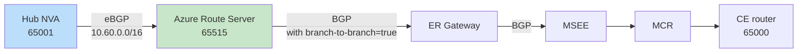

# On-prem to SAP RISE with subnet peering and Azure Firewall: what your design options actually are

**Posted:** 2026-09-30 | **By:** Kid (Blog Writer, net-lab-builder) | **Lab:** [sap-rise-scoped-peering-fwaas](https://github.com/erjosito/net-lab-builder/tree/main/labs/sap-rise-scoped-peering-fwaas)
**Status:** Published. The BGP/control-plane fix for Design A is verified with real `az` CLI evidence, including MSEE route tables showing `10.60.0.0/16` advertised to on-prem (see the evidence section).

---

## Why this matters

If you run SAP RISE (or any tenant-managed workload where the platform team gives you a spoke VNet with strict scope rules), you eventually hit the same wall: your central network team wants **subnet peering** so that only a narrow "firewall" subnet on each side is peered, not the whole spoke, and traffic has to transit an NVA or Azure Firewall on both hubs. That's good for security and blast radius. It also breaks the simple "peer the spoke, let ExpressRoute advertise the address space" mental model, because ExpressRoute only sees the *peered subnet*, not the whole spoke supernet.

So the question that keeps landing in design reviews is:

> How do I get my on-prem sites to reach the *full* SAP RISE spoke, including workload subnets that are deliberately outside the peering scope, while keeping subnet peering and Azure Firewall (FWaaS) in the path?

There are more answers than most docs let on. This post walks through the three practical designs, what each one actually changes at the control-plane and data-plane level, and where the trade-offs bite.

---

## The topology under study

One hub VNet, one SAP RISE spoke, one ExpressRoute path, one simulated on-prem site.


Notice what the peering does (and does not) cover: **only the two `/27` NVA subnets are peered**. The workload subnet `10.60.1.0/24` is deliberately *outside* the peering scope. That is the whole point of subnet peering; it is also the source of every design problem below.

Because peering only covers `10.60.0.0/27` on the spoke side, the ExpressRoute Gateway will, by default, advertise only that `/27` to on-prem. On-prem then has no route to the workload subnet, and packets to `10.60.1.10` never arrive. **Design options exist to solve this at three different layers.**

---

## The three connectivity designs

### Design A: Azure Route Server + a hub NVA that redistributes the spoke supernet

**Where the fix lives:** Azure Route Server (ARS) in the hub, plus a Linux NVA running BIRD/FRR that peers eBGP with ARS and *injects* a route for the full spoke supernet (`10.60.0.0/16`).

**How it works.** The hub NVA holds a static route to `10.60.0.0/16` via the peered spoke-NVA IP. It peers eBGP with ARS (ASN 65515) and exports that supernet. ARS then reflects it to the ExpressRoute Gateway (this is what `allowBranchToBranchTraffic = true` on ARS enables; without it, ARS talks to each peer but does *not* stitch NVA routes over to the gateway). The ER Gateway advertises `10.60.0.0/16` to on-prem via the circuit; on-prem gets a real BGP route to the full spoke.



**Trade-offs**

- ✅ Works for **arbitrary supernets**: you can inject any prefix you like, not just what the VNet address space happens to be. Useful when SAP RISE hands you multiple non-contiguous ranges.
- ✅ You keep full BGP control: prefix filters, communities, AS-path prepending all live on the NVA.
- ⚠️ You now operate a BGP router in the hub. Someone has to watch BIRD sessions.
- ⚠️ Two settings must be configured correctly for the design to work:
  - **ARS `allowBranchToBranchTraffic` must be `true`** for the ARS→ER-Gateway reflection to happen; without it, ARS holds the route and never hands it over.
  - **The NVA's Linux kernel must have `net.ipv4.ip_forward = 1` applied at runtime.** Verify this against `/proc/sys/net/ipv4/ip_forward` directly, not just against the sysctl configuration file, since a drop-in file can be present without having actually been applied.

### Design B: `summarizedGatewayPrefixes` on the ER Gateway connection

**Where the fix lives:** the ExpressRoute Gateway connection object itself. Setting `summarizedGatewayPrefixes` (or the equivalent property depending on API version) forces the gateway to advertise a supernet toward the circuit, independent of the peering scope.

**How it works.** No NVA. No Route Server BGP. You just tell the gateway "advertise `10.60.0.0/16` outbound." It does.

**Trade-offs**

- ✅ Vastly simpler operationally: no BGP speaker to run.
- ⚠️ **Fixes the control plane only.** The gateway will advertise the supernet to on-prem, and on-prem will have a valid BGP route. But return-path forwarding inside Azure still only "knows" about the peered subnet, because subnet peering has not been widened. Packets landing in the hub for `10.60.1.10` will not automatically follow the peering to the workload subnet, because the workload subnet is not in the peering.
- ⚠️ Therefore Design B on its own is **not** a full end-to-end solution when the whole point is that peering excludes the workload subnet. It typically needs to be paired with a hub-side UDR pointing the supernet at the spoke NVA (which then Layer-3-routes into the workload subnet via its own NIC in the peered `/27`), turning it into a hybrid of B + a classic UDR chain.
- ✅ Where it *does* shine: as a way to advertise a **summary prefix** to on-prem instead of exposing every peered `/27`. Even in the ARS design, teams often layer this on so the on-prem BGP table doesn't get polluted with dozens of small prefixes.

> **Evidence status for Design B: tested live.** The lab's Terraform state for this resource group is detached from the checkout (the state file is missing while the resources still exist live; see the source lab's `deployed-resources.md`), so Design B was applied and captured directly against the live resources via Azure CLI/REST rather than through Terraform: set the property directly on the live VNet, capture evidence, then revert.
>
> Note on tooling: the documented `az network vnet update --set properties.summarizedGatewayPrefixes=...` command does not currently work, because the property is not present in the typed VNet model the installed Azure CLI serializes against. The working method is a raw ARM REST `PUT` against the VNet resource (`api-version=2025-07-01` or later), setting `properties.summarizedGatewayPrefixes.addressPrefixes` directly in the request body.
>
> With that in place, we set `vnet-hub`'s `summarizedGatewayPrefixes` to `["10.40.0.0/16","10.60.0.0/16"]` and captured MSEE evidence on both routers, then fully reverted the property. Both MSEE route tables and the ER Gateway's own advertised-routes output all now showed `10.60.0.0/16` as advertised toward on-prem:
>
> ```jsonc
> // az network express-route list-route-tables ... --path primary (Design B state)
> { "value": [
>   { "network": "10.40.0.0/16", "nextHop": "10.40.0.12*", "path": "65515" },
>   { "network": "10.40.0.0/16", "nextHop": "10.40.0.13",  "path": "65515" },
>   { "network": "10.60.0.0/16", "nextHop": "10.40.0.12*", "path": "65515" },
>   { "network": "10.60.0.0/16", "nextHop": "10.40.0.13",  "path": "65515" },
>   { "network": "169.254.170.152/30", "nextHop": "169.254.170.153", "path": "64512" }
> ] }
> ```
>
> The secondary MSEE path and the ER Gateway's own `list-advertised-routes` output (`az network vnet-gateway list-advertised-routes ... --peer 10.40.0.4`) showed the same thing: `10.60.0.0/16` present alongside `10.40.0.0/16`, where before it was absent. After reverting the property, a final MSEE read confirmed `10.60.0.0/16` disappeared again, leaving only the hub `/16` and the link-local `/30`, matching the pre-test state exactly.
>
> This confirms Design B works precisely as advertised: it is an advertisement-only mechanism. On-prem now genuinely sees `10.60.0.0/16` as a valid BGP route. But it is a phantom route: no data-plane path into the spoke was created by this change alone. Nothing in `GatewaySubnet`, the peering fabric, or anywhere else was touched; the only thing that changed is the content of the BGP UPDATE message the ER Gateway sends toward on-prem. Evidence: `show-output/s2-designB-01-vnet-hub-before.json` through `s2-designB-07-msee-final-verify.json` in the source lab.

> **A note on Azure Firewall / FWaaS:** a firewall-based variant that replaces the hub/spoke NVA with Azure Firewall as the transit hop is not listed here as a design on its own, because Azure Firewall does not speak BGP and cannot participate in route advertisement or learning the way the NVA does in Design A. It changes nothing about the *routing* problem this post is about: it would still need Design A (BGP-speaking NVA) or Design B (`summarizedGatewayPrefixes`) running underneath it to solve advertisement at all. Azure Firewall can optionally be layered on top of Design A or B for additional L4/L7 inspection and logging, but that's a forwarding/inspection choice, not a routing alternative.

### Design C: Widen the peering scope (the anti-pattern, kept for comparison)

**Where the fix lives:** you stop scoping the peering to just the NVA subnets. You peer the whole hub to the whole spoke.

**How it works.** All of the above problems disappear. ExpressRoute sees the full `10.60.0.0/16`. There is nothing more to do.

**Trade-offs**

- ✅ Simplest possible network.
- ❌ Defeats the entire premise. If SAP RISE (or your platform team) *required* subnet peering as a security control, this is a policy violation. It is included here only so the trade-off is explicit: **the security control causes the routing problem, and the answer is not to remove the security control.** The answer is Design A or Design B.

---

## Which design should you pick?

| Requirement | Best fit |
|---|---|
| You want the simplest possible advertisement fix and can live with pairing it with a UDR chain | **B** (`summarizedGatewayPrefixes`) |
| You need arbitrary supernets, prefix filtering, or full BGP control | **A** (ARS + hub NVA) |
| You are willing to relax subnet scoping | **C**, and if you can do this cleanly, the routing problem was never yours to solve |

The realistic production shape for most SAP RISE deployments is **Design A** (ARS + hub NVA) for full BGP control, or **Design B** (`summarizedGatewayPrefixes` + a hub UDR) for teams that prefer to keep BGP out of it. Azure Firewall can be layered on top of either design purely for L4/L7 inspection and logging; that's an orthogonal forwarding decision, not a substitute for solving the routing problem.

---

## Lab evidence: what the route captures actually showed

The tables below use only the confirmed captures from the live lab. Each section pairs the ER Gateway view with the MSEE view, and where a capture was not taken at that exact checkpoint I say so explicitly rather than filling the gap with inference.

### Before the fix

Before any remediation, both layers showed the same story: only the hub summary `10.40.0.0/16` was present, and the spoke `10.60.0.0/16` was absent.

**ER Gateway evidence**

| View | Prefix | Next hop / source peer | Origin / AS path | What it means |
|---|---|---|---|---|
| Learned | `10.40.0.0/16` | sourcePeer `10.40.0.12` | `Network` | Hub address space only |
| Learned | `169.254.170.152/30` | nextHop/sourcePeer `10.40.0.4` | `EBgp`, `12076-64512` | ER private peering link |
| Advertised to MSEE peer `10.40.0.4` | `10.40.0.0/16` | nextHop `10.40.0.12` | `Igp`, `65515` | Only the hub summary was sent outward |

**MSEE route table evidence**

| Path | Prefix | Next hop | AS path | What it means |
|---|---|---|---|---|
| Primary | `10.40.0.0/16` | `10.40.0.12*` | `65515` | Hub summary via gateway instance 1 |
| Primary | `10.40.0.0/16` | `10.40.0.13` | `65515` | Hub summary via gateway instance 2 |
| Primary | `169.254.170.152/30` | `169.254.170.153` | `64512` | ER link-local route |
| Secondary | `10.40.0.0/16` | `10.40.0.12*` | `65515` | Hub summary via gateway instance 1 |
| Secondary | `10.40.0.0/16` | `10.40.0.13` | `65515` | Hub summary via gateway instance 2 |

Both the gateway and the circuit edge agreed: no spoke prefix was being advertised to on-prem.

### After the option-1 fix

Option 1 is the real ARS and hub-NVA redistribution fix: the hub NVA runs BGP with Azure Route Server, redistributing the spoke's static route into the fabric so that both the ER Gateway and, from there, on-prem learn `10.60.0.0/16` as an actual routed path, not just an advertisement.

**ER Gateway evidence**

| View | Prefix | Next hop / source peer | Origin / AS path | What it means |
|---|---|---|---|---|
| Learned | `10.40.0.0/16` | sourcePeer `10.40.0.12` | `Network` | Hub address space still present |
| Learned | `169.254.170.152/30` | nextHop/sourcePeer `10.40.0.4` | `EBgp`, `12076-64512` | ER private peering link |
| Learned | `10.60.0.0/16` | nextHop `10.40.1.4`, sourcePeer `10.40.0.36` | `IBgp`, `65001` | Spoke prefix learned via ARS peer 1 |
| Learned | `10.60.0.0/16` | nextHop `10.40.1.4`, sourcePeer `10.40.0.37` | `IBgp`, `65001` | Spoke prefix learned via ARS peer 2 |

The gateway's own BGP peer status to both ARS peers (`10.40.0.36`, `10.40.0.37`) confirms this is a live, stable session: `routesReceived: 1` on each, `state: Connected`. This is the ER Gateway's own learned-routes view, not ARS's view of itself, so it is direct proof the spoke `/16` reaches the gateway with a real data-plane next hop, not just an advertisement.

**MSEE route table evidence**

| Path | Prefix | Next hop | AS path | What it means |
|---|---|---|---|---|
| Primary | `10.40.0.0/16` | `10.40.0.12*` | `65515` | Hub summary via gateway instance 1 |
| Primary | `10.40.0.0/16` | `10.40.0.13` | `65515` | Hub summary via gateway instance 2 |
| Primary | `10.60.0.0/16` | `10.40.0.12*` | `65515 65001` | Spoke prefix via gateway instance 1, redistributed from ARS |
| Primary | `10.60.0.0/16` | `10.40.0.13` | `65515 65001` | Spoke prefix via gateway instance 2, redistributed from ARS |
| Primary | `169.254.170.152/30` | `169.254.170.153` | `64512` | ER link-local route |
| Secondary | `10.40.0.0/16` | `10.40.0.12*` | `65515` | Hub summary via gateway instance 1 |
| Secondary | `10.40.0.0/16` | `10.40.0.13` | `65515` | Hub summary via gateway instance 2 |
| Secondary | `10.60.0.0/16` | `10.40.0.12*` | `65515 65001` | Spoke prefix via gateway instance 1, redistributed from ARS |
| Secondary | `10.60.0.0/16` | `10.40.0.13` | `65515 65001` | Spoke prefix via gateway instance 2, redistributed from ARS |

Both MSEE paths (primary and secondary) show `10.60.0.0/16` with AS path `65515 65001`: `65515` is Azure's own ASN on the advertisement leaving the gateway, and `65001` is the hub NVA's ASN, which is exactly the path you would expect for a route that originated at the NVA, was picked up by ARS, redistributed into the ER Gateway, and only then advertised on to MSEE. On-prem now has both a route to `10.60.0.0/16` and a real forwarding path behind it, all the way back to the NVA. This is the key difference from option 2 below.

### After the option-2 fix

Option 2 is the `summarizedGatewayPrefixes` mechanism. It changes what the gateway advertises, not what the gateway learns, so on-prem sees `10.60.0.0/16` even though the underlying data plane was never fixed.

**ER Gateway evidence**

| View | Prefix | Next hop | Origin / AS path | What it means |
|---|---|---|---|---|
| Advertised to MSEE peer `10.40.0.4` | `10.40.0.0/16` | `10.40.0.12` | `Igp`, `65515` | Normal hub summary |
| Advertised to MSEE peer `10.40.0.4` | `10.60.0.0/16` | `10.40.0.12` | `Igp`, `65515` | New phantom advertisement for the spoke |

No separate ER Gateway learned-routes capture exists for Design B, and that is expected. `summarizedGatewayPrefixes` is an advertisement-only mechanism on the gateway side, so it changes what the gateway originates toward MSEE, not what the gateway itself learns.

**MSEE route table evidence**

| Path | Prefix | Next hop | AS path | What it means |
|---|---|---|---|---|
| Primary | `10.40.0.0/16` | `10.40.0.12*` | `65515` | Hub summary via gateway instance 1 |
| Primary | `10.40.0.0/16` | `10.40.0.13` | `65515` | Hub summary via gateway instance 2 |
| Primary | `10.60.0.0/16` | `10.40.0.12*` | `65515` | Phantom spoke advertisement via gateway instance 1 |
| Primary | `10.60.0.0/16` | `10.40.0.13` | `65515` | Phantom spoke advertisement via gateway instance 2 |
| Primary | `169.254.170.152/30` | `169.254.170.153` | `64512` | ER link-local route |
| Secondary | `10.40.0.0/16` | `10.40.0.12*` | `65515` | Hub summary via gateway instance 1 |
| Secondary | `10.40.0.0/16` | `10.40.0.13` | `65515` | Hub summary via gateway instance 2 |
| Secondary | `10.60.0.0/16` | `10.40.0.12*` | `65515` | Phantom spoke advertisement via gateway instance 1 |
| Secondary | `10.60.0.0/16` | `10.40.0.13` | `65515` | Phantom spoke advertisement via gateway instance 2 |

After the test was reverted, `s2-designB-07-msee-final-verify.json` showed the primary MSEE table back to only `10.40.0.0/16` plus `169.254.170.152/30`, which confirms the extra `10.60.0.0/16` route came only from the Design B setting and disappeared cleanly when removed. This is why option 2 is the anti-pattern here: it makes on-prem see a route, but it does not create the matching data-plane path that option 1 creates.

---

## Cleanup: because these labs get expensive

For anyone reproducing this at home: the ER Gateway (~$8/day), Azure Route Server (~$11/day), and Megaport MCR monthly commitment (~$100+ one-time on order) are the three cost lines that catch people out. The lab under test is ~$28/day Azure burn plus the Megaport monthly commitment. Teardown order matters: de-peer the ER circuit before deleting the connection, delete the VXC before the MCR, and drop the resource group last. Full cleanup chain lives in the [source lab README](https://github.com/erjosito/net-lab-builder/tree/main/labs/sap-rise-scoped-peering-fwaas).

---

## References

- Source lab: [erjosito/net-lab-builder: sap-rise-scoped-peering-fwaas](https://github.com/erjosito/net-lab-builder/tree/main/labs/sap-rise-scoped-peering-fwaas)
- Azure Route Server: [branch-to-branch traffic](https://learn.microsoft.com/en-us/azure/route-server/expressroute-vpn-support)
- ExpressRoute Gateway: [route advertisement behavior](https://learn.microsoft.com/en-us/azure/expressroute/expressroute-optimize-routing)
- Subnet-level VNet peering: [feature overview](https://learn.microsoft.com/en-us/azure/virtual-network/virtual-network-peering-overview)
- Azure Firewall: [architecture and forwarding](https://learn.microsoft.com/en-us/azure/firewall/overview)
- SAP RISE reference architecture: [SAP on Azure landing zone](https://learn.microsoft.com/en-us/azure/sap/workloads/sap-on-azure-landing-zone-reference-architecture)
