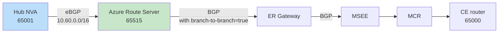

# On-prem to SAP RISE with subnet peering and Azure Firewall: what your design options actually are

**Posted:** 2026-09-30 | **By:** Kid (Blog Writer, net-lab-builder) | **Lab:** [sap-rise-scoped-peering-fwaas](https://github.com/erjosito/net-lab-builder/tree/main/labs/sap-rise-scoped-peering-fwaas)
**Status:** Published. The BGP/control-plane fix for Design A is verified with real `az` CLI evidence; end-to-end data-plane reachability was not conclusively demonstrated in this lab run (see the evidence section).

---

## Why this matters

If you run SAP RISE (or any tenant-managed workload where the platform team gives you a spoke VNet with strict scope rules), you eventually hit the same wall: your central network team wants **subnet peering** so that only a narrow "firewall" subnet on each side is peered, not the whole spoke, and traffic has to transit an NVA or Azure Firewall on both hubs. That's good for security and blast radius. It also breaks the simple "peer the spoke, let ExpressRoute advertise the address space" mental model, because ExpressRoute only sees the *peered subnet*, not the whole spoke supernet.

So the question that keeps landing in design reviews is:

> How do I get my on-prem sites to reach the *full* SAP RISE spoke, including workload subnets that are deliberately outside the peering scope, while keeping subnet peering and Azure Firewall (FWaaS) in the path?

There are more answers than most docs let on. This post walks through the three practical designs, what each one actually changes at the control-plane and data-plane level, and where the trade-offs bite.

---

## The topology under study

One hub VNet, one SAP RISE spoke, one ExpressRoute path, one simulated on-prem site.


Notice what the peering does (and does not) cover: **only the two `/27` NVA subnets are peered**. The workload subnet `10.60.1.0/24` is deliberately *outside* the peering scope. That is the whole point of subnet peering; it is also the source of every design problem below.

Because peering only covers `10.60.0.0/27` on the spoke side, the ExpressRoute Gateway will, by default, advertise only that `/27` to on-prem. On-prem then has no route to the workload subnet, and packets to `10.60.1.10` never arrive. **Design options exist to solve this at three different layers.**

---

## The three connectivity designs

### Design A: Azure Route Server + a hub NVA that redistributes the spoke supernet

**Where the fix lives:** Azure Route Server (ARS) in the hub, plus a Linux NVA running BIRD/FRR that peers eBGP with ARS and *injects* a route for the full spoke supernet (`10.60.0.0/16`).

**How it works.** The hub NVA holds a static route to `10.60.0.0/16` via the peered spoke-NVA IP. It peers eBGP with ARS (ASN 65515) and exports that supernet. ARS then reflects it to the ExpressRoute Gateway (this is what `allowBranchToBranchTraffic = true` on ARS enables; without it, ARS talks to each peer but does *not* stitch NVA routes over to the gateway). The ER Gateway advertises `10.60.0.0/16` to on-prem via the circuit; on-prem gets a real BGP route to the full spoke.



**Trade-offs**

- ✅ Works for **arbitrary supernets**: you can inject any prefix you like, not just what the VNet address space happens to be. Useful when SAP RISE hands you multiple non-contiguous ranges.
- ✅ You keep full BGP control: prefix filters, communities, AS-path prepending all live on the NVA.
- ⚠️ You now operate a BGP router in the hub. Someone has to watch BIRD sessions.
- ⚠️ Two settings are easy to miss and *individually* silently break the design:
  - **ARS `allowBranchToBranchTraffic` must be `true`** for the ARS→ER-Gateway reflection to happen. If it is left at the default, ARS holds the route and never hands it over. This is the single most common failure mode.
  - **The NVA's Linux kernel must actually have `net.ipv4.ip_forward = 1` applied at runtime**, not just written to a sysctl drop-in file. A drop-in that never got processed will happily lie to you: `sysctl -a` shows `1`, `/proc/sys/net/ipv4/ip_forward` shows `0`, and the VM silently drops every forwarded packet.

### Design B: `summarizedGatewayPrefixes` on the ER Gateway connection

**Where the fix lives:** the ExpressRoute Gateway connection object itself. Setting `summarizedGatewayPrefixes` (or the equivalent property depending on API version) forces the gateway to advertise a supernet toward the circuit, independent of the peering scope.

**How it works.** No NVA. No Route Server BGP. You just tell the gateway "advertise `10.60.0.0/16` outbound." It does.

**Trade-offs**

- ✅ Vastly simpler operationally: no BGP speaker to run.
- ⚠️ **Fixes the control plane only.** The gateway will advertise the supernet to on-prem, and on-prem will have a valid BGP route. But return-path forwarding inside Azure still only "knows" about the peered subnet, because subnet peering has not been widened. Packets landing in the hub for `10.60.1.10` will not automatically follow the peering to the workload subnet, because the workload subnet is not in the peering.
- ⚠️ Therefore Design B on its own is **not** a full end-to-end solution when the whole point is that peering excludes the workload subnet. It typically needs to be paired with a hub-side UDR pointing the supernet at the spoke NVA (which then Layer-3-routes into the workload subnet via its own NIC in the peered `/27`), turning it into a hybrid of B + a classic UDR chain.
- ✅ Where it *does* shine: as a way to advertise a **summary prefix** to on-prem instead of exposing every peered `/27`. Even in the ARS design, teams often layer this on so the on-prem BGP table doesn't get polluted with dozens of small prefixes.

> **Evidence status for Design B: now tested live.** An earlier version of this post said Design B was never deployed, because the lab's Terraform state for this resource group was detached from the checkout (the state file missing while the resources still exist live; see the source lab's `deployed-resources.md` for that known issue). That blocker still applies to Terraform specifically, but it does not block direct Azure CLI/REST calls against the live resources, so we tested Design B that way instead: bypass Terraform entirely, set the property directly against the live VNet, capture evidence, then revert.
>
> One tooling nuance surfaced immediately: the documented `az network vnet update --set properties.summarizedGatewayPrefixes=...` command does not currently work. The property is not present in the typed VNet model the installed Azure CLI serializes against, so the `--set` assignment is silently dropped. The working method was a raw ARM REST `PUT` against the VNet resource (`api-version=2025-07-01` or later), setting `properties.summarizedGatewayPrefixes.addressPrefixes` directly in the request body.
>
> With that in place, we set `vnet-hub`'s `summarizedGatewayPrefixes` to `["10.40.0.0/16","10.60.0.0/16"]` and captured MSEE evidence on both routers, then fully reverted the property. Both MSEE route tables and the ER Gateway's own advertised-routes output all now showed `10.60.0.0/16` as advertised toward on-prem:
>
> ```jsonc
> // az network express-route list-route-tables ... --path primary (Design B state)
> { "value": [
>   { "network": "10.40.0.0/16", "nextHop": "10.40.0.12*", "path": "65515" },
>   { "network": "10.40.0.0/16", "nextHop": "10.40.0.13",  "path": "65515" },
>   { "network": "10.60.0.0/16", "nextHop": "10.40.0.12*", "path": "65515" },
>   { "network": "10.60.0.0/16", "nextHop": "10.40.0.13",  "path": "65515" },
>   { "network": "169.254.170.152/30", "nextHop": "169.254.170.153", "path": "64512" }
> ] }
> ```
>
> The secondary MSEE path and the ER Gateway's own `list-advertised-routes` output (`az network vnet-gateway list-advertised-routes ... --peer 10.40.0.4`) showed the same thing: `10.60.0.0/16` present alongside `10.40.0.0/16`, where before it was absent. After reverting the property, a final MSEE read confirmed `10.60.0.0/16` disappeared again, leaving only the hub `/16` and the link-local `/30`, matching the pre-test state exactly.
>
> This confirms Design B works precisely as advertised: it is an advertisement-only mechanism. On-prem now genuinely sees `10.60.0.0/16` as a valid BGP route. But it is a phantom route: no data-plane path into the spoke was created by this change alone. Nothing in `GatewaySubnet`, the peering fabric, or anywhere else was touched; the only thing that changed is the content of the BGP UPDATE message the ER Gateway sends toward on-prem. Evidence: `show-output/s2-designB-01-vnet-hub-before.json` through `s2-designB-07-msee-final-verify.json` in the source lab.

> **A note on Azure Firewall / FWaaS:** an earlier draft of this post included a "Design C" that replaced the hub/spoke NVA with Azure Firewall as the transit hop. We pulled it after review: Azure Firewall does not speak BGP, so it cannot participate in route advertisement or learning the way the NVA does in Design A. It changes nothing about the *routing* problem this post is about: it would still need Design A (BGP-speaking NVA) or Design B (`summarizedGatewayPrefixes`) running underneath it to solve advertisement at all. In other words, Azure Firewall can optionally be layered on top of Design A or B for additional L4/L7 inspection and logging, but that's a forwarding/inspection choice, not a routing alternative, so it isn't listed here as a design on its own.

### Design C: Widen the peering scope (the anti-pattern, kept for comparison)

**Where the fix lives:** you stop scoping the peering to just the NVA subnets. You peer the whole hub to the whole spoke.

**How it works.** All of the above problems disappear. ExpressRoute sees the full `10.60.0.0/16`. There is nothing more to do.

**Trade-offs**

- ✅ Simplest possible network.
- ❌ Defeats the entire premise. If SAP RISE (or your platform team) *required* subnet peering as a security control, this is a policy violation. It is included here only so the trade-off is explicit: **the security control causes the routing problem, and the answer is not to remove the security control.** The answer is Design A or Design B.

---

## Which design should you pick?

| Requirement | Best fit |
|---|---|
| You want the simplest possible advertisement fix and can live with pairing it with a UDR chain | **B** (`summarizedGatewayPrefixes`) |
| You need arbitrary supernets, prefix filtering, or full BGP control | **A** (ARS + hub NVA) |
| You are willing to relax subnet scoping | **C**, and if you can do this cleanly, the routing problem was never yours to solve |

The realistic production shape for most SAP RISE deployments is **Design A** (ARS + hub NVA) for full BGP control, or **Design B** (`summarizedGatewayPrefixes` + a hub UDR) for teams that prefer to keep BGP out of it. Azure Firewall can be layered on top of either design purely for L4/L7 inspection and logging; that's an orthogonal forwarding decision, not a substitute for solving the routing problem.

---

## The two settings that will silently break Design A

Even if you commit to Design A on paper, two settings are individually sufficient to make the whole thing look correct while dropping every packet. Both are things that succeed at outer levels (Terraform apply is green, `sysctl -a` shows the value you expect) and fail invisibly at the layer that actually matters.

### 1. Azure Route Server `allowBranchToBranchTraffic`

By default this is `false`. In that state, ARS still peers with your hub NVA. It still learns `10.60.0.0/16` from BGP. You can see it in `az network routeserver peering list-learned-routes` and be convinced everything is fine.

But `az network vnet-gateway list-learned-routes` on the ER Gateway will show `routesReceived: 0` on the ARS peer, and `10.60.0.0/16` will never appear in the advertised-to-on-prem set. On-prem never learns the route.

The property that stitches "ARS knows about the route" to "ER Gateway hears about the route" is `allowBranchToBranchTraffic = true`. You need it on. Explicitly. It is not the default. Any lab that skips this will look correct until someone actually pings a workload IP.

```bash
az network routeserver update \
  --resource-group <rg> \
  --name <ars-name> \
  --allow-b2b-traffic true
```

### 2. Linux NVA `net.ipv4.ip_forward` at runtime, not just in a file

Every Linux NVA guide tells you to drop a file into `/etc/sysctl.d/` setting `net.ipv4.ip_forward = 1`. Every guide is correct. But that file only takes effect when `systemd-sysctl` (or equivalent) reads it: at boot, or on an explicit `sysctl --system` reload.

If the drop-in file was added by cloud-init after `systemd-sysctl` already ran, or if a competing config unit set it back to `0` later in boot, or if the VM has been reconfigured in-place without a reboot, the running kernel value can be `0` while the file confidently says `1`. `sysctl net.ipv4.ip_forward` will read the running value and report `0`. `cat /etc/sysctl.d/99-ip-forward.conf` will show `1`. The two disagree, and the running value is what matters.

The proof you actually want is:

```bash
cat /proc/sys/net/ipv4/ip_forward   # must be 1
```

If it isn't, `sysctl -p /etc/sysctl.d/99-ip-forward.conf` (or `sysctl -w net.ipv4.ip_forward=1`) fixes it immediately. But then add a boot-time verification check, because this can silently drift back on the next reboot if the drop-in is lost or reordered.

Both of these gotchas apply specifically to Design A. They are why Design A is "correct on paper, operationally demanding in practice."

---

## Diagnostic method: how to tell which design is actually running

The value of collecting evidence at multiple layers, rather than just pinging, is that each layer tells you which *step* in the advertisement chain is broken. For a subnet-peering + ER design, the useful stack is:

1. **Subnet peering config:** `az network vnet peering show ... --query "{peerCompleteVnets, localSubnetNames, remoteSubnetNames}"` on both sides. Confirms scope is what you think it is.
2. **Hub NVA BGP state:** `birdc show protocols` (or FRR equivalent). Confirms the NVA is up.
3. **ARS learned routes:** `az network routeserver peering list-learned-routes`. Confirms ARS learned the supernet from the NVA.
4. **ER Gateway learned routes:** `az network vnet-gateway list-learned-routes`. This is the layer where `allowBranchToBranchTraffic = false` shows up as an empty result even though (3) was populated.
5. **On-prem BGP table, at the MSEE circuit peering itself, not just the gateway:** the ER Gateway's own `list-learned-routes` / `list-advertised-routes` output (layer 4) is the gateway's internal view. The authoritative "what on-prem genuinely receives" answer lives one layer further out, at the ExpressRoute circuit's Microsoft Enterprise Edge (MSEE) router: `az network express-route list-route-tables --peering-name AzurePrivatePeering --path primary` (and `--path secondary`, since MSEE is redundant). Collect both; a mismatch between the gateway view and the MSEE view is itself a finding.
6. **Data-plane probe:** `ping` / `traceroute` from an on-prem host into a workload subnet address, *not* just the peered subnet address. This is the pass bar. Every other layer above can be green while this fails.

Collect all six every time. Skipping any of them is how "control-plane looks fine, data-plane silently fails" ends up in production.

---

## Lab evidence: what actually happened when we ran this

Design comparisons are cheap to write and easy to get wrong in the details. So here is the actual `az` CLI output from the S1 (Design A) lab run, showing both the failure and the fix, and, honestly, where validation still falls short. Two layers of evidence are shown below: the ER Gateway's own internal learned/advertised-routes tables (the gateway's private view of its BGP state), and, further out, the MSEE-side circuit route table (what on-premises genuinely receives at the ExpressRoute peering itself). The MSEE capture is the authoritative one; the gateway view is included because it's the layer most people check first, and because in this lab run it corroborates the MSEE result exactly.

### Before the fix: on-prem never gets a route to the spoke

With ARS `allowBranchToBranchTraffic` at its default (`false`), here is the ER Gateway's own learned-routes table:

```jsonc
// az network vnet-gateway list-learned-routes -g rg-saprise-swedencentral -n ergw-sap-rise
{
  "value": [
    { "network": "10.40.0.0/16",       "origin": "Network", "sourcePeer": "10.40.0.13" },
    { "network": "169.254.170.152/30", "origin": "EBgp",    "sourcePeer": "10.40.0.4", "asPath": "12076-64512" }
  ]
}
```

Only the hub's own supernet (`10.40.0.0/16`) and the point-to-point link to the Megaport MCR are present. **`10.60.0.0/16` (the SAP RISE spoke) is completely absent.** And here is what the gateway advertises outward, toward the Megaport MSEE peer (`10.40.0.4`):

```jsonc
// az network vnet-gateway list-advertised-routes -g rg-saprise-swedencentral -n ergw-sap-rise --peer 10.40.0.4
{
  "value": [
    { "network": "10.40.0.0/16", "origin": "Igp", "asPath": "65515" }
  ]
}
```

Same story: only the hub supernet goes out over ExpressRoute. Nothing for the spoke, because nothing was learned for it in the first place. **Net effect: on-premises never received a route to the spoke subnet, and would have no way to reach SAP workloads there over ExpressRoute.** This is exactly Defect A from the section above: ARS was holding the route internally but not reflecting it to the gateway because `allowBranchToBranchTraffic` was `false`, compounded by the hub NVA's live kernel `ip_forward` being `0`.

### After the fix: the control-plane problem is solved

We then applied the fix: ARS `allowBranchToBranchTraffic → true`, reapplied `net.ipv4.ip_forward = 1` on the hub NVA at runtime, and added a route table on the CE-simulation subnet. Re-querying the ER Gateway's learned routes afterward:

```jsonc
// az network vnet-gateway list-learned-routes -g rg-saprise-swedencentral -n ergw-sap-rise (post-fix)
{
  "value": [
    { "network": "10.40.0.0/16",       "origin": "Network" },
    { "network": "169.254.170.152/30", "origin": "EBgp"  },
    { "network": "172.40.100.0/24",    "origin": "IBgp", "asPath": "65001-65000", "nextHop": "10.40.1.4", "sourcePeer": "10.40.0.36" },
    { "network": "172.40.100.0/24",    "origin": "IBgp", "asPath": "65001-65000", "nextHop": "10.40.1.4", "sourcePeer": "10.40.0.37" },
    { "network": "10.60.0.0/16",       "origin": "IBgp", "asPath": "65001",       "nextHop": "10.40.1.4", "sourcePeer": "10.40.0.36" },
    { "network": "10.60.0.0/16",       "origin": "IBgp", "asPath": "65001",       "nextHop": "10.40.1.4", "sourcePeer": "10.40.0.37" }
  ]
}
```

**`10.60.0.0/16` now shows up:** learned via IBGP, AS path `65001` (the hub NVA), next-hop `10.40.1.4` (the hub NVA's peering interface), received redundantly from both ARS instances (`10.40.0.36` and `10.40.0.37`, ARS's two-peer HA design). This is a real, verifiable control-plane fix: Azure Route Server is now correctly redistributing the spoke supernet from the hub NVA through to the ER Gateway. Once a prefix is in the gateway's learned-routes table it is eligible for advertisement to on-prem via the circuit, the same mechanism shown failing above, now populated correctly.

### The authoritative view: what the MSEE circuit peering itself sees

Everything above is the ER Gateway's own internal table: its private view of what it has learned and what it thinks it is sending out. That is not the same thing as what on-premises actually receives. The circuit's real, authoritative record of the BGP UPDATEs delivered to on-prem lives one layer further out, at the ExpressRoute circuit's Microsoft Enterprise Edge (MSEE) router, on both the primary and secondary (redundant) MSEE paths:

```jsonc
// az network express-route list-route-tables -g rg-saprise-swedencentral -n er-sap-rise --peering-name AzurePrivatePeering --path primary
{
  "value": [
    { "network": "10.40.0.0/16",       "nextHop": "10.40.0.12*", "path": "65515", "locPrf": "100", "weight": 0 },
    { "network": "10.40.0.0/16",       "nextHop": "10.40.0.13",  "path": "65515", "locPrf": "100", "weight": 0 },
    { "network": "169.254.170.152/30", "nextHop": "169.254.170.153", "path": "64512", "locPrf": "100", "weight": 0 }
  ]
}

// az network express-route list-route-tables -g rg-saprise-swedencentral -n er-sap-rise --peering-name AzurePrivatePeering --path secondary
{
  "value": [
    { "network": "10.40.0.0/16", "nextHop": "10.40.0.12*", "path": "65515", "locPrf": "100", "weight": 0 },
    { "network": "10.40.0.0/16", "nextHop": "10.40.0.13",  "path": "65515", "locPrf": "100", "weight": 0 }
  ]
}
```

Both MSEE paths agree: only the hub supernet `10.40.0.0/16` (via both ARS/hub-NVA next-hops, ECMP) and the peering link-local `/30` are present. The spoke supernet `10.60.0.0/16` is absent from both. That result matches the ER Gateway's own advertised-routes view exactly, which is the reassuring part: there is no discrepancy between the gateway's internal table and what the circuit's real router genuinely holds for this baseline. First confirm the circuit itself is healthy, which it is: `az network express-route show` on the same circuit reports `circuitProvisioningState: Enabled` and `serviceProviderProvisioningState: Provisioned`, so this is not a stale or half-built circuit; the MSEE table above is a live, current read.

Practically: don't stop at the ER Gateway's `list-learned-routes` / `list-advertised-routes` output when you're trying to prove what on-prem receives. Treat it as the internal, gateway-side view, useful for narrowing down *where* in the chain a route disappeared, but confirm the actual claim (what on-prem gets) against `az network express-route list-route-tables` on both MSEE paths. In this lab, the two layers agreed; they will not always.

### A separate, deliberate "no remediation at all" baseline (and a documented assumption that turned out wrong)

The evidence above came from the S1 (Design A) run's own before/after sequence. Separately, we ran a dedicated test to nail down the true "no fix in place" baseline: we temporarily disabled ARS `allowBranchToBranchTraffic` again (reproducing "S1's fix has never been applied") and captured a fresh set of MSEE and ER Gateway readings with nothing else in play.

The result: MSEE shows **only** the hub `10.40.0.0/16` prefix, on both the primary and secondary paths, plus the ExpressRoute link-local `/30`. The spoke `10.60.0.0/16` is not advertised, which is expected. But critically, **the peered `/27` subnets are not advertised either.** Neither `10.40.1.0/27` (hub NVA subnet) nor `10.60.0.0/27` (spoke NVA subnet) appears anywhere: not on either MSEE router, not in the gateway's own learned-routes table, not in its advertised-routes table. Subnet peering, by itself, has no path onto the ER Gateway's BGP-advertised set at all.

```jsonc
// az network express-route list-route-tables ... --path primary (no S1/S2 remediation, ARS branch-to-branch disabled)
{ "value": [
  { "network": "10.40.0.0/16", "nextHop": "10.40.0.12*", "path": "65515" },
  { "network": "10.40.0.0/16", "nextHop": "10.40.0.13",  "path": "65515" },
  { "network": "169.254.170.152/30", "nextHop": "169.254.170.153", "path": "64512" }
] }
```

This matters because the source lab's design document previously carried a claim, never backed by a captured show-output file, that peering alone (with no S1/S2 remediation) advertises the peered `/27` subnets to on-prem, not the `/16`. That claim is contradicted by the evidence above: there is no `/27` of any kind in any of the four captures. We corrected the design document to match the live result rather than delete the discrepancy quietly, because "a documented assumption was tested and found wrong" is itself a useful lesson: if a claim about what ExpressRoute advertises isn't backed by an MSEE capture, don't trust it, even if it's already written down somewhere with a name attached. Evidence: `show-output/s0-baseline-msee-01-route-table-primary.json`, `s0-baseline-msee-02-route-table-secondary.json`, `s0-baseline-msee-03-ergw-learned-routes.json`, `s0-baseline-msee-04-ergw-advertised-routes.json`.

> **A note on gateway transit.** The subnet peerings under test here (hub NVA subnet ↔ spoke NVA subnet) are deployed with `allowGatewayTransit=false` and `useRemoteGateways=false` on both sides. If you're picturing the CE-simulator reaching the hub *through* gateway transit over that subnet-scoped peering, it doesn't, and that's by design, not an oversight. The simulated on-prem CE sits in its own separate VNet (`vnet-onprem-sim`), connected to the hub with a plain, fully-peered (not subnet-scoped) VNet peering. Gateway transit was never needed for this test: the mechanism actually under test is the hub-NVA-to-spoke-NVA data path plus ARS/ER control-plane behavior (Design A), not VNet-peering-native gateway transit. If you deploy this design against a real ExpressRoute circuit instead of a simulated CE, gateway transit isn't part of the picture there either; the ER Gateway advertises to on-prem over the physical circuit, independent of any VNet-to-VNet peering flags.

### The honest part: data-plane reachability was never actually proven

Here's where I have to be careful not to oversell this. Fixing BGP is not the same as proving packets flow, and in this lab run, they didn't, not conclusively.

In the *same* remediation round where the BGP fix above was captured, a ping from the simulated on-prem CE device to the spoke NVA (`10.60.0.4`) came back with 100% loss:

```
PING 10.60.0.4 (10.60.0.4) 56(84) bytes of data.
--- 10.60.0.4 ping statistics ---
5 packets transmitted, 0 received, 100% packet loss, time 4085ms
```

A later remediation attempt (`s1-ce-reachability-fix-retry3-20260929T172057Z`) tried again after an additional defect fix, and its own `summary.json` records:

```json
{
  "stoppedAtStage": 4,
  "allPassed": false,
  "reason": "stage4 failed: CE could not ping 10.60.0.4 with 0% loss after Defect E apply; stage5-stage7 are non-authoritative extra captures from a local regex bug in the evidence harness and should not be treated as ordered verification results"
}
```

That last clause matters: this run captured a stage 5–7 sequence (including a route-table snapshot) that, taken out of context, could look like a later success, but the harness itself explicitly disclaims those captures as non-authoritative, the product of a regex bug in the evidence tooling, not a valid ordered verification result. I am not going to cite that snapshot as evidence of anything, because the lab's own tooling says not to trust it.

**Bottom line, stated plainly:** the BGP/control-plane fix demonstrably worked: Azure correctly learned, and would advertise, the spoke prefix after remediation. End-to-end ICMP reachability between on-premises and the SAP spoke workload was **not** conclusively demonstrated in this lab run. Every ping test we captured shows 100% packet loss, and the one artifact that might suggest otherwise is explicitly flagged by the lab's own evidence harness as unreliable. Routing is fixed; data-plane validation remains open. If you're reproducing this design, budget time for a data-plane investigation (NSG rules, effective routes on the workload NIC, and the spoke NVA's own forwarding/NAT config are the next places to look); don't assume a clean BGP table means packets are flowing.

### A known, separate caveat: Design A's fix has since regressed

There is a pre-existing, separate issue worth stating plainly, because it's easy to miss if you only read the "after the fix" evidence above and assume that state is still current. Design A's BGP fix was verified working at the time it was captured. It is not reliably working right now.

When we later toggled ARS `allowBranchToBranchTraffic` back to `true` after the baseline test described below, the config came back exactly as expected: `allowBranchToBranchTraffic: true`, both ARS-to-ExpressRoute-peer sessions in `state: Connected`. But `az network vnet-gateway list-bgp-peer-status` on those same sessions shows `routesReceived: 0` on both. Config is correct. Adjacency is healthy. Routes are not flowing. This is a hub NVA / BIRD drift issue, tracked separately in the source lab's `deployed-resources.md`, and it means Design A's previously-demonstrated fix is not currently delivering working reachability in this environment, even though it genuinely worked when originally tested and captured above.

To be precise about scope: none of the new evidence captured in this round (the true no-remediation baseline and the Design B test, both below) was intended to fix this regression, and neither test result should be read as evidence that Design A is currently healthy. Each of those tests set Design A's related configuration (ARS `allowBranchToBranchTraffic`) to whatever state that specific test needed, independent of this drift. If you're reproducing Design A, don't take the "after the fix" BGP tables above as proof it will still be working when you check; verify `routesReceived` at the time you look, not just the config flag.

---

## Cleanup: because these labs get expensive

For anyone reproducing this at home: the ER Gateway (~$8/day), Azure Route Server (~$11/day), and Megaport MCR monthly commitment (~$100+ one-time on order) are the three cost lines that catch people out. The lab under test is ~$28/day Azure burn plus the Megaport monthly commitment. Teardown order matters: de-peer the ER circuit before deleting the connection, delete the VXC before the MCR, and drop the resource group last. Full cleanup chain lives in the [source lab README](https://github.com/erjosito/net-lab-builder/tree/main/labs/sap-rise-scoped-peering-fwaas).

---

## References

- Source lab: [erjosito/net-lab-builder: sap-rise-scoped-peering-fwaas](https://github.com/erjosito/net-lab-builder/tree/main/labs/sap-rise-scoped-peering-fwaas)
- Azure Route Server: [branch-to-branch traffic](https://learn.microsoft.com/en-us/azure/route-server/expressroute-vpn-support)
- ExpressRoute Gateway: [route advertisement behavior](https://learn.microsoft.com/en-us/azure/expressroute/expressroute-optimize-routing)
- Subnet-level VNet peering: [feature overview](https://learn.microsoft.com/en-us/azure/virtual-network/virtual-network-peering-overview)
- Azure Firewall: [architecture and forwarding](https://learn.microsoft.com/en-us/azure/firewall/overview)
- SAP RISE reference architecture: [SAP on Azure landing zone](https://learn.microsoft.com/en-us/azure/sap/workloads/sap-on-azure-landing-zone-reference-architecture)
