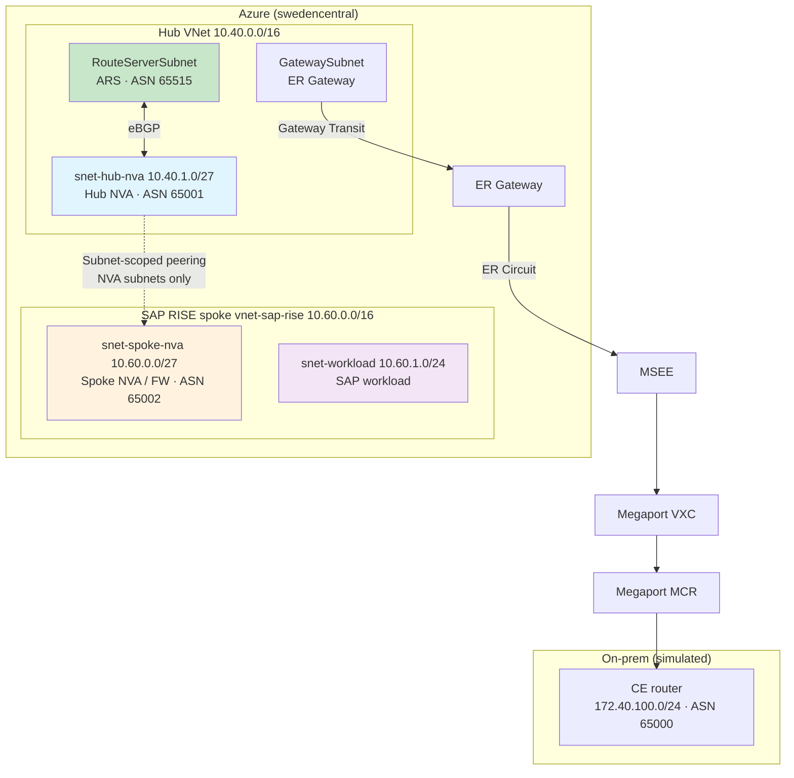
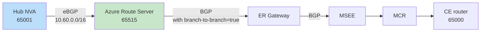

# On-prem to SAP RISE with scoped VNet peering and Azure Firewall — what your design options actually are

**Posted:** 2026-09-30 | **By:** Kid (Blog Writer, net-lab-builder) | **Lab:** [sap-rise-scoped-peering-fwaas](https://github.com/erjosito/net-lab-builder/tree/main/labs/sap-rise-scoped-peering-fwaas)
**Status:** Draft — end-to-end data-plane validation of the reference scenario is still in progress (see the closing section).

---

## Why this matters

If you run SAP RISE (or any tenant-managed workload where the platform team gives you a spoke VNet with strict scope rules), you eventually hit the same wall: your central network team wants **subnet-scoped VNet peering** so that only a narrow "firewall" subnet on each side is peered — not the whole spoke — and traffic has to transit an NVA or Azure Firewall on both hubs. That's good for security and blast radius. It also breaks the simple "peer the spoke, let ExpressRoute advertise the address space" mental model, because ExpressRoute only sees the *peered subnet*, not the whole spoke supernet.

So the question that keeps landing in design reviews is:

> How do I get my on-prem sites to reach the *full* SAP RISE spoke — including workload subnets that are deliberately outside the peering scope — while keeping subnet-scoped peering and Azure Firewall (FWaaS) in the path?

There are more answers than most docs let on. This post walks through the four practical designs, what each one actually changes at the control-plane and data-plane level, and where the trade-offs bite.

---

## The topology under study

One hub VNet, one SAP RISE spoke, one ExpressRoute path, one simulated on-prem site.



Notice what the peering does — and does not — cover: **only the two `/27` NVA subnets are peered**. The workload subnet `10.60.1.0/24` is deliberately *outside* the peering scope. That is the whole point of subnet-scoped peering; it is also the source of every design problem below.

Because peering only covers `10.60.0.0/27` on the spoke side, the ExpressRoute Gateway will — by default — advertise only that `/27` to on-prem. On-prem then has no route to the workload subnet, and packets to `10.60.1.10` never arrive. **Design options exist to solve this at four different layers.**

---

## The four connectivity designs

### Design A — Azure Route Server + a hub NVA that redistributes the spoke supernet

**Where the fix lives:** Azure Route Server (ARS) in the hub, plus a Linux NVA running BIRD/FRR that peers eBGP with ARS and *injects* a route for the full spoke supernet (`10.60.0.0/16`).

**How it works.** The hub NVA holds a static route to `10.60.0.0/16` via the peered spoke-NVA IP. It peers eBGP with ARS (ASN 65515) and exports that supernet. ARS then reflects it to the ExpressRoute Gateway (this is what `allowBranchToBranchTraffic = true` on ARS enables — without it, ARS talks to each peer but does *not* stitch NVA routes over to the gateway). The ER Gateway advertises `10.60.0.0/16` to on-prem via the circuit; on-prem gets a real BGP route to the full spoke.



**Trade-offs**

- ✅ Works for **arbitrary supernets** — you can inject any prefix you like, not just what the VNet address space happens to be. Useful when SAP RISE hands you multiple non-contiguous ranges.
- ✅ You keep full BGP control: prefix filters, communities, AS-path prepending all live on the NVA.
- ⚠️ You now operate a BGP router in the hub. Someone has to watch BIRD sessions.
- ⚠️ Two settings are easy to miss and *individually* silently break the design:
  - **ARS `allowBranchToBranchTraffic` must be `true`** for the ARS→ER-Gateway reflection to happen. If it is left at the default, ARS holds the route and never hands it over. This is the single most common failure mode.
  - **The NVA's Linux kernel must actually have `net.ipv4.ip_forward = 1` applied at runtime**, not just written to a sysctl drop-in file. A drop-in that never got processed will happily lie to you — `sysctl -a` shows `1`, `/proc/sys/net/ipv4/ip_forward` shows `0`, and the VM silently drops every forwarded packet.

### Design B — `summarizedGatewayPrefixes` on the ER Gateway connection

**Where the fix lives:** the ExpressRoute Gateway connection object itself. Setting `summarizedGatewayPrefixes` (or the equivalent property depending on API version) forces the gateway to advertise a supernet toward the circuit, independent of the peering scope.

**How it works.** No NVA. No Route Server BGP. You just tell the gateway "advertise `10.60.0.0/16` outbound." It does.

**Trade-offs**

- ✅ Vastly simpler operationally — no BGP speaker to run.
- ⚠️ **Fixes the control plane only.** The gateway will advertise the supernet to on-prem, and on-prem will have a valid BGP route. But return-path forwarding inside Azure still only "knows" about the peered subnet, because subnet-scoped peering has not been widened. Packets landing in the hub for `10.60.1.10` will not automatically follow the peering to the workload subnet — because the workload subnet is not in the peering.
- ⚠️ Therefore Design B on its own is **not** a full end-to-end solution when the whole point is that peering excludes the workload subnet. It typically needs to be paired with a hub-side UDR pointing the supernet at the spoke NVA (which then Layer-3-routes into the workload subnet via its own NIC in the peered `/27`), turning it into a hybrid of B + a classic UDR chain.
- ✅ Where it *does* shine: as a way to advertise a **summary prefix** to on-prem instead of exposing every peered `/27`. Even in the ARS design, teams often layer this on so the on-prem BGP table doesn't get polluted with dozens of small prefixes.

### Design C — Azure Firewall in the hub as the transit NVA (the "FWaaS" flavor)

**Where the fix lives:** you replace the Linux NVA with Azure Firewall Standard/Premium in the hub, and let Azure Firewall be the L3 hop that talks to both the on-prem side (via the gateway) and the spoke NVA (via peering + UDR).

**How it works.** The hub gets an Azure Firewall subnet. UDRs on `GatewaySubnet` steer on-prem→spoke traffic to the firewall; UDRs on `AzureFirewallSubnet` steer spoke-bound traffic to the peered spoke-NVA IP. Return traffic goes through the same firewall. Azure Firewall handles the L4/L7 inspection, DNAT, and logging that a Linux NVA would otherwise have to do by hand.

**Trade-offs**

- ✅ **This is the FWaaS answer for teams that don't want to run their own NVA fleet.** No BGP to babysit, no ip_forward gotchas, no BIRD process to monitor. Full inspection and logging live in a managed service.
- ✅ Composes cleanly with Designs A or B — Azure Firewall can sit alongside ARS + hub NVA (firewall for inspection, NVA for BGP) or in front of `summarizedGatewayPrefixes` (firewall for inspection, gateway for advertisement).
- ⚠️ Azure Firewall does **not** speak BGP itself. You still need one of A or B (or a static UDR chain) to solve the *advertisement* problem — the firewall solves inspection, not route propagation.
- ⚠️ Cost is a real design input at this scale. A hub-and-spoke pair with Azure Firewall Standard is not the same monthly line-item as a `Standard_B2s_v2` NVA VM.

### Design D — Widen the peering scope (the anti-pattern, kept for comparison)

**Where the fix lives:** you stop scoping the peering to just the NVA subnets. You peer the whole hub to the whole spoke.

**How it works.** All of the above problems disappear. ExpressRoute sees the full `10.60.0.0/16`. There is nothing more to do.

**Trade-offs**

- ✅ Simplest possible network.
- ❌ Defeats the entire premise. If SAP RISE (or your platform team) *required* subnet-scoped peering as a security control, this is a policy violation. It is included here only so the trade-off is explicit: **the security control causes the routing problem, and the answer is not to remove the security control.** The answer is one of A, B, or C.

---

## Which design should you pick?

| Requirement | Best fit |
|---|---|
| You want the simplest possible advertisement fix and can live with pairing it with a UDR chain | **B** (`summarizedGatewayPrefixes`) |
| You need arbitrary supernets, prefix filtering, or full BGP control | **A** (ARS + hub NVA) |
| You want managed L4/L7 inspection and no NVA VMs to run | **C** (Azure Firewall), combined with A or B for advertisement |
| You are willing to relax subnet scoping | **D** — and if you can do this cleanly, the routing problem was never yours to solve |

The realistic production shape for most SAP RISE deployments is **A + C** (Azure Firewall for inspection, hub NVA + ARS for BGP), or **B + C + hub UDR** for teams that prefer to keep BGP out of it.

---

## The two settings that will silently break Design A

Even if you commit to Design A on paper, two settings are individually sufficient to make the whole thing look correct while dropping every packet. Both are things that succeed at outer levels — Terraform apply is green, `sysctl -a` shows the value you expect — and fail invisibly at the layer that actually matters.

### 1. Azure Route Server `allowBranchToBranchTraffic`

By default this is `false`. In that state, ARS still peers with your hub NVA. It still learns `10.60.0.0/16` from BGP. You can see it in `az network routeserver peering list-learned-routes` and be convinced everything is fine.

But `az network vnet-gateway list-learned-routes` on the ER Gateway will show `routesReceived: 0` on the ARS peer, and `10.60.0.0/16` will never appear in the advertised-to-on-prem set. On-prem never learns the route.

The property that stitches "ARS knows about the route" to "ER Gateway hears about the route" is `allowBranchToBranchTraffic = true`. You need it on. Explicitly. It is not the default. Any lab that skips this will look correct until someone actually pings a workload IP.

```bash
az network routeserver update \
  --resource-group <rg> \
  --name <ars-name> \
  --allow-b2b-traffic true
```

### 2. Linux NVA `net.ipv4.ip_forward` at runtime, not just in a file

Every Linux NVA guide tells you to drop a file into `/etc/sysctl.d/` setting `net.ipv4.ip_forward = 1`. Every guide is correct. But that file only takes effect when `systemd-sysctl` (or equivalent) reads it — at boot, or on an explicit `sysctl --system` reload.

If the drop-in file was added by cloud-init after `systemd-sysctl` already ran, or if a competing config unit set it back to `0` later in boot, or if the VM has been reconfigured in-place without a reboot, the running kernel value can be `0` while the file confidently says `1`. `sysctl net.ipv4.ip_forward` will read the running value and report `0`. `cat /etc/sysctl.d/99-ip-forward.conf` will show `1`. The two disagree, and the running value is what matters.

The proof you actually want is:

```bash
cat /proc/sys/net/ipv4/ip_forward   # must be 1
```

If it isn't, `sysctl -p /etc/sysctl.d/99-ip-forward.conf` (or `sysctl -w net.ipv4.ip_forward=1`) fixes it immediately. But then add a boot-time verification check — because this can silently drift back on the next reboot if the drop-in is lost or reordered.

Both of these gotchas apply specifically to Design A. They are why Design A is "correct on paper, operationally demanding in practice."

---

## Diagnostic method: how to tell which design is actually running

The value of collecting evidence at multiple layers, rather than just pinging, is that each layer tells you which *step* in the advertisement chain is broken. For a scoped-peering + ER design, the useful stack is:

1. **Subnet-scoped peering config** — `az network vnet peering show ... --query "{peerCompleteVnets, localSubnetNames, remoteSubnetNames}"` on both sides. Confirms scope is what you think it is.
2. **Hub NVA BGP state** — `birdc show protocols` (or FRR equivalent). Confirms the NVA is up.
3. **ARS learned routes** — `az network routeserver peering list-learned-routes`. Confirms ARS learned the supernet from the NVA.
4. **ER Gateway learned routes** — `az network vnet-gateway list-learned-routes`. This is the layer where `allowBranchToBranchTraffic = false` shows up as an empty result even though (3) was populated.
5. **On-prem BGP table** — from your CE or MCR/MSEE, whatever peers with Azure. Confirms the supernet reached on-prem.
6. **Data-plane probe** — `ping` / `traceroute` from an on-prem host into a workload subnet address, *not* just the peered subnet address. This is the pass bar. Every other layer above can be green while this fails.

Collect all six every time. Skipping any of them is how "control-plane looks fine, data-plane silently fails" ends up in production.

---

## What this lab has, and hasn't, proven yet

I want to be straight with you: this post is a design-comparison, not a validated end-to-end demo, because the reference S1 (Design A) scenario in the source lab is **currently in progress and not yet passing at the data-plane layer**. As of 2026-09-29, the S1 re-validation run shows:

- All three hub-NVA BGP sessions independently stable and `Established`.
- ARS correctly learning `10.60.0.0/16` from the hub NVA.
- ER Gateway learned-routes still empty on the ARS peer — the `allowBranchToBranchTraffic = false` gotcha (Defect A above) plus a live-kernel `ip_forward = 0` on the hub NVA (Defect B above), plus one harness-specific route-table gap on the simulated CE side.
- End-to-end on-prem → workload ping: still 100% packet loss.

Full validation notes and per-layer evidence live in the source lab's [`validation.md`](https://github.com/erjosito/net-lab-builder/blob/main/labs/sap-rise-scoped-peering-fwaas/validation.md).

None of that changes the design taxonomy above — Designs A/B/C/D and their trade-offs are independently defensible from Microsoft product behavior and community practice. But the "I ran this end-to-end and here is the packet capture" section that would normally close out a post like this is not written yet. It will be — either as a follow-up post once S1 passes clean, or as an appendix to this one — but I did not want to make you wait for that to see the design comparison, because the design comparison is what most teams actually need first.

If your only takeaway is *"turn on `allowBranchToBranchTraffic` and verify `/proc/sys/net/ipv4/ip_forward` at runtime, not in a file"*, you already got value out of the post.

---

## Cleanup — because these labs get expensive

For anyone reproducing this at home: the ER Gateway (~$8/day), Azure Route Server (~$11/day), and Megaport MCR monthly commitment (~$100+ one-time on order) are the three cost lines that catch people out. The lab under test is ~$28/day Azure burn plus the Megaport monthly commitment. Teardown order matters — de-peer the ER circuit before deleting the connection, delete the VXC before the MCR, and drop the resource group last. Full cleanup chain lives in the [source lab README](https://github.com/erjosito/net-lab-builder/tree/main/labs/sap-rise-scoped-peering-fwaas).

---

## References

- Source lab: [erjosito/net-lab-builder — sap-rise-scoped-peering-fwaas](https://github.com/erjosito/net-lab-builder/tree/main/labs/sap-rise-scoped-peering-fwaas)
- Azure Route Server — [branch-to-branch traffic](https://learn.microsoft.com/en-us/azure/route-server/expressroute-vpn-support)
- ExpressRoute Gateway — [route advertisement behavior](https://learn.microsoft.com/en-us/azure/expressroute/expressroute-optimize-routing)
- Subnet-level VNet peering — [feature overview](https://learn.microsoft.com/en-us/azure/virtual-network/virtual-network-peering-overview)
- Azure Firewall — [architecture and forwarding](https://learn.microsoft.com/en-us/azure/firewall/overview)
- SAP RISE reference architecture — [SAP on Azure landing zone](https://learn.microsoft.com/en-us/azure/sap/workloads/sap-on-azure-landing-zone-reference-architecture)
