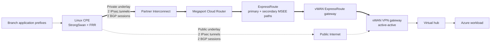
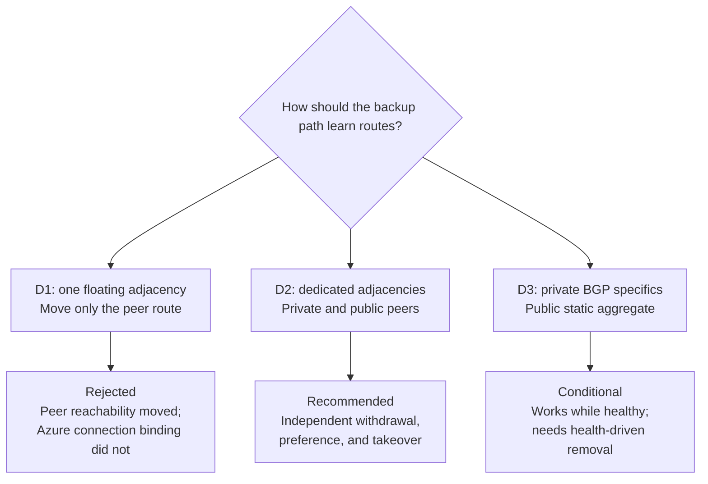
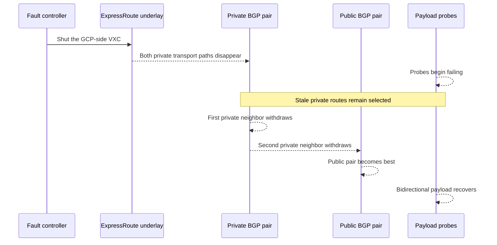
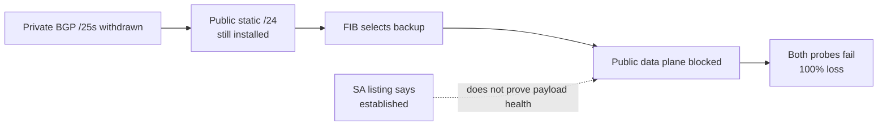

# Backing Up Azure Virtual WAN IPsec over ExpressRoute with Internet VPN

*A live cross-cloud test of three routing designs—and why independent BGP adjacencies are the one to take into production.*

## The decision

If you carry an IPsec tunnel over ExpressRoute and want an Internet IPsec tunnel as backup, build **dedicated BGP adjacencies for each transport**.

Do not try to float one unchanged BGP adjacency between the private and public tunnels. Moving the route to the peer is not enough: Azure Virtual WAN still associates the remote BGP identity with a particular VPN connection. Under complete ExpressRoute loss, the CPE's TCP/179 SYNs crossed the public IPsec tunnel, but Azure did not answer them.

A static aggregate over the public tunnel can also provide backup while that tunnel is healthy. It is not, however, a health signal. In the lab, the static route remained selected after its data plane was blocked and the private BGP routes were withdrawn. Traffic was blackholed even though every IPsec security association still appeared established.

The production-oriented result is therefore:

1. Use separate private and public BGP sessions.
2. Apply deterministic preference in both directions.
3. Set convergence objectives from measured failure detection, not from the provider link's administrative state.
4. If static routes are unavoidable, remove them through health automation that tests the real forwarding path.

This post summarizes the sanitized lab evidence. Supporting public documentation
and source-publication status are collected in [references.md](./references.md).

## The unusual topology: VPN over two different underlays

This was not a conventional choice between ExpressRoute and VPN routes. Both candidate paths were **site-to-site VPN overlays** terminating on the same active-active Virtual WAN VPN gateway:

- The primary pair of IPsec tunnels used ExpressRoute as their underlay.
- The backup pair used the public Internet as their underlay.
- BGP ran inside the IPsec tunnels.
- Application prefixes existed only in the overlay; ExpressRoute did not carry them in clear text.

The CPE was a StrongSwan and FRR appliance in Google Cloud. Its private endpoint reached Azure through Partner Interconnect, a Megaport Cloud Router, two Azure ExpressRoute paths, and a Virtual WAN ExpressRoute gateway. Its public endpoint reached the same Virtual WAN VPN gateway through the Internet.



This distinction between **underlay** and **overlay** is essential:

- The underlay answers, "Can the IPsec endpoints reach each other?"
- IPsec answers, "Is the encrypted tunnel usable?"
- BGP answers, "Should the application route remain installed?"
- The payload test answers, "Can an application packet complete the round trip?"

Those layers do not necessarily fail at the same time. A provider can report a VXC down while BGP retains stale routes. An IPsec SA can remain listed while a filtered data plane drops every packet. A static route can remain installed indefinitely because it has no protocol neighbor to withdraw it.

## Three designs, three different failure semantics

The lab kept the four IPsec slots and their pre-shared keys unchanged after a one-time synchronization. D1, D2, and D3 changed only routing and BGP state. That invariant matters: the results compare control-plane designs, not different tunnel configurations.



### D1: why a floating BGP adjacency fails

D1 tried to preserve one ordinary BGP tuple while moving only the CPE route to the Azure neighbor between XFRM interfaces.

At first, this looked promising. While ExpressRoute was still available, moving the peer route to the public tunnel kept the session working. Packet capture revealed why: the request left through public IPsec, but Azure still had ExpressRoute reachability for the return path. The apparent "float" was asymmetric.

The decisive test removed the complete ExpressRoute transport while leaving Internet VPN operational. The CPE had only the intended floating identity, and its host route to the Azure BGP peer pointed through the public XFRM interface. Captures repeatedly showed:

```text
CPE floating identity -> Azure BGP peer: TCP SYN, destination port 179
Azure BGP peer -> CPE floating identity: no response
```

FRR remained in `Connect`. No SYN-ACK arrived.

The result exposes the difference between **routing to a BGP endpoint** and **owning that peer on a managed connection**. The CPE could redirect packets into another healthy tunnel, but Azure did not transfer the remote BGP identity from the ExpressRoute-backed VPN connection to the Internet-backed VPN connection.

This is the general lesson from D1:

> A BGP adjacency cannot be assumed portable merely because its endpoint addresses are reachable through another tunnel.

Managed gateways have configuration-plane identity and connection binding in addition to packet forwarding. A design that depends on that binding moving at failure time needs an explicit platform mechanism to move it. D1 had none.

### D2: independent adjacencies make failure explicit

D2 assigned a different BGP control plane to each path class:

- Two private sessions used the VPN-over-ExpressRoute tunnels.
- Two custom APIPA sessions used the Internet VPN tunnels.
- Private routes received local preference `200` at the CPE.
- Public routes received local preference `100`.
- Advertisements toward Azure used AS-path prepending on the public sessions so that Azure also preferred the private overlay.

This produced four established sessions in the validated D2 baseline. Equal-cost paths were allowed within the private pair and within the public pair, but never across private and public transports.

That separation solves the D1 problem. Azure does not need to reinterpret one peer identity. The public connection already owns its own BGP sessions, and those sessions can remain established while private transport is healthy.

## What full ExpressRoute loss looked like

The complete private-underlay fault was injected by directly shutting the single Megaport VXC on the Google Cloud side. That one operation removed both MSEE paths while preserving Internet access. It was a cleaner fault than changing the CPE, disabling BGP manually, or applying a broad infrastructure plan.

The public BGP sessions remained established throughout. The private routes, however, did not disappear when the provider object first changed state. They remained stale until transport and BGP failure detection completed.



The measured sequence was:

| Event | Approximate time |
| --- | ---: |
| First failed payload probe | `17:51:55Z` |
| First private neighbor withdrew | `17:54:02Z` |
| Second private neighbor withdrew; public became best | `17:54:15Z` |
| Observed stale-private-path outage | About 140 seconds |

The important number is not the VXC shutdown time. It is the interval between the first payload failure and the route change that restored payload.

This was a failure-detection result, not an intrinsic promise from Azure Virtual WAN, ExpressRoute, StrongSwan, FRR, or Megaport. Different DPD, TCP, and BGP timers—and different failure modes—can produce different convergence. Production objectives should be based on repeated measurements of the failures that matter, with the chosen timer policy documented.

### Failback

After the VXC was restored, both provider paths and the ExpressRoute underlay returned. Azure initiated fresh private IKE, but the CPE initially could not match the inbound initiator to a loaded shared key. The test did not rotate a secret or alter StrongSwan.

Initiating the already-configured private children from the CPE recovered both private SAs. The two private BGP sessions then established, private preference won again, and five payload probes completed with 0% loss.

The routing design therefore passed both takeover and failback without changing a PSK or StrongSwan configuration. Operationally, however, the restore also demonstrates that "the circuit is back" and "the preferred overlay is back" are separate milestones.

## D3: longest-prefix preference works, but static health does not

D3 tested a tempting simplification:

- Advertise two `/25` specifics over private BGP.
- Configure a covering static `/24` on the public VPN connection.
- Use a high-distance public static route in the reverse direction.

While private BGP was healthy, longest-prefix match selected the `/25`s. When private BGP was deliberately withdrawn and the Internet tunnel was healthy, the public `/24` carried the traffic successfully.

Then the failure order was reversed:

1. Block public IKE, NAT-T, and ESP transport.
2. Confirm private BGP still carried both application probes.
3. Withdraw the private BGP sessions.
4. Observe the selected public static route and payload.

Both probes failed with 100% loss. The static route remained installed and selected. All four SAs still appeared established, while the public-fault packet counter increased.

This is exactly the failure mode that a routing table alone cannot diagnose:



A static route is configuration, not liveness. An SA listing is state, not an end-to-end service check. Production use of this pattern needs an external controller that probes the actual path and removes the static route when the backup cannot carry traffic. It also needs conservative restoration logic to avoid route flapping.

## Operational implications

### Prefer explicit path ownership

The robust design gives each transport its own peer addresses, sessions, policy, and failure state. That makes withdrawal meaningful and troubleshooting bounded. You can answer:

- Which transport owns this neighbor?
- Which session learned this route?
- Which path is preferred in each direction?
- Did the route withdraw when its transport failed?

With a floating identity, those questions become ambiguous at the exact moment when clarity matters.

### Engineer both directions

Private preference was implemented independently:

- At the CPE, local preference favored private-learned Azure routes.
- Toward Azure, AS-path prepending made public advertisements less attractive.

Solving only one direction risks asymmetric traffic, stateful-firewall surprises, or a test that appears healthy because the return path is still using the primary transport—as D1 demonstrated before full ExpressRoute loss.

### Tune and test convergence deliberately

The roughly 140-second interruption was dominated by stale private-path detection. If that exceeds the recovery objective, possible responses include reviewed BGP timer changes, BFD where the complete platform path supports it, stronger tunnel liveness, or application-level retry and redundancy.

Do not tune one timer in isolation. Aggressive values can turn transient packet loss into session churn, and a fast BGP withdrawal does not help if the underlying tunnel or managed gateway retains stale state elsewhere.

### Treat routing-mode changes as maintenance events

There is one final caveat. After D3, the Azure public connection was switched from static mode back to D2 BGP mode without re-establishing the public SAs. The custom APIPA configuration was still present, and the CPE's SYNs crossed both public XFRM interfaces, but Azure did not answer them.

The live final state therefore must **not** be described as four established BGP sessions. It had four IPsec SAs, the two private BGP adjacencies, private best-path selection, and healthy payload; the public APIPA BGP listeners had not resumed.

That later mode-switch behavior does not invalidate the earlier completed D2 failure and failback test, which began with four established sessions and proved public takeover. It does mean that changing a live connection between static and BGP modes should have its own maintenance procedure, including tunnel re-establishment and validation, rather than being treated as a harmless route-only edit.

## Practical design checklist

For a similar deployment:

- [ ] Build separate VPN connections or links for private and public transport identity.
- [ ] Give each path class dedicated BGP peer addresses.
- [ ] Verify all active-active sessions individually.
- [ ] Pin IKE endpoint routes to the intended underlay to prevent recursion.
- [ ] Keep application prefixes out of the clear-text ExpressRoute underlay.
- [ ] Apply private-over-public preference in both directions.
- [ ] Prevent ECMP across unlike path classes.
- [ ] Test complete private-underlay loss, not only a BGP shutdown.
- [ ] Measure first packet loss, route withdrawal, recovery, and failback separately.
- [ ] Test compound failures with the backup broken before the primary.
- [ ] Do not equate installed static routes or listed SAs with payload health.
- [ ] Revalidate or re-establish tunnels after changing a connection's routing mode.

## Bottom line

An Internet VPN can back up IPsec over ExpressRoute in Azure Virtual WAN, but the reliable unit of failover is the **adjacency**, not merely the route to a peer.

Dedicated per-tunnel BGP sessions survived complete ExpressRoute loss and provided deterministic failback. One floating adjacency failed because Azure's peer identity remained bound to the private connection. A static aggregate worked only until the backup data plane failed silently.

Make each transport own its control plane, measure how stale routes disappear, and let health—not configuration presence—decide whether a backup route deserves to stay installed.
