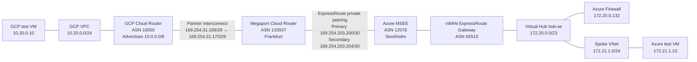
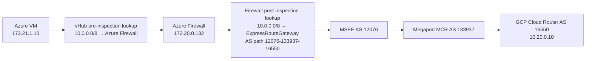

# What Happens When On-Premises Advertises `10.0.0.0/8` to Azure Virtual WAN?

*A live ExpressRoute lab showing how the same `10.0.0.0/8` prefix is represented at the MSEE, Virtual WAN hub, and Azure Firewall before and after Private Routing Intent.*

## Executive summary

This lab answers a narrow question:

> If an on-premises network advertises `10.0.0.0/8` through ExpressRoute, what routes should a network administrator expect to see at the MSEE, Virtual WAN hub, and Azure Firewall after enabling Private Routing Intent?

The live result is:

1. **MSEE continues to learn the real on-premises `10.0.0.0/8` BGP route.** Enabling Private Routing Intent does not replace it with an Azure-generated RFC1918 advertisement.
2. **The hub forwarding view uses the Routing Intent policy route.** Traffic from a spoke toward `10.0.0.0/8` is sent to Azure Firewall.
3. **Azure Firewall receives a post-inspection route for the same `10.0.0.0/8`.** Its effective route points to the ExpressRoute gateway and retains the on-premises AS path.

In other words, the same prefix appears at two forwarding stages for two different purposes:

- Before inspection: `10.0.0.0/8 -> Azure Firewall`
- After inspection: `10.0.0.0/8 -> ExpressRoute gateway`

This is expected and is not a duplicate-route fault.

All route tables and traffic-test outputs used in this post are available in [`raw-output`](./raw-output/). Supporting documentation is listed in [`references.md`](./references.md).

## Scope

The goal is an archetypical reference design, not a reproduction of one customer's private-AS topology.

The primary test uses one Virtual WAN hub and one ExpressRoute circuit. That is sufficient to document the route at the three important observation points:

- ExpressRoute MSEE route table
- Virtual WAN hub and connection effective routes
- Azure Firewall effective routes

VPN and a second hub are useful for separate failover and inter-hub questions, but they are not required to explain the fundamental `10.0.0.0/8` Routing Intent behavior.

## Lab topology



The GCP subnet is only `10.20.0.0/24`. Cloud Router is configured to advertise the synthetic aggregate `10.0.0.0/8`, which lets the lab test the routing behavior without allocating an actual `/8`.

## Addressing and ASNs

| Component | Address or prefix | ASN |
|---|---:|---:|
| GCP VPC subnet | `10.20.0.0/24` | — |
| Advertised on-premises summary | `10.0.0.0/8` | Originated by `16550` |
| GCP Cloud Router | `169.254.31.169/29` | `16550` |
| Megaport MCR | `169.254.31.170/29` | `133937` |
| Azure MSEE | ER private-peering interfaces | `12076` |
| Virtual WAN gateways | Azure-managed | `65515` |
| Virtual hub | `172.20.0.0/23` | — |
| Azure Firewall | `172.20.0.132` | — |
| Azure spoke | `172.21.1.0/24` | — |
| Azure test VM | `172.21.1.10` | — |

## Observation point 1: MSEE before the circuit is attached to the vHub

The Partner Interconnect and ExpressRoute private peering were established before the ExpressRoute circuit was connected to the Virtual WAN hub.

Both MSEE paths learned:

```text
Network       Next hop          AS path
10.0.0.0/8    169.254.203.201   133937 16550 ?
10.0.0.0/8    169.254.203.205   133937 16550 ?
```

This is the expected provider-to-customer path:

```text
GCP Cloud Router ASN 16550
        |
Megaport MCR ASN 133937
        |
Azure MSEE ASN 12076
```

ASN `12076` does not appear in the path displayed by the MSEE because `12076` is the local ASN at that observation point.

## Observation point 2: MSEE after attaching ExpressRoute to the vHub

After the ExpressRoute connection was created on the Virtual WAN ExpressRoute gateway, the original `10.0.0.0/8` route remained unchanged:

```text
Network       Next hop          AS path
10.0.0.0/8    169.254.203.201   133937 16550 ?
10.0.0.0/8    169.254.203.205   133937 16550 ?
```

The MSEE also began receiving Azure routes from both active-active gateway instances:

```text
Network          Next hop       AS path
172.20.0.0/23    172.20.0.14    65515 I
172.20.0.0/23    172.20.0.15    65515 I
172.21.1.0/24    172.20.0.14    65515 I
172.21.1.0/24    172.20.0.15    65515 I
```

This is an important interpretation point:

- Two `65515` paths can simply be the two Virtual WAN gateway instances.
- The MSEE's local ASN `12076` is not included in its own route-table AS path.
- ASN `65515` does not by itself prove that a route came from a site-to-site VPN connection.

## Routing Intent disabled

Before enabling Routing Intent, the effective route associated with the hub default route table showed the on-premises route directly through ExpressRoute:

```text
Prefix:         10.0.0.0/8
Next hop type:  ExpressRouteGateway
AS path:        12076-133937-16550
Origin:         ergw-se
```

At this stage, Azure Firewall was deployed in the hub but was not the next hop for private traffic.

The AS path differs from the MSEE view because this observation point is on the Azure side of the MSEE:

```text
Virtual WAN hub view: 12076-133937-16550
MSEE view:                  133937-16550
```

## Routing Intent enabled

The lab then enabled a single Routing Intent policy:

```text
Policy:       PrivateTrafficPolicy
Destination:  PrivateTraffic
Next hop:     Azure Firewall afw-hub-se
```

Virtual WAN inserted this route into `defaultRouteTable`:

```text
Route name: _policy_PrivateTrafficPolicy
Destinations:
  10.0.0.0/8
  172.16.0.0/12
  192.168.0.0/16
Next hop:
  Azure Firewall afw-hub-se
```

### Stage 1: route used before inspection

The spoke connection effective routes became:

```text
Prefix          Next hop type    Next hop
10.0.0.0/8      Azure Firewall   afw-hub-se
172.16.0.0/12   Azure Firewall   afw-hub-se
192.168.0.0/16  Azure Firewall   afw-hub-se
```

For a packet leaving the Azure spoke toward `10.20.0.10`, the matching pre-inspection route is therefore:

```text
10.0.0.0/8 -> Azure Firewall
```

### Stage 2: route used after inspection

The Azure Firewall effective routes were queried through the Virtual Hub effective-routes API with resource type `AzureFirewalls`.

The firewall contained:

```text
Prefix:         10.0.0.0/8
Next hop type:  ExpressRouteGateway
AS path:        12076-133937-16550
Origin:         ergw-se
```

This confirms the expected two-stage forwarding model:



The policy route in the hub does not erase the learned BGP route. It changes the pre-inspection next hop. Virtual WAN separately programs the firewall with the route needed to forward the packet after inspection.

## What changed at MSEE after enabling Routing Intent?

Nothing changed for the on-premises `10.0.0.0/8` route.

MSEE still showed:

```text
Network       AS path
10.0.0.0/8    133937 16550 ?
```

The MSEE did **not** receive a new Azure-originated `10.0.0.0/8` route merely because Private Routing Intent was enabled.

This demonstrates the distinction between:

- An RFC1918 policy route inserted into the hub route table for traffic steering.
- A BGP route advertised over ExpressRoute.

They are not the same operation.

## Route-table comparison

| Observation point | Routing Intent off | Private Routing Intent on |
|---|---|---|
| MSEE, `10.0.0.0/8` | `133937 16550` | Unchanged: `133937 16550` |
| vHub route before inspection | ER gateway, `12076-133937-16550` | Static policy route to Azure Firewall |
| Spoke connection effective route | Direct hub-learned ER route | `10.0.0.0/8 -> Azure Firewall` |
| Azure Firewall effective route | Firewall not in private path | `10.0.0.0/8 -> ExpressRouteGateway`, `12076-133937-16550` |

## Data-plane validation

An Azure Firewall Standard policy allowed traffic between `172.16.0.0/12` and `10.0.0.0/8`. The test then exercised the route in both directions.

From the Azure VM at `172.21.1.10` to the GCP VM at `10.20.0.10`:

```text
4 packets transmitted, 4 received, 0% packet loss
rtt min/avg/max/mdev = 86.388/94.428/103.138/6.247 ms
Connection to 10.20.0.10 22 port [tcp/ssh] succeeded!
```

From the GCP VM at `10.20.0.10` to the Azure VM at `172.21.1.10`:

```text
4 packets transmitted, 4 received, 0% packet loss
rtt min/avg/max/mdev = 87.450/94.076/97.980/4.033 ms
Connection to 172.21.1.10 22 port [tcp/ssh] succeeded!
```

The route tables establish the forwarding chain; the bidirectional probes confirm that the programmed pre-inspection and post-inspection routes form a working data path.

## Commands used to collect the evidence

### MSEE primary and secondary route tables

```powershell
az network express-route list-route-tables `
  --resource-group lab-vwan-rfc1918-20260916 `
  --name er-vwan-rfc1918 `
  --peering-name AzurePrivatePeering `
  --path primary `
  --output json

az network express-route list-route-tables `
  --resource-group lab-vwan-rfc1918-20260916 `
  --name er-vwan-rfc1918 `
  --peering-name AzurePrivatePeering `
  --path secondary `
  --output json
```

### Hub route table

```powershell
az network vhub route-table show `
  --resource-group lab-vwan-rfc1918-20260916 `
  --vhub-name hub-se `
  --name defaultRouteTable `
  --output json
```

### Spoke connection effective routes

```powershell
$connectionId = az network vhub connection show `
  --resource-group lab-vwan-rfc1918-20260916 `
  --vhub-name hub-se `
  --name conn-spoke-se `
  --query id `
  --output tsv

az network vhub get-effective-routes `
  --resource-group lab-vwan-rfc1918-20260916 `
  --name hub-se `
  --resource-type HubVirtualNetworkConnection `
  --resource-id $connectionId `
  --output json
```

### Azure Firewall effective routes

The resource type is plural:

```powershell
$firewallId = az network firewall show `
  --resource-group lab-vwan-rfc1918-20260916 `
  --name afw-hub-se `
  --query id `
  --output tsv

az network vhub get-effective-routes `
  --resource-group lab-vwan-rfc1918-20260916 `
  --name hub-se `
  --resource-type AzureFirewalls `
  --resource-id $firewallId `
  --output json
```

Using `AzureFirewall` singular returns an empty table. Also, `az network firewall learned-ip-prefix` is not the routing table: it reports prefixes learned for Azure Firewall SNAT behavior.

## Operational interpretation

When troubleshooting a route such as `10.0.0.0/8`, first identify the observation point.

| Where the route is captured | What the route represents |
|---|---|
| MSEE route table | Routes exchanged on the ExpressRoute peering |
| vHub route table or spoke connection | The next hop selected before security inspection |
| Azure Firewall effective routes | The next hop selected after security inspection |

Without the observation point, AS-path comparisons can be misleading.

For example:

- `133937 16550` at MSEE is the external path received from Megaport and GCP.
- `12076-133937-16550` inside Virtual WAN includes the MSEE ASN.
- Two `65515` paths at MSEE can represent advertisements from the two active-active Virtual WAN gateway instances.

## Conclusion

If on-premises advertises `10.0.0.0/8` over ExpressRoute and Private Routing Intent is enabled:

1. The on-premises BGP route remains present at MSEE.
2. The hub installs its RFC1918 policy route to Azure Firewall for pre-inspection forwarding.
3. Azure Firewall receives the original `10.0.0.0/8` route through the ExpressRoute gateway for post-inspection forwarding.
4. Private Routing Intent alone does not advertise a new RFC1918 aggregate toward ExpressRoute.

For this question, one ExpressRoute circuit and one secured Virtual WAN hub are enough. A VPN path or second hub is useful only when the test objective expands to transport preference, failover, or inter-hub propagation.

---

**Evidence:** [`raw-output`](./raw-output/)  
**References:** [`references.md`](./references.md)
