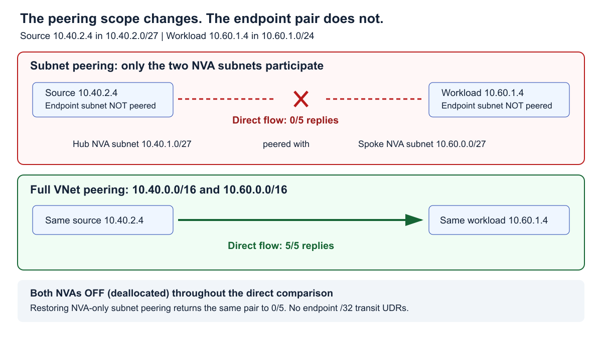
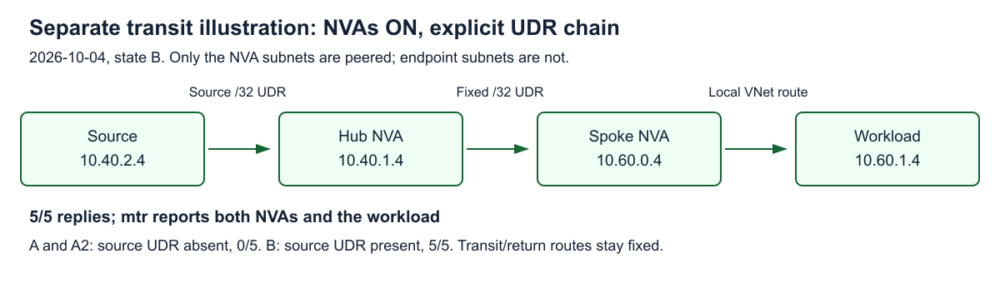

# Azure subnet peering prevents the direct path that full VNet peering allows

**Subnet peering prevented direct connectivity between the tested non-peered endpoint subnets; full VNet peering allowed it.** The same source VM sent five ICMP echo requests to the same workload in each state: **0 replies with NVA-only subnet peering, 5 with full VNet peering, then 0 after restoring subnet peering**. Both network virtual appliances (NVAs) were deallocated throughout this comparison. The successful full-peering exchanges therefore did not pass through either appliance.

That is the design-relevant difference: widening the peering can introduce a direct path around the appliances, even when the workload retains its default route toward an NVA. Subnet peering removes that direct endpoint-to-endpoint path in this test. Deliberately configured NVA transit is a separate possibility, illustrated later with an earlier experiment.

**Direct comparison:** 2026-10-05. **Separate transit illustration:** 2026-10-04. These are ICMP measurements, not application validation or a universal proof against every administrator-created bypass.

## One endpoint pair, three peering states

The source was `10.40.2.4` in hub subnet `10.40.2.0/27`; the workload was `10.60.1.4` in spoke subnet `10.60.1.0/24`. Neither endpoint subnet participates in the NVA-only subnet peering.

| State | Peering scope | Both NVAs | Ping | ICMP `mtr` |
|---|---|---|---|---|
| Subnet peering | `10.40.1.0/27` ↔ `10.60.0.0/27` | Deallocated | 0/5 | Header only |
| Full VNet peering | `10.40.0.0/16` ↔ `10.60.0.0/16` | Deallocated | 5/5 | One reported hop: `10.60.1.4`, five probes, 0% loss |
| Subnet peering restored | `10.40.1.0/27` ↔ `10.60.0.0/27` | Deallocated | 0/5 | Header only |

Notice what is absent from the successful path: there is no running NVA to forward the packet. This is stronger evidence than inferring a bypass merely because a traceroute does not display an appliance.



### What the comparison holds constant

- **Endpoints:** the same source and workload VMs, NICs and private IPs across all three states.
- **Source routing:** an associated but empty user-defined route (UDR) table.
- **Workload routing:** its existing `0.0.0.0/0` UDR configured as `VirtualAppliance 10.60.0.4`. No endpoint `/32` transit or return UDRs were present in this comparison.
- **Propagation:** BGP route propagation disabled on both endpoint route tables (`disableBgpRoutePropagation=true`).
- **Security:** the same narrow inbound ICMP allow on both endpoint network security groups (NSGs), priority 105, covering the four lab IPs. Creation and pre-removal snapshots match; the saved change record has no intervening NSG edits.
- **Forwarding controls:** hub NVA `10.40.1.4`, spoke NVA `10.60.0.4`, and the on-premises simulation VM were deallocated in the saved phase snapshots.
- **Peering permissions:** virtual network access and forwarded traffic allowed; gateway transit and remote-gateway use disabled in every state.

Changing peering type requires deleting and recreating the peering links. Scope was the only changed forwarding-policy setting; new service metadata and scope-derived address fields are consequences of recreation. This was not an in-place toggle of an existing link.

The source guest consistently reported `10.60.1.4 via 10.40.2.1 dev eth0 src 10.40.2.4`. Azure routing configuration was held fixed as described above. No corresponding per-state workload guest route snapshot was collected, so that is not an independently observed guest-routing control.

The spoke contains a Linux probe workload, not a validated SAP application. The VNet's `vnet-sap-rise` name comes from the source networking lab.

## Direct-path evidence

The following tables are selected **actual effective routes on the two endpoint NICs**. They are not four-NIC captures: the NVAs were deallocated. All displayed rows are `Active` except the explicitly marked system Internet defaults. Empty next-hop arrays are written `[]`.

The same bounded source commands were used in each state:

```bash
ip route get 10.60.1.4
timeout 10 ping -n -c 5 -W 1 10.60.1.4
timeout 18 mtr -n -r -c 5 --max-ttl 8 10.60.1.4
```

`mtr` uses ICMP by default here. A header-only report is not a measured `mtr` loss percentage and does not locate a drop. The loss percentages below come from `ping`.

### 1. Subnet peering: direct connectivity prevented

| NIC | Source | Prefix | Effective next-hop type | Next-hop IP | State |
|---|---|---|---|---|---|
| Source | Default | `10.40.0.0/16` | VnetLocal | `[]` | Active |
| Source | Default | `10.60.0.0/27` | VNetPeering | `[]` | Active |
| Source | Default | `10.0.0.0/8` | None | `[]` | Active |
| Source | Default | `0.0.0.0/0` | Internet | `[]` | Active |
| Workload | Default | `10.60.0.0/16` | VnetLocal | `[]` | Active |
| Workload | Default | `10.40.1.0/27` | VNetPeering | `[]` | Active |
| Workload | User | `0.0.0.0/0` | None | `10.60.0.4` | Active |
| Workload | Default | `0.0.0.0/0` | Internet | `[]` | Invalid |

The source's visible `10.60.0.0/27` does not contain workload `10.60.1.4`. Its longest matching route for that destination is `10.0.0.0/8`, next-hop type `None`. In the opposite table, `10.40.1.0/27` contains the hub NVA, **not** source `10.40.2.4`.

The workload default remains **configured** as `VirtualAppliance 10.60.0.4`, but Azure reports its **effective** next-hop type as `None` while that NVA is off. The retained IP alone is not evidence of forwarding.

```text
--- 10.60.1.4 ping statistics ---
5 packets transmitted, 0 received, 100% packet loss, time 4085ms

Start: 2026-10-05T08:15:05+0000
HOST: vm-hub-test                 Loss%   Snt   Last   Avg  Best  Wrst StDev
```

[Complete subnet-peering evidence](assets/enforcement/subnet.json): both endpoint effective tables, configured route tables, both peering directions, VM power and source output.

### 2. Full VNet peering: a direct path appears

| NIC | Source | Prefix | Effective next-hop type | Next-hop IP | State |
|---|---|---|---|---|---|
| Source | Default | `10.40.0.0/16` | VnetLocal | `[]` | Active |
| Source | Default | `10.60.0.0/16` | VNetPeering | `[]` | Active |
| Source | Default | `10.0.0.0/8` | None | `[]` | Active |
| Source | Default | `0.0.0.0/0` | Internet | `[]` | Active |
| Workload | Default | `10.60.0.0/16` | VnetLocal | `[]` | Active |
| Workload | Default | `10.40.0.0/16` | VNetPeering | `[]` | Active |
| Workload | User | `0.0.0.0/0` | None | `10.60.0.4` | Active |
| Workload | Default | `0.0.0.0/0` | Internet | `[]` | Invalid |

Now the source's `10.60.0.0/16` peering route covers the workload, and the workload's `10.40.0.0/16` peering route covers the source. Both are the longest active matches for the tested pair.

**The workload's default UDR does not force this exchange through its NVA.** The peering `/16` is more specific than `/0`; user-route preference does not mean a default UDR wins over a more-specific system peering route.

```text
--- 10.60.1.4 ping statistics ---
5 packets transmitted, 5 received, 0% packet loss, time 4059ms
rtt min/avg/max/mdev = 0.892/1.276/2.052/0.479 ms

Start: 2026-10-05T08:24:20+0000
HOST: vm-hub-test                 Loss%   Snt   Last   Avg  Best  Wrst StDev
  1.|-- 10.60.1.4                  0.0%     5    1.1   1.0   0.9   1.2   0.1
```

Five echo replies while both NVAs were deallocated establish that neither appliance forwarded these successful exchanges. The single reported destination hop corroborates that result; it is not the sole reason for it.

[Complete full-peering evidence](assets/enforcement/full.json), with the same observation points as the subnet-peering state.

### 3. Restore subnet peering: the direct path disappears

| NIC | Source | Prefix | Effective next-hop type | Next-hop IP | State |
|---|---|---|---|---|---|
| Source | Default | `10.40.0.0/16` | VnetLocal | `[]` | Active |
| Source | Default | `10.60.0.0/27` | VNetPeering | `[]` | Active |
| Source | Default | `10.0.0.0/8` | None | `[]` | Active |
| Source | Default | `0.0.0.0/0` | Internet | `[]` | Active |
| Workload | Default | `10.60.0.0/16` | VnetLocal | `[]` | Active |
| Workload | Default | `10.40.1.0/27` | VNetPeering | `[]` | Active |
| Workload | User | `0.0.0.0/0` | None | `10.60.0.4` | Active |
| Workload | Default | `0.0.0.0/0` | Internet | `[]` | Invalid |

Both endpoint tables return to the selected rows from state 1. Neither endpoint subnet is exported by the restored peering.

```text
--- 10.60.1.4 ping statistics ---
5 packets transmitted, 0 received, 100% packet loss, time 4083ms

Start: 2026-10-05T08:27:55+0000
HOST: vm-hub-test                 Loss%   Snt   Last   Avg  Best  Wrst StDev
```

[Complete restored-subnet evidence](assets/enforcement/restored.json). This reversal, with the successful full-peering control between the failures, is the central enforcement result.

## Can a visible route or a different UDR recreate the direct path?

Three ideas need to be distinguished: seeing a peering route, configuring a local-VNet next hop, and trying to configure a peering next hop.

### A visible NVA-subnet route is not a delivery guarantee

The source NIC really does show `10.60.0.0/27 → VNetPeering`, despite being outside the peered source subnet. That does **not** establish that a UDR could skip the hub NVA and successfully deliver to the spoke NVA.

Microsoft Learn's [subnet peering checks and limitations, item 4](https://learn.microsoft.com/en-us/azure/virtual-network/how-to-configure-subnet-peering#subnet-peering-checks-and-limitations) explicitly describes a route visible from a non-peered subnet to a peered subnet, while the packet "is dropped and doesn't reach the virtual machine." Route visibility and permitted delivery are different observations.

**This comparison does not test a UDR that skips only the hub NVA.** The result established here is the difference between direct endpoint reachability under subnet peering and full VNet peering.

### Remote `VnetLocal`: accepted configuration, effective `None`

With subnet peering in place, a source-table ARM PUT for remote workload `10.60.1.4/32`, next-hop type `VnetLocal`, was **accepted**. The configured route remained `VnetLocal`; it was not rejected by the service. The source NIC's effective route was:

| Source | State | Prefix | Effective next-hop type | Next-hop IP |
|---|---|---|---|---|
| User | Active | `10.60.1.4/32` | None | `[]` |

Ping returned 0/5. The decisive routing observation is **effective `None`**, not merely a failed round trip: the workload's return NVA was also off. This test does not turn an accepted remote `VnetLocal` configuration into a usable remote-local path.

[Configured route, full effective tables and probe](assets/enforcement/vnetlocal.json).

### `VNetPeering`: not a configurable UDR next-hop type

A separate ARM PUT requested the same `/32` with `nextHopType: VNetPeering`. The service rejected it. The saved CLI error contains:

```text
InvalidRequestFormat: Cannot parse the request.
InvalidJson: Error converting value "VNetPeering" to type
'Microsoft.WindowsAzure.Networking.Nrp.Frontend.Contract.Csm.Public.NextHopType'.
Path 'properties.nextHopType', line 1, position 73.
```

This is a reformatted excerpt; [the exact stderr and route-absence check](assets/enforcement/vnetpeering-rejection.json) are bundled. The subsequent table read was empty, and the PUT was not replayed. The CLI did not report a numeric HTTP status, so none is inferred here.

This matches [Azure routing documentation](https://learn.microsoft.com/en-us/azure/virtual-network/virtual-networks-udr-overview#user-defined-routes): you cannot specify **Virtual network peering** as a UDR next-hop type. A system effective-route label is not necessarily an accepted UDR value.

## Separate illustration: explicitly routed NVA transit can still work

The direct-path restriction is not a prohibition on all routed transit. An earlier **2026-10-04** experiment used running NVAs and an explicit transit/return route chain. It reused these IP addresses, but it is a separate deployment state, not part of the NVAs-off comparison above.

Only the NVA subnets were peered. A source `/32` UDR sent traffic to the local hub NVA; a fixed hub UDR sent it across subnet peering to the spoke NVA; the spoke's local VNet route reached the workload.



The fixed routes were:

| Subnet | Fixed route |
|---|---|
| Hub NVA | `10.60.1.4/32 → VirtualAppliance 10.60.0.4` |
| Spoke NVA | `10.40.2.4/32 → VirtualAppliance 10.40.1.4` |
| Workload | `10.40.2.4/32 → VirtualAppliance 10.60.0.4` |
| Workload | Existing `0.0.0.0/0 → VirtualAppliance 10.60.0.4` |

Both NVA NICs and Linux guests enabled forwarding. Peering permitted forwarded traffic; fixed NSG rules allowed the lab IPs. The hub guest's policy table `4242`, default via `10.40.1.1`, was selected for `10.60.1.4/32` and `10.60.0.4/32`, allowing Azure effective routing to handle those destinations. Pre-test NAT evidence showed an empty hub NAT table and spoke RFC 1918 exemptions; no NAT changes were recorded. [Archived prerequisites](assets/evidence/prerequisites.json) retain those setup observations.

### Historical A: no source UDR

Selected actual rows on **all four NICs** are below. All are `Active`; the workload's local-VNet and peering system routes are included, not just its UDRs.

| NIC | Source | Prefix | Next-hop type | Next-hop IP |
|---|---|---|---|---|
| Source | Default | `10.40.0.0/16` | VnetLocal | `[]` |
| Source | Default | `10.60.0.0/27` | VNetPeering | `[]` |
| Source | Default | `0.0.0.0/0` | Internet | `[]` |
| Source | Default | `10.0.0.0/8` | None | `[]` |
| Hub NVA | Default | `10.40.0.0/16` | VnetLocal | `[]` |
| Hub NVA | Default | `10.60.0.0/27` | VNetPeering | `[]` |
| Hub NVA | VirtualNetworkGateway | `10.60.0.0/16` | VirtualNetworkGateway | `10.40.1.4` |
| Hub NVA | User | `10.60.1.4/32` | VirtualAppliance | `10.60.0.4` |
| Spoke NVA | Default | `10.60.0.0/16` | VnetLocal | `[]` |
| Spoke NVA | Default | `10.40.1.0/27` | VNetPeering | `[]` |
| Spoke NVA | User | `10.40.2.4/32` | VirtualAppliance | `10.40.1.4` |
| Workload | Default | `10.60.0.0/16` | VnetLocal | `[]` |
| Workload | Default | `10.40.1.0/27` | VNetPeering | `[]` |
| Workload | User | `0.0.0.0/0` | VirtualAppliance | `10.60.0.4` |
| Workload | User | `10.40.2.4/32` | VirtualAppliance | `10.60.0.4` |

```text
5 packets transmitted, 0 received, 100% packet loss, time 4079ms
Start: 2026-10-04T17:47:24+0000
HOST: vm-hub-test                 Loss%   Snt   Last   Avg  Best  Wrst StDev
```

[Complete A tables and source output](assets/evidence/A.json).

### Historical B: source UDR through both NVAs

Only source route `10.60.1.4/32 → VirtualAppliance 10.40.1.4` was added. The same route selection is shown below, including the workload's local-VNet and peering system routes.

| NIC | Source | Prefix | Next-hop type | Next-hop IP |
|---|---|---|---|---|
| Source | Default | `10.40.0.0/16` | VnetLocal | `[]` |
| Source | Default | `10.60.0.0/27` | VNetPeering | `[]` |
| Source | Default | `0.0.0.0/0` | Internet | `[]` |
| Source | Default | `10.0.0.0/8` | None | `[]` |
| Source | User | `10.60.1.4/32` | VirtualAppliance | `10.40.1.4` |
| Hub NVA | Default | `10.40.0.0/16` | VnetLocal | `[]` |
| Hub NVA | Default | `10.60.0.0/27` | VNetPeering | `[]` |
| Hub NVA | VirtualNetworkGateway | `10.60.0.0/16` | VirtualNetworkGateway | `10.40.1.4` |
| Hub NVA | User | `10.60.1.4/32` | VirtualAppliance | `10.60.0.4` |
| Spoke NVA | Default | `10.60.0.0/16` | VnetLocal | `[]` |
| Spoke NVA | Default | `10.40.1.0/27` | VNetPeering | `[]` |
| Spoke NVA | User | `10.40.2.4/32` | VirtualAppliance | `10.40.1.4` |
| Workload | Default | `10.60.0.0/16` | VnetLocal | `[]` |
| Workload | Default | `10.40.1.0/27` | VNetPeering | `[]` |
| Workload | User | `0.0.0.0/0` | VirtualAppliance | `10.60.0.4` |
| Workload | User | `10.40.2.4/32` | VirtualAppliance | `10.60.0.4` |

```text
5 packets transmitted, 5 received, 0% packet loss, time 4006ms
rtt min/avg/max/mdev = 4.930/6.517/9.910/1.822 ms
Start: 2026-10-04T17:49:31+0000
HOST: vm-hub-test                 Loss%   Snt   Last   Avg  Best  Wrst StDev
  1.|-- 10.40.1.4                  0.0%     5    1.4   2.2   1.3   4.4   1.3
  2.|-- 10.60.0.4                  0.0%     5    2.7   2.8   2.6   3.0   0.2
  3.|-- 10.60.1.4                  0.0%     5    3.7   4.8   3.1  10.2   3.0
```

Both NVA hops are visible, each with five probes and 0.0% reported loss. [Complete B tables and source output](assets/evidence/B.json).

### Historical A2: source UDR removed

Removing that source route restored A's four NIC tables:

| NIC | Source | Prefix | Next-hop type | Next-hop IP |
|---|---|---|---|---|
| Source | Default | `10.40.0.0/16` | VnetLocal | `[]` |
| Source | Default | `10.60.0.0/27` | VNetPeering | `[]` |
| Source | Default | `0.0.0.0/0` | Internet | `[]` |
| Source | Default | `10.0.0.0/8` | None | `[]` |
| Hub NVA | Default | `10.40.0.0/16` | VnetLocal | `[]` |
| Hub NVA | Default | `10.60.0.0/27` | VNetPeering | `[]` |
| Hub NVA | VirtualNetworkGateway | `10.60.0.0/16` | VirtualNetworkGateway | `10.40.1.4` |
| Hub NVA | User | `10.60.1.4/32` | VirtualAppliance | `10.60.0.4` |
| Spoke NVA | Default | `10.60.0.0/16` | VnetLocal | `[]` |
| Spoke NVA | Default | `10.40.1.0/27` | VNetPeering | `[]` |
| Spoke NVA | User | `10.40.2.4/32` | VirtualAppliance | `10.40.1.4` |
| Workload | Default | `10.60.0.0/16` | VnetLocal | `[]` |
| Workload | Default | `10.40.1.0/27` | VNetPeering | `[]` |
| Workload | User | `0.0.0.0/0` | VirtualAppliance | `10.60.0.4` |
| Workload | User | `10.40.2.4/32` | VirtualAppliance | `10.60.0.4` |

```text
5 packets transmitted, 0 received, 100% packet loss, time 4088ms
Start: 2026-10-04T17:51:53+0000
HOST: vm-hub-test                 Loss%   Snt   Last   Avg  Best  Wrst StDev
```

[Complete A2 tables and source output](assets/evidence/A2.json). Comparing the twelve complete snapshots, ignoring ordering only, shows exactly one source-route addition and its removal. Route counts for source/hub NVA/spoke NVA/workload were `43/45/44/5`, then `44/45/44/5`, then `43/45/44/5`.

In these historical tables, BGP propagation was disabled on source, spoke NVA and workload, but enabled on the hub NVA. Its fixed `/32` outranked the propagated `/16`. The workload's visible remote system route was `10.40.1.0/27`, **not** the non-peered source subnet `10.40.2.0/27`. Its explicit return `/32` carried replies into the NVA chain.

The historical source also kept the same Linux gateway, `10.40.2.1`, in A/B/A2. Effective NIC routes, not a change to the source's Linux route, explain the difference. This demonstrates one deliberately configured transit path, not that both NVAs are unavoidable in every possible design.

## What to take into a design review

**Subnet peering enforced the tested direct-path boundary; full VNet peering removed it.** Keeping a default route toward an appliance did not preserve that boundary when full peering installed more-specific routes to the endpoint VNets.

Check the peering scope and both endpoint effective tables, including local-VNet and peering system routes, rather than reviewing UDRs alone. Distinguish a configured next-hop type from its effective result. And use a successful control: the NVAs-off full-peering test proves direct reachability that two failed pings alone could not.

These conclusions concern this endpoint pair and ICMP. No reverse-initiated test, reverse trace or TCP/UDP application result is claimed. The visible `/27` is not proof of the untested hub-only bypass hypothesis.

Before reproducing, check the current [subnet peering prerequisites and limitations](https://learn.microsoft.com/en-us/azure/virtual-network/how-to-configure-subnet-peering): the documentation checked on 2026-10-05 requires subscription allowlisting and lists supported configuration methods and VM-generation restrictions.

Independent saved-evidence verification confirmed restoration: original resource identities and scoped peerings restored, temporary source resources and test rules removed, and the four original VMs deallocated. Network configuration compared equal after excluding only ETags and three disk ownership timestamps. [New verification summary](assets/enforcement/verification.json) and [historical verification](assets/evidence/verification.json) are separate records.

## References

- [Configure subnet peering, including route-visibility limitations](https://learn.microsoft.com/en-us/azure/virtual-network/how-to-configure-subnet-peering)
- [Azure traffic routing, route selection and permitted UDR next-hop types](https://learn.microsoft.com/en-us/azure/virtual-network/virtual-networks-udr-overview)
- [Peering and service chaining](https://learn.microsoft.com/en-us/azure/virtual-network/virtual-network-peering-overview#service-chaining)
- [Evidence provenance, timestamps, sanitization and source lab](references.md)
