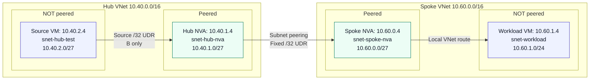

# Azure subnet peering: the same VM, one UDR, and two NVA hops

Keeping a subnet outside a peering relationship does not mean its VMs can never reach the other virtual network. In this test, the **same VM in a non-peered subnet** could not ping a workload in the other VNet until a user-defined route (UDR) sent its traffic through two network virtual appliances (NVAs). With that route, five pings succeeded and an ICMP `mtr` report showed both NVAs. Removing it brought the failure back.

**Tested:** 2026-10-04. **Scope:** controlled ICMP forwarding, not application validation or a proof that every bypass is impossible.

The useful distinction is between **which prefixes subnet peering exposes** and **which path an explicitly routed packet can take**. The endpoint subnets stayed outside the peering throughout this experiment. What changed was one route on the source subnet, not the source VM, the destination, or the peering scope.

## The result in one table

All three measurements originated on `vm-hub-test`, `10.40.2.4`, and targeted `vm-workload-probe`, `10.60.1.4`.

| State | Source-subnet route to `10.60.1.4/32` | Ping replies | ICMP `mtr` |
|---|---|---|---|
| A: without | Absent | 0 of 5 | Header only, no hop rows |
| B: with | `VirtualAppliance`, next hop `10.40.1.4` | 5 of 5 | `10.40.1.4` → `10.60.0.4` → `10.60.1.4` |
| A2: removed again | Absent | 0 of 5 | Header only, no hop rows |

The successful report identified the hub NVA, the spoke NVA, and the workload, each with five probes and `0.0%` reported loss. These are small diagnostic samples, not a latency benchmark or availability guarantee.

## Two peered NVA subnets, two non-peered endpoint subnets

Only `snet-hub-nva` and `snet-spoke-nva` participate in subnet peering. The diagram shows the forward path observed in B. Its first arrow depends on the source UDR; the remaining routing and forwarding configuration was already present in A.



The spoke VNet is named `vnet-sap-rise` in the source lab. Here it contains a Linux probe VM, not a validated SAP application deployment. This is a networking experiment, not SAP vendor guidance or an endorsed deployment design.

### What stayed fixed

“Without the source UDR” does **not** mean “without any UDRs.” To isolate the source route, both NVAs and the return path were prepared before A and left unchanged through B and A2:

| Subnet | Fixed Azure route | Purpose |
|---|---|---|
| `snet-hub-nva` | `10.60.1.4/32` → `VirtualAppliance 10.60.0.4` | Hub NVA forwards toward the spoke NVA |
| `snet-spoke-nva` | `10.40.2.4/32` → `VirtualAppliance 10.40.1.4` | Spoke NVA has a return route toward the hub NVA |
| `snet-workload` | `10.40.2.4/32` → `VirtualAppliance 10.60.0.4` | Workload replies enter the spoke NVA |

The workload's existing default UDR via `10.60.0.4` also remained present. The explicit return `/32` makes the route for this endpoint pair unambiguous.

Other prerequisites matter just as much as those three routes:

- **Forwarding:** both NVA NICs permit IP forwarding, and both Linux guests have `net.ipv4.ip_forward = 1`. Peering must allow the forwarded traffic, and appliance firewall policy must permit the flow.
- **Network security groups (NSGs):** narrow allows for the four lab IPs, covering ICMP and TCP port 22, were fixed across the experiment. The TCP allow is configuration, not evidence of successful TCP connectivity.
- **Guest routing:** the hub NVA uses policy table `4242`, with a default route via its local Azure gateway, `10.40.1.1`. Destination rules for `10.60.1.4/32` and `10.60.0.4/32` select that table. This keeps those packets off the existing BIRD remote-`onlink` route and lets Azure apply the NIC's effective routes. The guest policy was constant in all three states.
- **No NAT for this private pair:** the hub's pre-test NAT table is empty; the spoke's rules exempt RFC 1918 destinations before its public-destination masquerade rule. The change ledger contains no NAT changes. These are setup observations, not per-phase packet captures.
- **No propagated route on the source:** its associated route table has `disableBgpRoutePropagation=true` in A, B, and A2. ExpressRoute and Azure Route Server are not the path under test. The hub NVA's full table still contains a propagated `/16`, but its fixed workload `/32` is more specific.

[Sanitized prerequisite evidence](assets/evidence/prerequisites.json) includes the relevant setup entries and both NVA guest snapshots.

## Without the source UDR

### Effective routes on all four NICs

These are selected rows from the A snapshots, not reconstructed route tables. All rows below have `state=Active`. A single IP in the last column represents the one-element `nextHopIpAddress` array; `[]` means the captured array is empty.

| NIC | `source` | `addressPrefix` | `nextHopType` | `nextHopIpAddress` |
|---|---|---|---|---|
| Source | Default | `10.40.0.0/16` | VnetLocal | `[]` |
| Source | Default | `10.60.0.0/27` | VNetPeering | `[]` |
| Source | Default | `10.0.0.0/8` | None | `[]` |
| Source | Default | `0.0.0.0/0` | Internet | `[]` |
| Hub NVA | Default | `10.40.0.0/16` | VnetLocal | `[]` |
| Hub NVA | Default | `10.60.0.0/27` | VNetPeering | `[]` |
| Hub NVA | VirtualNetworkGateway | `10.60.0.0/16` | VirtualNetworkGateway | `10.40.1.4` |
| Hub NVA | User | `10.60.1.4/32` | VirtualAppliance | `10.60.0.4` |
| Spoke NVA | Default | `10.60.0.0/16` | VnetLocal | `[]` |
| Spoke NVA | Default | `10.40.1.0/27` | VNetPeering | `[]` |
| Spoke NVA | User | `10.40.2.4/32` | VirtualAppliance | `10.40.1.4` |
| Workload | User | `10.40.2.4/32` | VirtualAppliance | `10.60.0.4` |
| Workload | User | `0.0.0.0/0` | VirtualAppliance | `10.60.0.4` |

`disableBgpRoutePropagation` is `true` on the source, spoke NVA, and workload rows, and `false` on the hub NVA rows. [Full A JSON](assets/evidence/A.json) retains every route and field, including inactive rows and unrelated prefixes.

The source sees a peering route to `10.60.0.0/27`, **not** to the workload subnet `10.60.1.0/24`. The destination `10.60.1.4` does not match that `/27`. With no more-specific route for the workload, its longest matching route is `10.0.0.0/8`, next-hop type `None`. That explains the routing-table outcome without pretending an empty trace identifies a physical drop location.

### Ping and ICMP mtr from the source

The same bounded commands were used in A, B, and A2:

```bash
ip route get 10.60.1.4
timeout 12 ping -n -c 5 -W 1 10.60.1.4
timeout 20 mtr -n -r -c 5 --max-ttl 8 10.60.1.4
```

`mtr` uses its default ICMP mode here. It supplies the hop-by-hop evidence normally sought with traceroute; **standalone `traceroute` was unavailable on the source VM** and is not claimed as a separate measurement.

Observed ping summary:

```text
--- 10.60.1.4 ping statistics ---
5 packets transmitted, 0 received, 100% packet loss, time 4079ms
```

Observed `mtr` report:

```text
Start: 2026-10-04T17:47:24+0000
HOST: vm-hub-test                 Loss%   Snt   Last   Avg  Best  Wrst StDev
```

There are no hop rows. The measured 100% loss above comes from **ping**, not from `mtr`. A header-only report neither supplies a loss percentage nor locates the drop.

## With the source UDR through both NVAs

The only route added for B was on the source subnet's associated route table:

```json
{
  "addressPrefix": ["10.60.1.4/32"],
  "disableBgpRoutePropagation": true,
  "name": "ab-workload-via-hub",
  "nextHopIpAddress": ["10.40.1.4"],
  "nextHopType": "VirtualAppliance",
  "source": "User",
  "state": "Active"
}
```

This is an **Azure UDR**, not a Linux `ip route add`. The `/32` matches the one workload IP and is more specific than the source's private-address discard route. It sends the packet to the hub NVA in the source VNet. The fixed hub UDR then sends it to the spoke NVA over subnet peering; the spoke's local VNet route reaches the workload.

### Effective routes on all four NICs

The B excerpts use exactly the same selection as A, plus the new source `/32`. Again, all displayed rows are `Active`.

| NIC | `source` | `addressPrefix` | `nextHopType` | `nextHopIpAddress` |
|---|---|---|---|---|
| Source | Default | `10.40.0.0/16` | VnetLocal | `[]` |
| Source | Default | `10.60.0.0/27` | VNetPeering | `[]` |
| Source | Default | `10.0.0.0/8` | None | `[]` |
| Source | Default | `0.0.0.0/0` | Internet | `[]` |
| Source | User | `10.60.1.4/32` | VirtualAppliance | `10.40.1.4` |
| Hub NVA | Default | `10.40.0.0/16` | VnetLocal | `[]` |
| Hub NVA | Default | `10.60.0.0/27` | VNetPeering | `[]` |
| Hub NVA | VirtualNetworkGateway | `10.60.0.0/16` | VirtualNetworkGateway | `10.40.1.4` |
| Hub NVA | User | `10.60.1.4/32` | VirtualAppliance | `10.60.0.4` |
| Spoke NVA | Default | `10.60.0.0/16` | VnetLocal | `[]` |
| Spoke NVA | Default | `10.40.1.0/27` | VNetPeering | `[]` |
| Spoke NVA | User | `10.40.2.4/32` | VirtualAppliance | `10.40.1.4` |
| Workload | User | `10.40.2.4/32` | VirtualAppliance | `10.60.0.4` |
| Workload | User | `0.0.0.0/0` | VirtualAppliance | `10.60.0.4` |

The per-NIC propagation settings are unchanged. [Full B JSON](assets/evidence/B.json) contains the four complete snapshots and the source probe output.

### Ping and ICMP mtr from the same source

Observed ping summary:

```text
--- 10.60.1.4 ping statistics ---
5 packets transmitted, 5 received, 0% packet loss, time 4006ms
rtt min/avg/max/mdev = 4.930/6.517/9.910/1.822 ms
```

Observed `mtr` report:

```text
Start: 2026-10-04T17:49:31+0000
HOST: vm-hub-test                 Loss%   Snt   Last   Avg  Best  Wrst StDev
  1.|-- 10.40.1.4                  0.0%     5    1.4   2.2   1.3   4.4   1.3
  2.|-- 10.60.0.4                  0.0%     5    2.7   2.8   2.6   3.0   0.2
  3.|-- 10.60.1.4                  0.0%     5    3.7   4.8   3.1  10.2   3.0
```

This is the important positive evidence: probes from the **non-peered source subnet** identify both NVAs on the way to the same workload. The test did not move to a VM in a peered subnet to obtain a successful result.

### Why Linux still shows the same gateway

In every state, the source guest's `ip route get` returned the same route:

```text
10.60.1.4 via 10.40.2.1 dev eth0 src 10.40.2.4 uid 0
    cache
```

That is expected. Linux hands the packet to its Azure gateway; Azure applies the effective route outside the guest. Looking only at the VM's Linux routing table would miss the A-to-B change. Pair the **NIC effective routes** with a **data-plane probe**.

## Remove the route: A2

Removing the same source `/32`, while leaving the common setup in place, returned the experiment to the original result:

```text
--- 10.60.1.4 ping statistics ---
5 packets transmitted, 0 received, 100% packet loss, time 4088ms
```

```text
Start: 2026-10-04T17:51:53+0000
HOST: vm-hub-test                 Loss%   Snt   Last   Avg  Best  Wrst StDev
```

[Full A2 JSON](assets/evidence/A2.json) includes the repeated route snapshots. Comparing all twelve NIC snapshots while ignoring only ordering confirms:

- A → B adds exactly the source `10.60.1.4/32` UDR.
- B → A2 removes exactly that route.
- Every other route and route field on all four NICs stays constant.
- A and A2 match. Route counts for source/hub NVA/spoke NVA/workload are `43/45/44/5` in A and A2, and `44/45/44/5` in B.

The reversal strengthens the conclusion that the source UDR controlled reachability under this fixed setup. It is not a claim about every possible routing or firewall configuration.

## What this means for a design

**Subnet peering limits the prefixes exposed through the peering relationship; it is not, by itself, a universal prohibition on routed transit from other subnets.** Here, the endpoint subnets remained non-peered and an explicitly routed NVA path carried ICMP successfully.

If both appliances must inspect traffic, treat the path as a configuration you must maintain: controlled peering scope, next-hop reachability, source and transit routes, return routes, Azure and guest forwarding, and NSG/appliance firewall policy. A successful path through two Linux routers demonstrates forwarding, not inspection policy or resistance to every bypass.

The boundaries of this result are deliberate:

- **ICMP only.** There is no TCP application PASS, workload-originated trace, or measured reverse-hop sequence.
- **Visible forward hops.** B's `mtr` names both NVAs. No packet-capture or counter proof is claimed. If your appliances hide hops, corroborate forwarding with captures or counters rather than treating missing replies as a drop-location diagnosis.
- **Controlled setup, not continuous state capture.** The ledger records fixed NSG and guest/NAT settings; pre-test guest snapshots are not repeated guest-state measurements for every phase.
- **No source-filtering inference.** Neither A's failure nor B's success establishes a general Azure fabric source-filtering rule.

To repeat the comparison, keep the endpoint pair, peering, return routes, forwarding, and security rules fixed; capture all four NICs and run the same bounded ICMP commands before adding the source route, after adding it, and after removing it. Inspect `source`, `state`, `nextHopType`, and `nextHopIpAddress` together. An IP printed in a next-hop field alone is not proof that a route forwards traffic.

The lab's independent ICMP verdict was PASS, and subsequent restoration verification was PASS. Temporary test resources and settings were removed, original network and guest settings restored, and the four existing lab VMs deallocated. [Verification evidence](assets/evidence/verification.json) distinguishes the experiment verdict from the later restoration check.

**Bottom line:** in this topology, one Azure source UDR changed the same non-peered VM's outcome from no ping replies to a visible two-NVA path, and removing it reversed that outcome. That is a useful, tested routing result, without turning it into an untested security guarantee.

## References

- [Microsoft Learn: configure subnet peering](https://learn.microsoft.com/en-us/azure/virtual-network/how-to-configure-subnet-peering)
- [Microsoft Learn: Azure traffic routing and route selection](https://learn.microsoft.com/en-us/azure/virtual-network/virtual-networks-udr-overview)
- [Microsoft Learn: peering and service chaining](https://learn.microsoft.com/en-us/azure/virtual-network/virtual-network-peering-overview#service-chaining)
- [Evidence provenance, methodology, and source lab](references.md)
