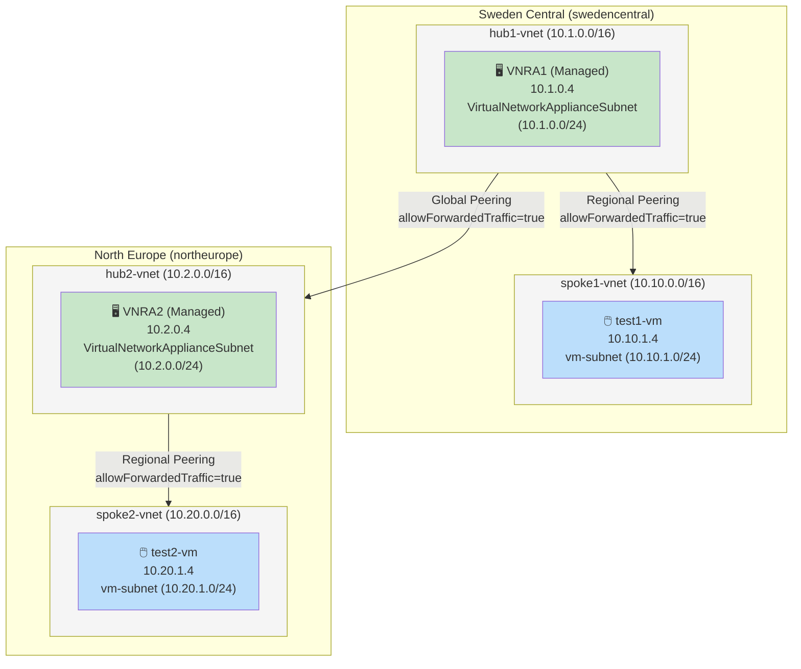
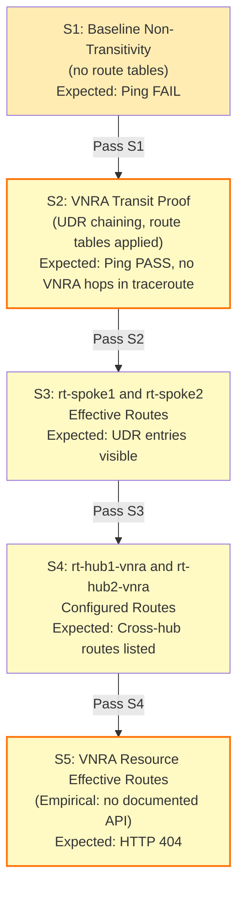
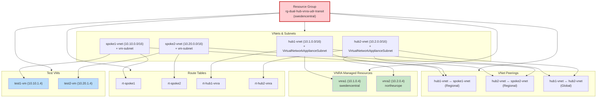

# Azure Managed VNRA: Multi-Region Transit Design, Observability Limits, and the Two Peering Prerequisites

**Posted:** 2026-08-19 | **By:** Kid (Blog Writer, net-lab-builder) | **Lab:** [dual-hub-vnra-udr-transit](https://github.com/erjosito/net-lab-builder/tree/main/labs/dual-hub-vnra-udr-transit)

---

## What This Covers

Azure's **managed Virtual Network Routing Appliance (VNRA)** — GA since August 2026 — is a hardware-based forwarder at 50–200 Gbps per appliance with no customer-managed OS, no SSH access, and no customer NIC. For teams building cross-region east-west transit without deploying and managing a Linux VM NVA, it is the right technology. But several non-obvious behaviors determine whether that transit actually flows:

**Two peering flags are jointly required.** `allowVirtualNetworkAccess` AND `allowForwardedTraffic` must both be `true` on every peering leg in both directions. A peering that shows `Connected`/`FullyInSync` with only `allowForwardedTraffic=true` silently drops 100% of data-plane traffic. The control plane reports no error.

**The VNRA has no effective-route API.** The `VirtualNetworkApplianceSubnet/effectiveRouteTable` endpoint returns HTTP 404 as of August 2026. Diagnosing what the hardware sees requires indirect methods: spoke VM NIC effective routes, configured UDR tables, and Azure Monitor metrics.

**VNRA is TTL-invisible in traceroute.** Hardware forwarding does not decrement TTL. A single-hop tracepath reaching the destination is the definitive proof that the appliance is forwarding correctly — not evidence that it was bypassed.

This post covers the validated two-region hub-spoke-VNRA design, the exact route table chain, the peering prerequisites with a diagnostic walkthrough for silent failure, and the full observability surface available on managed VNRA.

**Validated results (50 Gbps VNRAs, swedencentral ↔ northeurope, post-fix):**

| Direction | Packets | Loss | Avg RTT |
|-----------|---------|------|---------|
| Sweden→Europe | 10/10 | **0%** | 33.094 ms |
| Europe→Sweden | 10/10 | **0%** | 31.372 ms |

---

## Architecture

The validated topology uses a hub-spoke model in each region, with a global VNet peering connecting the two regional hubs. Each hub contains one managed VNRA; each spoke contains one test VM.



**Managed VNRA distinguishers** (relevant to design decisions):

- No user NIC, no OS disk, no cloud-init. Created via `az rest` (REST API) or Terraform AzAPI provider — there is no `az network routing-appliance` subcommand.
- Reserves 5 consecutive IPs from its subnet (primary + 4 secondary). A 50 Gbps VNRA in 10.1.0.0/24 occupies 10.1.0.4–10.1.0.8. A /29 cannot fit one; use /24 for production.
- GA API schema: `properties.bandwidthInGbps: "50"` (string). The preview `virtualNetworkApplianceSku.scalingBandwidth` shape is obsolete.
- No ILB placement supported in front of VNRA (unlike VM NVA).

---

## The UDR Transit Chain

Four route tables wire the two-VNRA forwarding path. The cross-hub tables (orange border below) are the empirically interesting legs: they route traffic across the global peering between two managed appliances.

**Forward: swedencentral → northeurope**


**Return: northeurope → swedencentral**



```mermaid
graph LR
    TEST2R["🖱️ test2-vm<br/>10.20.1.4<br/>spoke2-vnet"]
    RT2["rt-spoke2<br/>10.10.0.0/16<br/>→ VA 10.2.0.4"]
    VNRA2R["🖥️ VNRA2<br/>10.2.0.4<br/>hub2-vnet"]
    RT2H["rt-hub2-vnra<br/>10.10.0.0/16<br/>→ VA 10.1.0.4"]
    VNRA1R["🖥️ VNRA1<br/>10.1.0.4<br/>hub1-vnet"]
    SYS1["System Route<br/>10.10.0.0/16<br/>→ Peering<br/>spoke1-vnet"]
    TEST1R["🖱️ test1-vm<br/>10.10.1.4<br/>spoke1-vnet"]

    TEST2R -->|lookup| RT2
    RT2 -->|next-hop| VNRA2R
    VNRA2R -->|lookup| RT2H
    RT2H -->|next-hop<br/>via global peering| VNRA1R
    VNRA1R -->|lookup| SYS1
    SYS1 -->|via regional peering| TEST1R

    style TEST2R fill:#bbdefb
    style TEST1R fill:#bbdefb
    style VNRA2R fill:#c8e6c9
    style VNRA1R fill:#c8e6c9
    style RT2 fill:#fff9c4
    style RT2H fill:#fff9c4,stroke:#ff6f00,stroke-width:3px
    style SYS1 fill:#fff9c4
```

**Route table summary:**

| Route Table | Subnet | CIDR | Next Hop Type | Next Hop IP |
|---|---|---|---|---|
| `rt-spoke1` | spoke1-vnet/vm-subnet | 10.20.0.0/16 | VirtualAppliance | 10.1.0.4 |
| `rt-hub1-vnra` | hub1-vnet/VirtualNetworkApplianceSubnet | 10.20.0.0/16 | VirtualAppliance | 10.2.0.4 |
| `rt-hub2-vnra` | hub2-vnet/VirtualNetworkApplianceSubnet | 10.10.0.0/16 | VirtualAppliance | 10.1.0.4 |
| `rt-spoke2` | spoke2-vnet/vm-subnet | 10.10.0.0/16 | VirtualAppliance | 10.2.0.4 |

Notes on the chain: `VirtualAppliance` next-hop across a global VNet peering is valid and confirmed working. No IP forwarding flag is required on VNRA (it has no customer NIC). No ILB is required or supported in front of the appliance.

---

## Peering Prerequisites: Both Flags Are Required on Every Leg

VNet peerings for hub-spoke UDR topologies require two distinct flags. In VNRA topologies this matters more than in VM NVA topologies because VNRA has fewer diagnostic surfaces to catch the problem after the fact.

### `allowVirtualNetworkAccess=true`

Permits any traffic *to* the remote VNet's address space. This is the foundational SDN-fabric permission: without it, the Azure SDN fabric does not forward packets between the peered VNets regardless of routing, UDRs, or appliance state. **This flag is required even when the peering state is `Connected`/`FullyInSync`.**

### `allowForwardedTraffic=true`

Permits traffic *forwarded from* the remote VNet. Required for hub-spoke transit where a hub appliance (VNRA, firewall, NVA) processes traffic arriving from the spoke, then forwards it onward. Without this flag, the remote VNet's SDN fabric will not accept forwarded packets from the hub.

### The Silent Failure Pattern

A peering with `allowVirtualNetworkAccess=false` and `allowForwardedTraffic=true` will show `peeringState: Connected` and `peeringSyncLevel: FullyInSync` in the Azure API. There is no error flag, no portal warning, no Azure Monitor alert. The data plane silently drops 100% of traffic.

The API response for a misconfigured peering looks like this:

```json
{
  "name": "hub1-to-spoke1",
  "peeringState": "Connected",
  "peeringSyncLevel": "FullyInSync",
  "allowVirtualNetworkAccess": false,
  "allowForwardedTraffic": true
}
```

### Verification Commands

Check all six peering legs (hub1↔spoke1, hub2↔spoke2, hub1↔hub2, both directions each) immediately after provisioning:

```bash
az network vnet peering show \
  --resource-group <rg> \
  --vnet-name hub1-vnet \
  --name hub1-to-spoke1 \
  --query "{allowVirtualNetworkAccess: allowVirtualNetworkAccess, allowForwardedTraffic: allowForwardedTraffic, state: peeringState}"
```

If either flag is `false`, correct it before testing:

```bash
az network vnet peering update \
  --resource-group <rg> \
  --vnet-name hub1-vnet \
  --name hub1-to-spoke1 \
  --set allowVirtualNetworkAccess=true allowForwardedTraffic=true
```

Repeat for every peering in both directions. The flag defaults vary by provisioning method (Portal, CLI, Terraform, ARM template); always verify explicitly rather than assuming.

---

## Diagnosing Silent Data-Plane Failure

When multi-hop UDR transit fails silently, the diagnostic process should work through control-plane and data-plane evidence systematically, because each layer can appear healthy while the one below it is broken.

### Layer 1: Is the routing intent correct?

Network Watcher Next Hop confirms the routing decision from the spoke VM's perspective:

```bash
az network watcher show-next-hop \
  --resource-group <rg> \
  --vm test1-vm \
  --source-ip 10.10.1.4 \
  --dest-ip 10.20.1.4
# Expected: nextHopType=VirtualAppliance, nextHopIpAddress=10.1.0.4
```

If this returns `VirtualAppliance`, the UDR is programmed correctly. The problem is downstream.

### Layer 2: Is the appliance receiving traffic?

Azure Monitor metrics confirm whether packets are reaching the VNRA:

```bash
az monitor metrics list \
  --resource-group <rg> \
  --resource vnra1 \
  --resource-type "Microsoft.Network/virtualNetworkAppliances" \
  --metric BytesReceived PacketsReceived \
  --start-time <start> --end-time <end>
```

Zero `BytesReceived` and `PacketsReceived` while routing is confirmed correct means traffic is being dropped between the spoke NIC and the VNRA — at the peering or fabric layer.

### Layer 3: Are the peerings permitting data-plane traffic?

Check `allowVirtualNetworkAccess` on every peering (not just `peeringState`). A peering that shows `Connected/FullyInSync` but has `allowVirtualNetworkAccess=false` passes all control-plane checks and fails all data-plane tests. This flag is the most frequent silent failure point in hub-spoke UDR topologies.

### What a Working Transit Path Looks Like

After setting both flags to `true` on all six peerings:

```
# swedencentral → northeurope
10 packets transmitted, 10 received, 0% packet loss
rtt min/avg/max = 32.786/33.094/34.601 ms

# northeurope → swedencentral
10 packets transmitted, 10 received, 0% packet loss
rtt min/avg/max = 30.794/31.372/33.228 ms

Tracepath: 1 hop (destination reached directly)
  1: 10.20.1.4  30.102 ms  reached
```

**One tracepath hop to the remote spoke is the definitive proof of managed VNRA forwarding.** Hardware-based forwarding does not decrement TTL, so the two intermediate VNRAs are invisible to traceroute. A VM NVA would appear as hops at 10.1.0.4 and 10.2.0.4. Their absence proves managed hardware is forwarding the traffic — not that VNRA was bypassed.

---

## The Observability Ceiling

Diagnosing managed VNRA requires knowing which surfaces exist and which don't. The validated probe sequence — from baseline non-transitivity through the effective-route gap — maps out what is and is not programmatically accessible:



| Observable | Available | Method |
|---|---|---|
| **Configured UDR routes** | ✅ YES | `az network route-table route list` |
| **Effective routes on spoke VM NIC** | ✅ YES | `az network nic show-effective-route-table` |
| **Effective routes on VNRA subnet** | ❌ NO | HTTP 404 from regional backend |
| **VNRA resource state + IPs** | ✅ YES | `az rest GET .../virtualNetworkAppliances/vnra1` |
| **Azure Monitor metrics** | ✅ YES | 8 metrics including BytesSent/BytesReceived/PacketsSent/PacketsReceived |
| **Network Watcher next-hop (spoke perspective)** | ✅ YES | `az network watcher show-next-hop` with spoke VM as source |
| **Network Watcher next-hop (VNRA as source)** | ❌ NO | Source IP enforcement prevents using VNRA as the probe source |
| **VNet flow logs on VNRA subnet** | ❌ NO | Not supported |
| **Traceroute hop visibility at VNRA IPs** | ❌ NO | Hardware forwarding is TTL-invisible |

### The Effective-Route Gap

Both `VirtualNetworkApplianceSubnet/effectiveRouteTable` and `VirtualNetworkApplianceSubnet/listEffectiveRoutes` return HTTP 404. There is no programmatic way to ask the VNRA what routes it sees on its subnet.

**Indirect workaround:** Spoke VM NIC effective routes indirectly reflect what the hub has learned. Cross-checking spoke NIC effective routes against configured UDR tables, combined with Azure Monitor `BytesReceived`/`BytesSent`, provides a reasonable proxy for VNRA internal routing state.

**Network Watcher limitation:** Network Watcher's Next Hop tool cannot use a VNRA IP as the source — source IP enforcement rejects it. You can probe *to* the VNRA from a spoke VM, but not *through* it programmatically.

---

## Undocumented Details (as of August 2026)

**5-IP reservation per VNRA:** Each managed VNRA reserves 5 consecutive IPs from its subnet (primary + 4 secondary). A 50 Gbps VNRA placed at 10.1.0.0/24 will occupy 10.1.0.4–10.1.0.8. This is not in GA documentation. Impact: a /28 fits 2 VNRAs; a /29 cannot fit one. Use /24 for production.

**No CLI subcommand:** `az network` has no `routing-appliance` subcommand as of August 2026. Creation requires `az rest --method PUT` or Terraform with the AzAPI provider. No `az network vnet-appliance` or equivalent.

**GA API schema:** Use `properties.bandwidthInGbps: "50"` (string value). The preview schema property `virtualNetworkApplianceSku.scalingBandwidth` is not valid in the GA API (`2025-05-01`).

**Pricing ambiguous:** The Azure Retail Prices API returns no unambiguous match for managed VNRA at 50 Gbps. Estimated operational cost: $33–$170/day per appliance (two appliances in this topology). Verify against current official docs before production budgeting.

---

## Reproduction Commands

### Create a VNRA via REST API

```bash
az rest --method PUT \
  --url "https://management.azure.com/subscriptions/<SUBSCRIPTION_ID>/resourceGroups/<RG>/providers/Microsoft.Network/virtualNetworkAppliances/vnra1?api-version=2025-05-01" \
  --body '{
    "location": "swedencentral",
    "properties": {
      "bandwidthInGbps": "50",
      "subnet": {
        "id": "/subscriptions/<SUBSCRIPTION_ID>/resourceGroups/<RG>/providers/Microsoft.Network/virtualNetworks/hub1-vnet/subnets/VirtualNetworkApplianceSubnet"
      }
    }
  }'
```

### Verify All Six Peering Legs

```bash
# Run for each of: hub1/hub1-to-spoke1, hub1/hub1-to-hub2, hub2/hub2-to-spoke2,
# spoke1/spoke1-to-hub1, spoke2/spoke2-to-hub2, hub2/hub2-to-hub1
az network vnet peering show \
  --resource-group <rg> \
  --vnet-name <vnet-name> \
  --name <peering-name> \
  --query "{allowVirtualNetworkAccess: allowVirtualNetworkAccess, allowForwardedTraffic: allowForwardedTraffic, state: peeringState}"
```

### Test Transit

```bash
# Forward path (swedencentral → northeurope)
az vm run-command invoke \
  --resource-group <rg> --name test1-vm \
  --command-id RunShellScript --scripts "ping -c 10 10.20.1.4"

# Return path (northeurope → swedencentral)
az vm run-command invoke \
  --resource-group <rg> --name test2-vm \
  --command-id RunShellScript --scripts "ping -c 10 10.10.1.4 && tracepath 10.10.1.4"
```

---

## Design Checklist

Before considering a VNRA multi-region transit topology production-ready:

1. **Verify both peering flags on every leg, post-provisioning.** Do not rely on provisioning tool defaults. Check `allowVirtualNetworkAccess` AND `allowForwardedTraffic` explicitly with `az network vnet peering show` after every deployment and update. A peering showing `Connected/FullyInSync` provides no guarantee either flag is set correctly.

2. **Plan observability around the gaps.** There is no subnet-scope effective-route API. Build your diagnostics around spoke VM NIC effective routes, Azure Monitor metrics (BytesSent/BytesReceived), Network Watcher next-hop from spoke VMs, and end-to-end ICMP tests. Traceroute hop counts and TTL behavior will differ from VM NVA — absence of a hop at the VNRA IP is correct behavior, not a skip.

3. **Size subnets for 5-IP-per-VNRA reservation.** A `VirtualNetworkApplianceSubnet` of /28 supports 2 VNRAs (10 IPs usable). /29 cannot support any. Use /24 for single-VNRA production deployments to leave headroom.

4. **VNRA subnet is managed by Azure.** NSGs are auto-created with default allow rules. Do not place other resources (VMs, NICs, etc.) in `VirtualNetworkApplianceSubnet`.

5. **No ILB in front of VNRA.** Unlike VM NVA, managed VNRA does not support an Internal Load Balancer in the path. Do not design the UDR next-hop as an ILB frontend IP.

---

## Takeaway

Managed VNRA delivers transparent cross-region forwarding at hardware speeds — TTL-invisible, no OS patching, no cloud-init. The design is straightforward once the route table chain is correct. The operational complexity lies in two areas: verifying that both VNet peering flags are explicitly true on every leg (the control plane will not tell you when they are not), and working around a narrower diagnostic surface than VM NVA provides. Both are manageable with the verification and indirect-diagnostics approach described above.

---

## Full Lab Evidence

**Validation artifacts:** [net-lab-builder/labs/dual-hub-vnra-udr-transit](https://github.com/erjosito/net-lab-builder/tree/main/labs/dual-hub-vnra-udr-transit)

- Transit failure evidence: `show-output/validation/retry-20260819T185118+0200/06-test1-to-test2.json` (100% loss, `allowVirtualNetworkAccess=false`)
- Peering audit: `show-output/validation/retry-20260819T185118+0200/04-peerings-hub1.json`
- Peering correction: `show-output/validation/retry-20260819T185118+0200/10-peering-access-correction.json`
- Transit success: `show-output/validation/retry-20260819T185118+0200/12-after-fix-test1-to-test2.json` (0% loss, 33 ms)
- Effective-route 404: `show-output/validation/s5-a1-subnet-effectiveRouteTable.txt`
- Lessons learned: `lessons-learned.md` (L1–L11)

The lab resource set and its deletion dependency chain — useful if reproducing or adapting this topology:



---

## References

- Microsoft Docs: [VNRA Overview](https://learn.microsoft.com/azure/virtual-network/virtual-network-routing-appliance-overview)
- Microsoft Docs: [Create a VNRA](https://learn.microsoft.com/azure/virtual-network/virtual-network-routing-appliance-create)
- Microsoft Docs: [Troubleshoot VNRA](https://learn.microsoft.com/azure/virtual-network/virtual-network-routing-appliance-troubleshoot)
- Blog: [What is the Azure Virtual Network Routing Appliance?](https://blog.cloudtrooper.net/2026/03/07/what-is-the-azure-virtual-network-routing-appliance/)