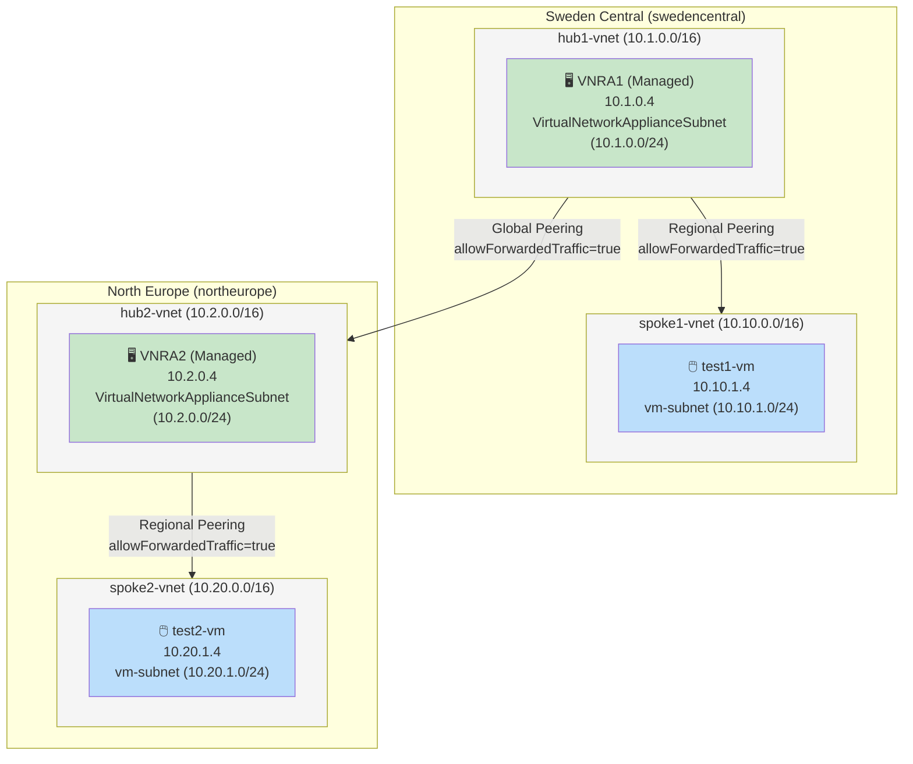
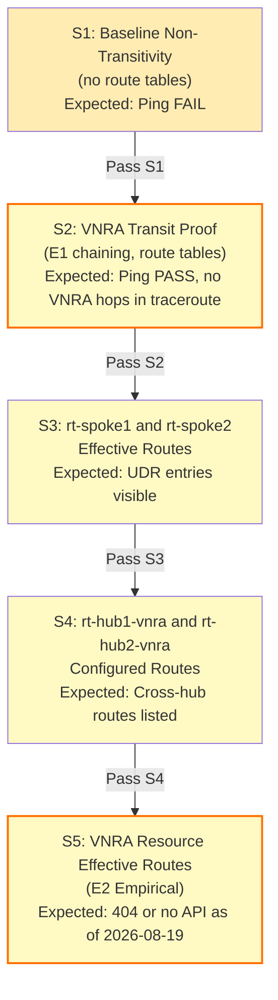
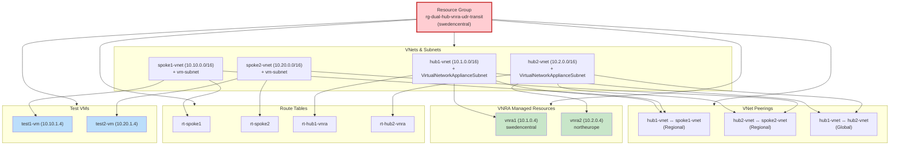

```mermaid
graph LR
    TEST2R["🖱️ test2-vm<br/>10.20.1.4<br/>spoke2-vnet"]
    RT2["rt-spoke2<br/>10.10.0.0/16<br/>→ VA 10.2.0.4"]
    VNRA2R["🖥️ VNRA2<br/>10.2.0.4<br/>hub2-vnet"]
    RT2H["rt-hub2-vnra<br/>10.10.0.0/16<br/>→ VA 10.1.0.4"]
    VNRA1R["🖥️ VNRA1<br/>10.1.0.4<br/>hub1-vnet"]
    SYS1["System Route<br/>10.10.0.0/16<br/>→ Peering<br/>spoke1-vnet"]
    TEST1R["🖱️ test1-vm<br/>10.10.1.4<br/>spoke1-vnet"]

    TEST2R -->|lookup| RT2
    RT2 -->|next-hop| VNRA2R
    VNRA2R -->|lookup| RT2H
    RT2H -->|next-hop<br/>via global peering| VNRA1R
    VNRA1R -->|lookup| SYS1
    SYS1 -->|via regional peering| TEST1R

    style TEST2R fill:#bbdefb
    style TEST1R fill:#bbdefb
    style VNRA2R fill:#c8e6c9
    style VNRA1R fill:#c8e6c9
    style RT2 fill:#fff9c4
    style RT2H fill:#fff9c4,stroke:#ff6f00,stroke-width:3px
    style SYS1 fill:#fff9c4
```

# Managed VNRA Multi-Region UDR Transit: The Silent Peering Trap

**Posted:** 2026-08-19 | **By:** Kid (Blog Writer, net-lab-builder) | **Lab:** [dual-hub-vnra-udr-transit](https://github.com/erjosito/net-lab-builder/tree/main/labs/dual-hub-vnra-udr-transit)

---

## The Headline

Azure's new **managed Virtual Network Routing Appliance (VNRA)** can chain traffic across regions via UDRs to provide transparent east-west transit between spokes—and it works. But the path to success is paved with one silent killer: a peering flag misconfiguration that looks perfectly correct in the Azure Portal yet drops 100% of traffic.

**Proof:** Two managed 50-Gbps VNRAs (one per regional hub), four UDRs, one global VNet peering. Final result after fix:

| Direction | Packets | Loss | Avg RTT |
|-----------|---------|------|---------|
| Sweden→Europe | 10/10 | **0%** | 33.094 ms |
| Europe→Sweden | 10/10 | **0%** | 31.372 ms |

**The trap:** All six peering objects showed `Connected`/`FullyInSync` with `allowForwardedTraffic=true`, yet data-plane traffic was silently dropped. Root cause: **`allowVirtualNetworkAccess=false`** on every peering leg. Neither flag is optional; both must be explicitly `true` on every direction.

---

## The Setup

**Topology:** swedencentral and northeurope, globally peered. Each region has a hub VNet with one managed VNRA (50 Gbps), and a spoke VNet with a test VM.

The two-region layout uses a hub-spoke model in each region, with a global peering connecting the two hubs:



**UDR chain (forward):**
1. test1-vm (10.10.1.4, spoke1) → rt-spoke1 routes 10.20.0.0/16 to VNRA1 (10.1.0.4)
2. VNRA1 (hub1) → rt-hub1-vnra routes 10.20.0.0/16 to VNRA2 (10.2.0.4) **across global peering**
3. VNRA2 (hub2) → system route via regional peering to test2-vm (10.20.1.4, spoke2)

The forward and return data paths each traverse two VNRAs and the inter-hub global peering:




**Managed VNRA** is hardware-based (no OS, no customer NIC), created via Azure REST API (`Microsoft.Network/virtualNetworkAppliances`), GA since August 2026. Bandwidth tiers: 50/100/200 Gbps.

---

## What Went Wrong

**Initial validation:** 100% packet loss both directions. Azure Monitor showed zero bytes/packets on both VNRAs. Network Watcher confirmed UDRs were Active on spoke NICs and correctly steered traffic to the VNRA—so why no forwarding?

### The Control Plane Looked Perfect

✅ All four route tables created and associated  
✅ Spoke NIC effective routes: UDRs `Active`  
✅ Hub VNRA NIC effective routes: UDRs correct  
✅ Network Watcher next-hop from spoke: `NextHop=VirtualAppliance/10.1.0.4`  
✅ Peering states: `Connected` and `FullyInSync` on all six legs  
✅ `allowForwardedTraffic=true` on all peerings  

### The Data Plane Died Silently

```
test1-vm → test2-vm: 0 received, 100% packet loss, time 9224ms
tracepath: 19 hops, all "no reply"
VNRA1 metrics (BytesSent, PacketsSent): all zero
VNRA2 metrics (BytesSent, PacketsSent): all zero
```

### Root Cause: The Missing Flag

Inspecting the peering objects in detail revealed the culprit: **`allowVirtualNetworkAccess=false`** on all six peerings (hub1↔spoke1, hub2↔spoke2, hub1↔hub2, in both directions).

```json
{
  "name": "hub1-to-spoke1",
  "peeringState": "Connected",
  "peeringSyncLevel": "FullyInSync",
  "allowVirtualNetworkAccess": false,
  "allowForwardedTraffic": true,
}
```

**Why this is a trap:** `allowForwardedTraffic=true` permits traffic *forwarded from* the remote VNet. But `allowVirtualNetworkAccess=true` permits traffic *to* the remote VNet's address space—the foundational requirement for any connectivity. The Azure SDN fabric silently drops packets destined for peered address spaces when this flag is false.

---

## The Fix and Verification

Set `allowVirtualNetworkAccess=true` on all six peerings (retaining `allowForwardedTraffic=true`). Immediate result:

```
test1-vm → test2-vm (swedencentral → northeurope)
  10 packets transmitted, 10 received, 0% packet loss
  min/avg/max = 32.786/33.094/34.601 ms

test2-vm → test1-vm (northeurope → swedencentral)
  10 packets transmitted, 10 received, 0% packet loss
  min/avg/max = 30.794/31.372/33.228 ms

Tracepath: 1 hop (destination reached)
  1: 10.20.1.4  30.102 ms reached
```

**No intermediate VNRA hops.** The managed VNRA hardware forwards packets without decrementing TTL—it is invisible to traceroute. This is the definitive proof of hardware-based forwarding and a key distinguisher from VM NVA designs.

---

## Why Both Flags Matter

### `allowForwardedTraffic=true`

Permits traffic forwarded *from* the remote VNet. Essential for spoke-to-hub-to-spoke topologies where a hub appliance (VNRA, firewall, NVA) processes traffic from both ends.

### `allowVirtualNetworkAccess=true`

Permits any traffic *to* the remote VNet's address space. This is the baseline requirement—without it, the SDN fabric does not allow communication between the peered VNets, regardless of routing or forwarding intent.

**Lesson:** For VNRA transit across peerings, **both flags are required on every peering leg in both directions.** Setting only `allowForwardedTraffic=true` leaves the peering Connected/FullyInSync but silently drops all data-plane traffic.

---

## The Observability Ceiling

The validation process proceeded through five structured probes. Stages S2 and S5 represent empirical unknowns that had to be confirmed in the lab:



Managed VNRA exposes a narrower set of diagnostics than VM NVA:

| Observable | Available | Method |
|---|---|---|
| **Configured UDR routes** | ✅ YES | `az network route-table route list` |
| **Effective routes on spoke VM NIC** | ✅ YES | `az network nic show-effective-route-table` |
| **Effective routes on VNRA subnet** | ❌ NO | Subnet action returns HTTP 404 |
| **VNRA resource state + IPs** | ✅ YES | `az rest GET .../virtualNetworkAppliances/vnra1` |
| **Azure Monitor metrics (no diag config)** | ✅ YES | `az monitor metrics list` (8 metrics available) |
| **Network Watcher next-hop (spoke perspective)** | ✅ YES | `az network watcher show-next-hop` |
| **Network Watcher next-hop (VNRA forwarding context)** | ❌ NO | Source-IP enforcement prevents proxy |
| **VNet flow logs** | ❌ NO | Not supported on VNRA subnet |
| **Traceroute hop visibility** | ❌ NO | Hardware forwarding is TTL-invisible |

### The Gap: No Subnet-Scope Effective Route API

POST to `VirtualNetworkApplianceSubnet/effectiveRouteTable` and `VirtualNetworkApplianceSubnet/listEffectiveRoutes` both return **HTTP 404** from the regional backend. There is no programmatic way to inspect what the VNRA sees—you can only observe the spoke VM NICs and the configured UDR tables.

**Workaround:** Spoke VM NIC effective routes indirectly show what the hub has learned. Cross-check against configured UDRs and Azure Monitor metrics to infer VNRA behavior.

---

## Undocumented Details

**5-IP reservation per VNRA:** Each managed VNRA reserves 5 consecutive IPs from its subnet (primary + 4 secondary). A 50 Gbps VNRA in 10.1.0.0/24 consumed 10.1.0.4–10.1.0.8. This is not documented in GA docs as of August 2026.  
**Impact:** A /28 subnet can fit 2 VNRAs (10 IPs usable); a /29 cannot fit one. Use /24 for production.

**No CLI subcommand:** `az network` has no `routing-appliance` subcommand. VNRA creation requires `az rest` or Terraform (AzAPI provider only).

**API schema:** GA schema uses `properties.bandwidthInGbps: "50"` (string), **not** the preview `virtualNetworkApplianceSku.scalingBandwidth` shape.

**Pricing ambiguous:** The retail Prices API returns no unambiguous SKU match for 50 Gbps. Estimated cost: $33–$170/day (pending official pricing docs).

---

## Reproduction Commands

### 1. Create VNRAs via REST API

```bash
# VNRA1 in hub1-vnet
az rest --method PUT \
  --url "https://management.azure.com/subscriptions/<SUBSCRIPTION_ID>/resourceGroups/rg-dual-hub-vnra-udr-transit/providers/Microsoft.Network/virtualNetworkAppliances/vnra1?api-version=2025-05-01" \
  --body @- <<'EOF'
{
  "location": "swedencentral",
  "properties": {
    "bandwidthInGbps": "50",
    "subnet": {
      "id": "/subscriptions/<SUBSCRIPTION_ID>/resourceGroups/rg-dual-hub-vnra-udr-transit/providers/Microsoft.Network/virtualNetworks/hub1-vnet/subnets/VirtualNetworkApplianceSubnet"
    }
  },
  "tags": {
    "lab": "true",
    "created_by": "copilot-lab"
  }
}
EOF
```

### 2. Verify Peering Flags on All Six Legs

```bash
# Check hub1-spoke1 peering
az network vnet peering show \
  --resource-group rg-dual-hub-vnra-udr-transit \
  --vnet-name hub1-vnet \
  --name hub1-to-spoke1 \
  --query "{allowVirtualNetworkAccess: allowVirtualNetworkAccess, allowForwardedTraffic: allowForwardedTraffic, state: peeringState}"

# If either flag is false or missing, correct it:
az network vnet peering update \
  --resource-group rg-dual-hub-vnra-udr-transit \
  --vnet-name hub1-vnet \
  --name hub1-to-spoke1 \
  --set allowVirtualNetworkAccess=true allowForwardedTraffic=true
```

### 3. Test Transit (Post-Fix)

```bash
# From test1-vm (swedencentral)
az vm run-command invoke \
  --resource-group rg-dual-hub-vnra-udr-transit \
  --name test1-vm \
  --command-id RunShellScript \
  --scripts "ping -c 10 10.20.1.4"

# From test2-vm (northeurope)
az vm run-command invoke \
  --resource-group rg-dual-hub-vnra-udr-transit \
  --name test2-vm \
  --command-id RunShellScript \
  --scripts "ping -c 10 10.10.1.4"
```

### 4. Verify VNRA Metrics

```bash
# Check bytes forwarded by VNRA1
az monitor metrics list \
  --resource-group rg-dual-hub-vnra-udr-transit \
  --resource vnra1 \
  --resource-type "Microsoft.Network/virtualNetworkAppliances" \
  --metric BytesSent BytesReceived \
  --start-time 2026-08-19T00:00:00Z \
  --end-time 2026-08-19T23:59:59Z
```

---

## Design Lessons

1. **Always verify `allowVirtualNetworkAccess=true`** on every peering leg before testing hub-spoke UDR scenarios. The flag defaults can vary by creation method (CLI, Portal, Terraform, ARM); always verify explicitly post-creation.

2. **Managed VNRA is hardware-based, not software.** You cannot SSH into it, inspect routes via `ip route`, or use `tcpdump`. Plan your observability around spoke VM NICs, Azure Monitor metrics, and end-to-end tests. Effective-route visibility on the VNRA subnet is not available.

3. **TTL invisibility is a feature, not a bug.** Managed VNRA hardware forwards without decrementing TTL—it appears transparent in tracepath. This distinguishes it from VM NVA and allows deterministic hop counting in multi-stage forwarding chains.

4. **VNRA subnet isolation:** The `VirtualNetworkApplianceSubnet` is managed by Azure. NSGs are created automatically with default allow rules. Do not try to co-locate other resources (VMs, etc.) in this subnet—stick to VNRA instances only.

5. **Test peering flags post-creation, even if using Terraform or ARM templates.** The conditional application of these flags by different provisioning tools is still inconsistent. A simple `az network vnet peering show` followed by `az network vnet peering update` on all six peering objects is your safety net.

---

## Takeaway

Managed VNRA enables transparent, multi-region transit at 50+ Gbps without deploying and managing a Linux VM NVA. **The control plane is straightforward; the data plane is not.** Two mandatory peering flags (`allowVirtualNetworkAccess=true` AND `allowForwardedTraffic=true`) must be explicitly verified on every peering leg in both directions. Miss one, and your entire topology silently fails. Get both right, and you have a production-ready, TTL-invisible forwarding path that scales beyond the throughput constraints of VM-based appliances.

---

## Full Lab Evidence

**Validation artifacts:** [net-lab-builder/labs/dual-hub-vnra-udr-transit](https://github.com/erjosito/net-lab-builder/tree/main/labs/dual-hub-vnra-udr-transit)

- Pre-fix failure: `show-output/validation/retry-20260819T185118+0200/06-test1-to-test2.json` (100% loss)
- Root cause: `show-output/validation/retry-20260819T185118+0200/04-peerings-hub1.json` (allowVirtualNetworkAccess=false)
- Peering fix: `show-output/validation/retry-20260819T185118+0200/10-peering-access-correction.json`
- Post-fix success: `show-output/validation/retry-20260819T185118+0200/12-after-fix-test1-to-test2.json` (0% loss, 33 ms)
- Lessons learned: `lessons-learned.md` (L1–L11)

The lab creates and then tears down a predictable set of resources. Understanding the dependency chain clarifies which resources exist, the order they must be cleaned up, and why VNRA deletion must precede VNet deletion:



---

## References

- Microsoft Docs: [VNRA Overview](https://learn.microsoft.com/azure/virtual-network/virtual-network-routing-appliance-overview)
- Microsoft Docs: [Create a VNRA](https://learn.microsoft.com/azure/virtual-network/virtual-network-routing-appliance-create)
- Microsoft Docs: [Troubleshoot VNRA](https://learn.microsoft.com/azure/virtual-network/virtual-network-routing-appliance-troubleshoot)
- Blog: [What is the Azure Virtual Network Routing Appliance?](https://blog.cloudtrooper.net/2026/03/07/what-is-the-azure-virtual-network-routing-appliance/)