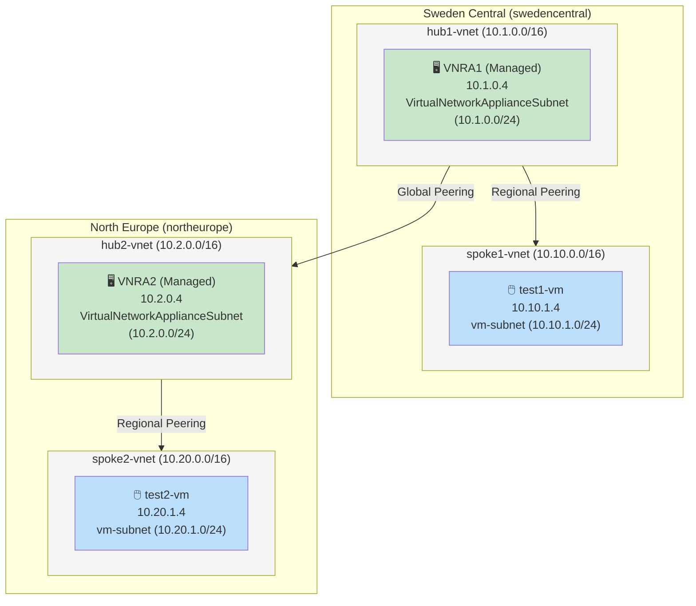
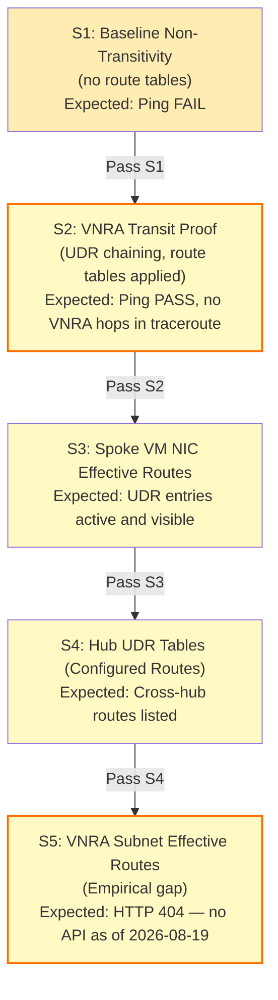
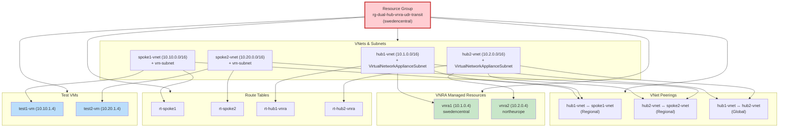

# Multi-Region UDR Transit with Azure Managed VNRA: Design Guide and Observability Model

**Posted:** 2026-08-19 | **By:** Kid (Blog Writer, net-lab-builder) | **Lab:** [dual-hub-vnra-udr-transit](https://github.com/erjosito/net-lab-builder/tree/main/labs/dual-hub-vnra-udr-transit)

---

## What This Covers

Azure's **managed Virtual Network Routing Appliance (VNRA)** — GA since August 2026 — is a hardware-based forwarder at 50–200 Gbps without a managed OS, customer NIC, or SSH access. For cross-region east-west transit at scale, it replaces the VM NVA pattern while removing the need to patch, scale, or operate a virtual machine in the forwarding path.

Using VNRA effectively requires understanding two things that differ from VM NVA topologies. First, how to wire the UDR chain so that cross-hub traffic traverses both appliances across a global VNet peering. Second, what observability the managed hardware provides — which is meaningfully narrower than a VM you can SSH into, and different enough that it changes how you verify and troubleshoot.

This article covers both: a validated two-region hub-spoke-VNRA design with the complete route table chain, and the observability model — what is directly accessible, what requires indirect inference, and what TTL-invisible hardware forwarding tells you when transit is working correctly.

**Validated results (50 Gbps VNRAs, swedencentral ↔ northeurope):**

| Direction | Packets | Loss | Avg RTT |
|-----------|---------|------|---------|
| Sweden→Europe | 10/10 | **0%** | 33.094 ms |
| Europe→Sweden | 10/10 | **0%** | 31.372 ms |

---

## Architecture

The topology is a standard dual-hub-spoke model: a regional hub VNet in each Azure region, each containing one managed VNRA; a spoke VNet per region containing test workloads; and a global VNet peering connecting the two hubs. Regional hub-spoke peerings connect each hub to its spoke.



**Key VNRA properties that shape design decisions:**

- No user NIC, no OS disk, no cloud-init. Created via `az rest` (REST API) or Terraform AzAPI provider — there is no `az network routing-appliance` CLI subcommand.
- Reserves **5 consecutive IPs** from its subnet (primary + 4 secondary). A 50 Gbps VNRA placed in a 10.1.0.0/24 occupies 10.1.0.4–10.1.0.8. A /29 cannot fit one; use /24 for production.
- GA API schema uses `properties.bandwidthInGbps: "50"` (string). The preview property `virtualNetworkApplianceSku.scalingBandwidth` is obsolete.
- **No ILB in the forwarding path.** Unlike VM NVA, managed VNRA does not support an Internal Load Balancer as the UDR next-hop.
- `VirtualNetworkApplianceSubnet` is managed by Azure; NSGs are auto-created. Do not co-locate other resources in this subnet.

---

## The UDR Transit Chain

Four route tables wire the two-appliance forwarding path. The cross-hub legs (orange border below) route traffic across the global peering from one managed VNRA to the other — the key design step that is unique to multi-region VNRA transit.

**Forward path: swedencentral → northeurope**


**Return path: northeurope → swedencentral**

```mermaid
graph LR
    TEST2R["🖱️ test2-vm<br/>10.20.1.4<br/>spoke2-vnet"]
    RT2["rt-spoke2<br/>10.10.0.0/16<br/>→ VA 10.2.0.4"]
    VNRA2R["🖥️ VNRA2<br/>10.2.0.4<br/>hub2-vnet"]
    RT2H["rt-hub2-vnra<br/>10.10.0.0/16<br/>→ VA 10.1.0.4"]
    VNRA1R["🖥️ VNRA1<br/>10.1.0.4<br/>hub1-vnet"]
    SYS1["System Route<br/>10.10.0.0/16<br/>→ Peering<br/>spoke1-vnet"]
    TEST1R["🖱️ test1-vm<br/>10.10.1.4<br/>spoke1-vnet"]

    TEST2R -->|lookup| RT2
    RT2 -->|next-hop| VNRA2R
    VNRA2R -->|lookup| RT2H
    RT2H -->|next-hop<br/>via global peering| VNRA1R
    VNRA1R -->|lookup| SYS1
    SYS1 -->|via regional peering| TEST1R

    style TEST2R fill:#bbdefb
    style TEST1R fill:#bbdefb
    style VNRA2R fill:#c8e6c9
    style VNRA1R fill:#c8e6c9
    style RT2 fill:#fff9c4
    style RT2H fill:#fff9c4,stroke:#ff6f00,stroke-width:3px
    style SYS1 fill:#fff9c4
```



**Route table summary:**

| Route Table | Subnet | Destination | Next Hop Type | Next Hop IP |
|---|---|---|---|---|
| `rt-spoke1` | spoke1-vnet/vm-subnet | 10.20.0.0/16 | VirtualAppliance | 10.1.0.4 |
| `rt-hub1-vnra` | hub1-vnet/VirtualNetworkApplianceSubnet | 10.20.0.0/16 | VirtualAppliance | 10.2.0.4 |
| `rt-hub2-vnra` | hub2-vnet/VirtualNetworkApplianceSubnet | 10.10.0.0/16 | VirtualAppliance | 10.1.0.4 |
| `rt-spoke2` | spoke2-vnet/vm-subnet | 10.10.0.0/16 | VirtualAppliance | 10.2.0.4 |

A `VirtualAppliance` next-hop IP across a global VNet peering is valid. No IP forwarding flag is needed on the VNRA (it has no customer NIC). The spoke-to-spoke path traverses VNRA1 → global peering → VNRA2 with both VNRAs forwarding invisibly to the source.

---

## Verifying Transit: TTL Invisibility as the Confirmation Signal

Managed VNRA forwarding is hardware-based and does not decrement TTL. This means the two intermediate appliances are invisible to traceroute — which is both the design property that enables transparent transit and the primary confirmation signal that transit is working.

When the topology is correctly configured:

```
# swedencentral → northeurope
10 packets transmitted, 10 received, 0% packet loss
rtt min/avg/max = 32.786/33.094/34.601 ms

# northeurope → swedencentral (tracepath)
Tracepath: 1 hop (destination reached)
  1: 10.20.1.4  30.102 ms  reached
```

**Interpreting the tracepath output:** One hop directly to the remote spoke is correct. VNRA1 and VNRA2 do not appear because hardware forwarding is TTL-invisible. A VM NVA would appear as hops at 10.1.0.4 and 10.2.0.4; their absence here is the definitive proof that managed hardware is in the path. Do not mistake the missing hops for a misconfiguration.

This has a practical implication for operational runbooks: ICMP round-trips and single-hop tracepath results are your primary success indicators. You cannot count VNRA hops to verify the chain is active.

---

## The Observability Model

Managed VNRA has a meaningfully narrower diagnostic surface than VM NVA. Planning for this upfront avoids surprises when something needs investigation. The diagram below shows the validated probe sequence from baseline through the effective-route gap:



| Observable | Available | Method |
|---|---|---|
| **Configured UDR routes** | ✅ | `az network route-table route list` |
| **Effective routes on spoke VM NIC** | ✅ | `az network nic show-effective-route-table` |
| **VNRA resource state, IPs, provisioning** | ✅ | `az rest GET .../virtualNetworkAppliances/vnra1` |
| **Azure Monitor metrics** | ✅ | 8 metrics: BytesSent, BytesReceived, PacketsSent, PacketsReceived, and four more |
| **Network Watcher next-hop (spoke as source)** | ✅ | `az network watcher show-next-hop` from spoke VM |
| **Effective routes on VNRA subnet** | ❌ | HTTP 404 — endpoint not implemented as of August 2026 |
| **Network Watcher next-hop (VNRA as source)** | ❌ | Source IP enforcement rejects VNRA IP as probe origin |
| **VNet flow logs on VNRA subnet** | ❌ | Not supported |
| **Traceroute hops at VNRA IPs** | ❌ | Hardware forwarding is TTL-invisible (by design) |

### The Effective-Route Gap

Both `VirtualNetworkApplianceSubnet/effectiveRouteTable` and `VirtualNetworkApplianceSubnet/listEffectiveRoutes` return HTTP 404 from the regional backend. There is no API to ask the managed hardware what routes it sees on its subnet.

### Indirect Diagnostics Methodology

Because direct VNRA introspection is unavailable, an effective diagnostic methodology chains indirect signals:

1. **Spoke VM NIC effective routes** (`az network nic show-effective-route-table`) confirm that UDRs are active and pointing to the correct VNRA IP. This is the closest proxy for what the appliance's subnet sees.
2. **Configured route tables** (`az network route-table route list`) confirm the hub UDRs exist and point to the correct cross-hub next-hop.
3. **Azure Monitor metrics** (`BytesReceived`, `PacketsReceived` on the VNRA resource) confirm whether traffic is reaching the appliance at all. Zero metrics with confirmed UDR routing indicates a fabric-layer drop between the spoke and the VNRA.
4. **End-to-end ICMP** and single-hop tracepath are the definitive functional tests. Given the TTL-invisible hardware, they are also the only way to confirm the full forwarding chain is active.

---

## Undocumented Details (as of August 2026)

**5-IP reservation per VNRA:** Each managed VNRA occupies 5 consecutive IPs from its subnet (primary + 4 secondary). A 50 Gbps VNRA at 10.1.0.4 consumes through 10.1.0.8. This is not documented in GA docs. Impact: /28 fits 2 VNRAs; /29 fits none. Use /24 for production.

**No CLI subcommand:** `az network` has no `routing-appliance` or `vnet-appliance` subcommand. VNRA creation and deletion require `az rest --method PUT/DELETE` or Terraform with the AzAPI provider.

**GA API schema:** `properties.bandwidthInGbps: "50"` (string). The preview property `virtualNetworkApplianceSku.scalingBandwidth` is not valid in the GA API version `2025-05-01`.

**Pricing ambiguous:** The Azure Retail Prices API returns no unambiguous match for managed VNRA at 50 Gbps as of August 2026. Estimated cost: $33–$170/day per appliance. Verify against official pricing documentation before budgeting production deployments.

---

## Reproduction Commands

### Create a VNRA via REST API

```bash
az rest --method PUT \
  --url "https://management.azure.com/subscriptions/<SUBSCRIPTION_ID>/resourceGroups/<RG>/providers/Microsoft.Network/virtualNetworkAppliances/vnra1?api-version=2025-05-01" \
  --body '{
    "location": "swedencentral",
    "properties": {
      "bandwidthInGbps": "50",
      "subnet": {
        "id": "/subscriptions/<SUBSCRIPTION_ID>/resourceGroups/<RG>/providers/Microsoft.Network/virtualNetworks/hub1-vnet/subnets/VirtualNetworkApplianceSubnet"
      }
    }
  }'
```

### Verify Peering Flags on All Six Legs

```bash
# Repeat for all six peerings: hub1/hub1-to-spoke1, hub1/hub1-to-hub2,
# hub2/hub2-to-spoke2, spoke1/spoke1-to-hub1, spoke2/spoke2-to-hub2, hub2/hub2-to-hub1
az network vnet peering show \
  --resource-group <rg> --vnet-name <vnet-name> --name <peering-name> \
  --query "{vna: allowVirtualNetworkAccess, aft: allowForwardedTraffic, state: peeringState}"
```

### Test Transit

```bash
# Forward path
az vm run-command invoke --resource-group <rg> --name test1-vm \
  --command-id RunShellScript --scripts "ping -c 10 10.20.1.4 && tracepath 10.20.1.4"

# Return path
az vm run-command invoke --resource-group <rg> --name test2-vm \
  --command-id RunShellScript --scripts "ping -c 10 10.10.1.4"
```

### Query VNRA Metrics

```bash
az monitor metrics list \
  --resource-group <rg> --resource vnra1 \
  --resource-type "Microsoft.Network/virtualNetworkAppliances" \
  --metric BytesSent BytesReceived PacketsSent PacketsReceived \
  --start-time <ISO-start> --end-time <ISO-end>
```

---

## Design Checklist

1. **Verify peering flags post-provisioning.** Check `allowVirtualNetworkAccess` AND `allowForwardedTraffic` on every peering leg in both directions with `az network vnet peering show` after every deployment. Neither flag is reliably set by all provisioning tools. See the field note at the end of this article for a concrete illustration.

2. **Size subnets for 5-IP-per-VNRA reservation.** Use /24 for single-VNRA production deployments; /28 for up to two VNRAs; /29 for none.

3. **Plan observability around the gaps.** No subnet-scope effective-route API exists. Use spoke NIC effective routes, Azure Monitor metrics, and end-to-end ICMP as your diagnostic signals. Expect one tracepath hop to the remote spoke — that is correct behavior, not a misconfiguration.

4. **No ILB in the UDR next-hop.** The UDR must point directly to the VNRA IP, not an ILB frontend.

5. **VNRA subnet is managed by Azure.** Do not co-locate VMs, NICs, or other resources in `VirtualNetworkApplianceSubnet`.

---

## Takeaway

Managed VNRA delivers hardware-speed, TTL-invisible forwarding across regions without OS management overhead. The route table design is straightforward; the operational model is different from VM NVA in two important ways — narrower diagnostic visibility and TTL-invisible forwarding that changes how you read traceroute output. Understanding both before deployment avoids surprises during operation.

---

## Field Note: `Connected/FullyInSync` Is Not Data-Plane Proof

During validation of this topology, all six peerings reported `peeringState: Connected` and `peeringSyncLevel: FullyInSync`, yet end-to-end ping produced 100% packet loss and Azure Monitor showed zero bytes on both VNRAs.

The root cause was `allowVirtualNetworkAccess=false` on every peering — set that way by the provisioning tool's defaults. The peering state fields do not reflect this flag's value, and there is no portal warning or Azure Monitor alert for it:

```json
{
  "name": "hub1-to-spoke1",
  "peeringState": "Connected",
  "peeringSyncLevel": "FullyInSync",
  "allowVirtualNetworkAccess": false,
  "allowForwardedTraffic": true
}
```

Setting `allowVirtualNetworkAccess=true` on all six legs (while retaining `allowForwardedTraffic=true`) restored full transit immediately.

**The generalizable lesson:** `Connected/FullyInSync` is a control-plane state — it confirms the peering objects are synchronized, not that the data plane will pass traffic. For any hub-spoke UDR topology, both `allowVirtualNetworkAccess` and `allowForwardedTraffic` must be explicitly `true` in both directions. Because VNRA has fewer diagnostic surfaces than VM NVA, this misconfiguration is harder to detect after the fact; verify the flags immediately after every provisioning change.

---

## Full Lab Evidence

**Validation artifacts:** [net-lab-builder/labs/dual-hub-vnra-udr-transit](https://github.com/erjosito/net-lab-builder/tree/main/labs/dual-hub-vnra-udr-transit)

- Pre-fix transit failure: `show-output/validation/retry-20260819T185118+0200/06-test1-to-test2.json`
- Peering audit (flags): `show-output/validation/retry-20260819T185118+0200/04-peerings-hub1.json`
- Peering correction: `show-output/validation/retry-20260819T185118+0200/10-peering-access-correction.json`
- Post-fix success: `show-output/validation/retry-20260819T185118+0200/12-after-fix-test1-to-test2.json` (0% loss, 33 ms)
- Effective-route 404: `show-output/validation/s5-a1-subnet-effectiveRouteTable.txt`
- Lessons learned: `lessons-learned.md` (L1–L11)

The lab resource dependency chain — useful for reproducing or adapting this topology:



---

## References

- Microsoft Docs: [VNRA Overview](https://learn.microsoft.com/azure/virtual-network/virtual-network-routing-appliance-overview)
- Microsoft Docs: [Create a VNRA](https://learn.microsoft.com/azure/virtual-network/virtual-network-routing-appliance-create)
- Microsoft Docs: [Troubleshoot VNRA](https://learn.microsoft.com/azure/virtual-network/virtual-network-routing-appliance-troubleshoot)
- Blog: [What is the Azure Virtual Network Routing Appliance?](https://blog.cloudtrooper.net/2026/03/07/what-is-the-azure-virtual-network-routing-appliance/)